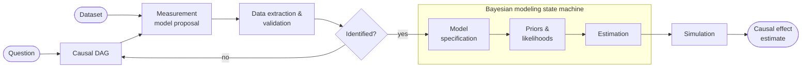
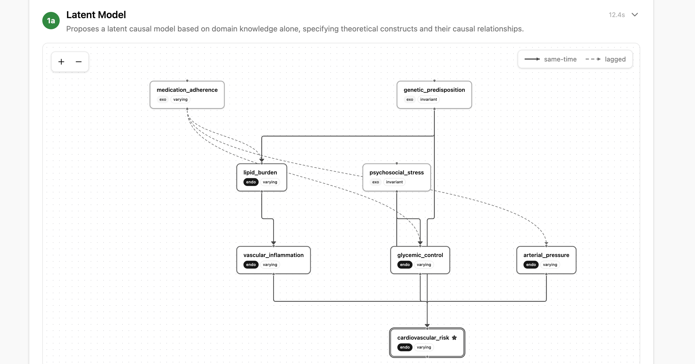
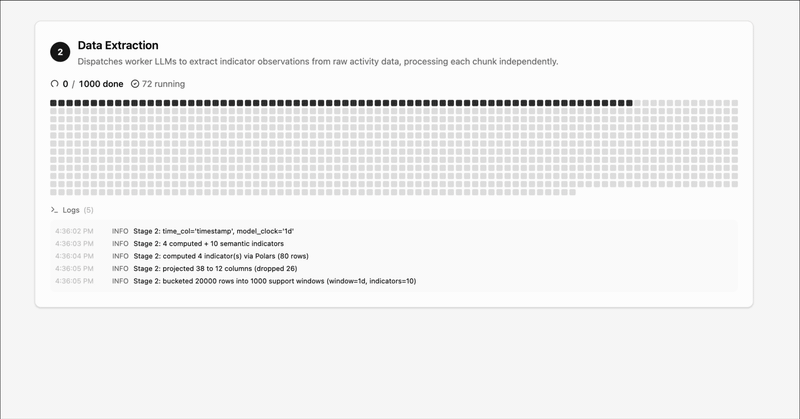
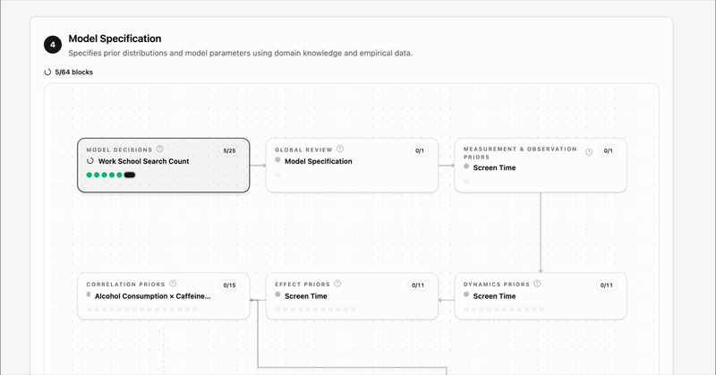
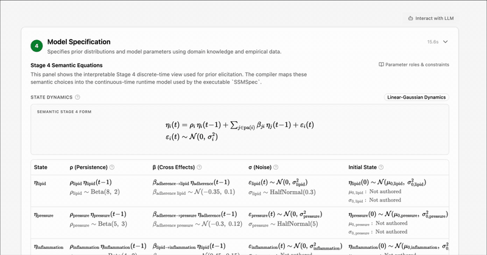
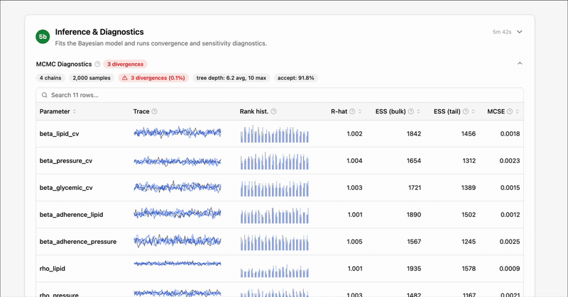
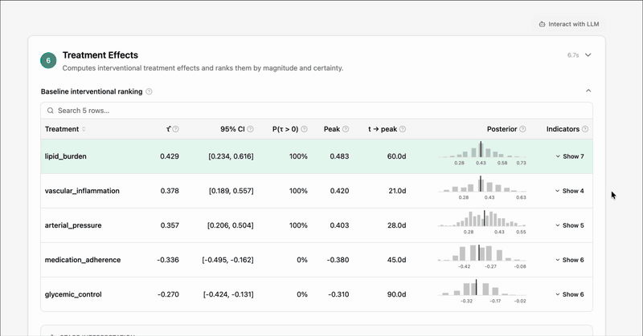

# causal-ssm-agent

[](https://github.com/ma9o/causal-ssm-agent/actions/workflows/ci.yml)


**causal-ssm-agent** is an opinionated LLM harness for end-to-end Bayesian causal inference on N-of-1 time series data.

The ultimate goal of the project is to facilitate epistemically optimal decision-making at the individual level, using high-leverage digital trace datasets (medical records, chatbot conversation logs, browsing history, etc.) while transparently incorporating existing scientific knowledge - where available - in the form of prior distributions and modeling assumptions.

In practice, the user will pose a question in natural language given a dataset of their choosing. First, the system will lay out the causal DAG implied by the question and a measurement model for the DAG that is compatible with the given dataset. If the causal effect in question is structurally identifiable, the DAG is translated into a continuous-time state-space model and estimated with MCMC. Finally, an LLM will run simulations on the fitted model to estimate the causal effects of interventions and counterfactual scenarios that answer the original question.



## Features and Goals

- **Methodological rigor without friction** - An user should be simply able to provide a dataset and a question, and the software should provide the most rigorous possible answer without pushing any methodological decision onto the user.
- **Interpretability and interactivity** - At any stage, users can inspect and intervene on the LLM outputs in the UI, either by interactively challenging the LLM in conversation or directly overriding its decisions.
- **Support for large datasets, irregular timestamps and semantic heterogeneity** - via multivariate continuous-time Ornstein-Uhlenbeck dynamics with non-Gaussian indicator-specific likelihoods (Poisson, Bernoulli, Beta, etc.).
- **Robust LLM-based numerical modeling and prior elicitation** - by embedding the LLM decision process in a state machine that minimizes the LLM's decision surface at each step, and gates progression on numerical checks (e.g. prior/posterior predictive, SDE stability, scale adequacy, etc.)
- **Fast and accurate MCMC estimation in `jax`** - Exact inference in minutes using O(log T) associative Kalman filtering on GPU ([Corenflos et al. 2025](https://arxiv.org/abs/2303.00301)). Efficient caching ensures that we never waste time waiting for compilation.
- **Compatible with `codex` and `claude-code`** - Leverage your existing subscription for the interactive stages of the pipeline.

| <br>Structural causal model specification | <br>Parallel data extraction |
|:--:|:--:|
| <br>**Functional modeling decisions and prior elicitation** | <br>**Functional model specification** <tr></tr> |
| <br>**Inference diagnostics** | <br>**Counterfactual simulation** |

## Modeling

Causal identification on the SSM is achieved by temporal unrolling the DAG as per [Jahn et al. (2025)](https://proceedings.mlr.press/v275/jahn25a.html) then running the [ID algorithm](https://doi.org/10.1016/j.artint.2008.12.006) on the unrolled segment for each treatment-outcome pair.

The latent dynamics are modeled as a multivariate Ornstein-Uhlenbeck process:

<!-- docs-latex:start eyJkaXNwbGF5Ijp0cnVlLCJsYXRleCI6ImRcXGJvbGRzeW1ib2x7XFxldGF9KHQpID0gXFxiaWdsKFxcbWF0aGJme0F9XFwsXFxib2xkc3ltYm9se1xcZXRhfSh0KSArIFxcbWF0aGJme2N9XFxiaWdyKVxcLGR0ICsgXFxtYXRoYmZ7R31cXCxkXFxtYXRoYmZ7V30odCkifQ -->
<p align="center">
  
</p>
<!-- docs-latex:end -->

with indicator-specific likelihoods (see the supported [distribution families](docs/reference/model-spec/likelihoods.md#distribution-families) and [link functions](docs/reference/model-spec/likelihoods.md#link-functions)):

<!-- docs-latex:start eyJkaXNwbGF5Ijp0cnVlLCJsYXRleCI6InlfaSh0KSBcXG1pZCBcXGJvbGRzeW1ib2x7XFxldGF9KHQpIFxcc2ltIEZfaVxcIVxcbGVmdChnX2leey0xfVxcbGVmdCgoXFxib2xkc3ltYm9se1xcTGFtYmRhfVxcYm9sZHN5bWJvbHtcXGV0YX0odCkrXFxib2xkc3ltYm9se1xcbXV9KV9pXFxyaWdodCk7IFxcdGhldGFfaVxccmlnaHQpIn0 -->
<p align="center">
  
</p>
<!-- docs-latex:end -->

See [causal-spec](docs/reference/causal-spec/identifiability.md), [latent-model](docs/reference/latent-model/assumptions.md) and [measurement-model](docs/reference/measurement-model/assumptions.md) for the structural assumptions baked into the modeling framework.

## Quick Start

```bash
bun install --frozen-lockfile
cd apps/data-pipeline && uv sync --frozen --group dev && cd ../..

# Environment — set OPENROUTER_API_KEY at minimum
cp .env.example.dev .env

# Start all dev servers - NextJS, Prefect and LLM tools server
bun run dev
```

See the [dev setup guide](docs/guides/dev_setup.md) for full details including environment variables and optional dependencies.

## Documentation

| Section | Description |
|---------|-------------|
| **[Index](docs/index.md)** | Full documentation entrypoint with route-by-question |
| **[Pipeline](docs/pipeline.md)** | Stage-by-stage walkthrough and artifact ownership |
| **[Reference](docs/reference/)** | Assumptions, compilation, estimation, inference routing |
| **[Guides](docs/guides/)** | Dev setup, code generation, integration testing, evaluations |

## Project Structure

```text
causal-ssm-agent/                    # Turborepo monorepo
├── apps/
│   ├── data-pipeline/               # Python — Prefect pipeline + NumPyro models
│   │   ├── src/causal_ssm_agent/
│   │   │   ├── orchestrator/        # LLM agents: construct, measurement, prior proposals
│   │   │   ├── workers/             # Parallel indicator extraction + prior research
│   │   │   ├── models/              # NumPyro SSM compilation + likelihoods
│   │   │   ├── flows/               # Prefect stages (0–6) + orchestration
│   │   │   └── utils/               # Identifiability, config, LLM runtime
│   │   ├── evals/                   # Inspect AI evaluation suites
│   │   └── tests/                   # pytest suite
│   └── web/                         # Next.js — interactive frontend
│       └── src/
│           ├── app/                  # App router + API routes
│           ├── components/           # DAG editor, charts, pipeline views
│           └── lib/                  # Clients, hooks, types
├── packages/
│   └── api-types/                   # Generated TypeScript types from Pydantic
├── data/                            # Workspace data (local inputs, runs, artifacts)
└── docs/                            # Documentation
```

<!-- cloc:start -->

## Lines of Code

| Language | Files | Blank | Comment | Code | p50&nbsp;/&nbsp;p90&nbsp;/&nbsp;max | Top files |
| --- | ---: | ---: | ---: | ---: | ---: | --- |
| Python | 345 | 17,389 | 10,499 | 104,849 | 160&nbsp;/&nbsp;698&nbsp;/&nbsp;9,076 | [test_stage4.py](<apps/data-pipeline/tests/test_stage4.py>), [test_inference_strategies.py](<apps/data-pipeline/tests/test_inference_strategies.py>), [test_pipeline.py](<apps/data-pipeline/tests/test_pipeline.py>) |
| TypeScript | 323 | 4,012 | 1,152 | 36,051 | 71&nbsp;/&nbsp;258&nbsp;/&nbsp;1,076 | [generate-markdown.ts](<apps/web/src/lib/utils/generate-markdown.ts>), [generate-markdown.test.ts](<apps/web/src/lib/utils/generate-markdown.test.ts>), [_shared.test.ts](<apps/web/src/app/api/analysis/_shared.test.ts>) |
| JSON | 53 | 0 | 0 | 32,549 | 169&nbsp;/&nbsp;1,165&nbsp;/&nbsp;6,320 | [stage-4.json](<data/DOCTOLIB/run/stage-4.json>), [stage-5b.json](<data/DOCTOLIB/run/stage-5b.json>), [contracts.json](<packages/api-types/schemas/contracts.json>) |
| Markdown | 36 | 1,404 | 9 | 4,275 | 59&nbsp;/&nbsp;171&nbsp;/&nbsp;1,024 | [report.md](<data/DOCTOLIB/report.md>), [report.md](<data/DEFAULT/report.md>), [llm-driven-specification.md](<docs/reference/model-spec/llm-driven-specification.md>) |
| Jupyter Notebook | 9 | 0 | 68,025 | 3,452 | 277&nbsp;/&nbsp;901&nbsp;/&nbsp;901 | [stage4_manual_golden_repair.ipynb](<apps/data-pipeline/notebooks/stage4_manual_golden_repair.ipynb>), [pathological_geometries_gallery.ipynb](<apps/data-pipeline/notebooks/pathological_geometries_gallery.ipynb>), [pathfinder_gallery.ipynb](<apps/data-pipeline/notebooks/pathfinder_gallery.ipynb>) |
| CSV | 2 | 0 | 0 | 642 | 321&nbsp;/&nbsp;321&nbsp;/&nbsp;321 | [expected-stage2-model-data.csv](<data/MEDICAL_SEMANTICS/expected-stage2-model-data.csv>), [expected-stage2-raw-data.csv](<data/MEDICAL_SEMANTICS/expected-stage2-raw-data.csv>) |
| JavaScript | 5 | 128 | 10 | 617 | 43&nbsp;/&nbsp;376&nbsp;/&nbsp;376 | [codegen_docs_latex.js](<scripts/codegen_docs_latex.js>), [update_readme_cloc.js](<scripts/update_readme_cloc.js>), [copy-perspective-assets.mjs](<apps/web/scripts/copy-perspective-assets.mjs>) |
| YAML | 10 | 53 | 82 | 337 | 1&nbsp;/&nbsp;80&nbsp;/&nbsp;122 | [ci.yml](<.github/workflows/ci.yml>), [deploy.yml](<.github/workflows/deploy.yml>), [config.yaml](<apps/data-pipeline/config.yaml>) |
| Bourne Shell | 1 | 37 | 0 | 180 | 180&nbsp;/&nbsp;180&nbsp;/&nbsp;180 | [start_agentic_integration_stack.sh](<scripts/start_agentic_integration_stack.sh>) |
| TOML | 1 | 10 | 0 | 117 | 117&nbsp;/&nbsp;117&nbsp;/&nbsp;117 | [pyproject.toml](<apps/data-pipeline/pyproject.toml>) |
| CSS | 1 | 6 | 1 | 100 | 100&nbsp;/&nbsp;100&nbsp;/&nbsp;100 | [globals.css](<apps/web/src/app/globals.css>) |
| Text | 4 | 0 | 0 | 34 | 1&nbsp;/&nbsp;31&nbsp;/&nbsp;31 | [cspell-project-words.txt](<cspell-project-words.txt>), [query.txt](<data/DEFAULT/query.txt>), [query.txt](<data/DOCTOLIB/query.txt>) |
| Bourne Again Shell | 2 | 7 | 5 | 22 | 2&nbsp;/&nbsp;20&nbsp;/&nbsp;20 | [sync-private-data](<.githooks/sync-private-data>), [post-merge](<.githooks/post-merge>) |
| SVG | 7 | 0 | 0 | 7 | 1&nbsp;/&nbsp;1&nbsp;/&nbsp;1 | [file.svg](<apps/web/public/file.svg>), [globe.svg](<apps/web/public/globe.svg>), [next.svg](<apps/web/public/next.svg>) |
| **Total** | **799** | **23,046** | **79,783** | **183,232** | **97&nbsp;/&nbsp;510&nbsp;/&nbsp;9,076** | **[test_stage4.py](<apps/data-pipeline/tests/test_stage4.py>), [stage-4.json](<data/DOCTOLIB/run/stage-4.json>), [stage-5b.json](<data/DOCTOLIB/run/stage-5b.json>)** |

<!-- cloc:end -->
