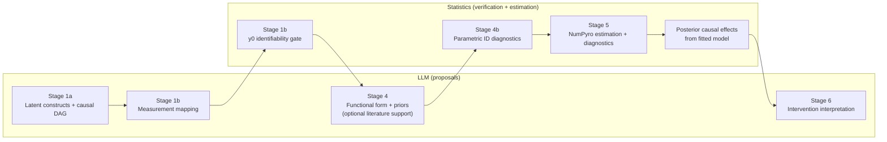

# causal-ssm-agent

causal-ssm-agent is for single-individual or already-aggregated longitudinal questions where the data are messy, irregularly sampled, and semantically heterogeneous. The LLM proposes constructs, indicators, causal structure, and priors, but quantitative answers only proceed through explicit identifiability checks and Bayesian continuous-time state-space estimation. The goal is not just to estimate effects, but to know when numeric causal claims are justified and when the system should stop at structural reasoning.



## Key Feature: Natural Language Causal Queries

Users don't need to be data scientists or understand causal inference terminology. They can ask questions in plain language:

- *"Why do I feel tired on Mondays?"*
- *"Does talking to my therapist actually help?"*
- *"What's making my code reviews take so long?"*

The orchestrator LLM translates these informal queries into formal causal structures - identifying relevant variables, potential confounders, and constructing a proper DAG. This democratizes causal inference, making it accessible to anyone with data and curiosity.

## Quickstart

[...]

## Documentation

See [`docs/index.md`](docs/index.md) for the full documentation structure.

References are colocated with the docs that use them rather than collected in a standalone bibliography page.

- **[Pipeline](docs/pipeline.md)** - Ordered stage map plus per-stage reference files
- **[Reference](docs/reference/)** - Domain objects, cross-cutting concepts, estimation, inference routing, and execution semantics
- **[Guides](docs/guides/)** - Practical usage: data contract, data workflow, running evals, codegen

## Structure

```text
causal-ssm-agent/                  # Turborepo monorepo
├── apps/
│   ├── data-pipeline/             # Python – Prefect pipeline + NumPyro models
│   │   ├── src/causal_ssm_agent/
│   │   │   ├── orchestrator/      # LLM model specification (latent + measurement)
│   │   │   ├── workers/           # Indicator extraction + prior research LLMs
│   │   │   ├── models/            # NumPyro SSM compilation, likelihoods, inference routing
│   │   │   ├── flows/             # Prefect pipeline stages (0–6) + replay orchestration
│   │   │   └── utils/             # Shared utilities (config, LLM runtime, identifiability)
│   │   ├── benchmarks/            # Inference method benchmarks (parameter recovery)
│   │   ├── evals/                 # Inspect AI evals
│   │   ├── notebooks/             # Showcase notebooks
│   │   ├── tests/                 # pytest tests
│   │   └── tools/                 # Narrow utilities (eval log reader, GPU smoke, LaTeX renderer)
│   └── web/                       # Next.js frontend
│       └── src/
│           ├── app/               # App router pages + API routes
│           ├── components/        # React components (stages, charts, DAG, pipeline)
│           └── lib/               # API clients, hooks, types, utilities
├── packages/
│   └── api-types/                 # Generated TypeScript types + exported schema snapshots
├── data/                          # Workspace data (query, input, session lineage, run artifacts)
├── docs/                          # Project documentation (see docs/index.md)
└── scratchpad/                    # Temporary work files (gitignored)
```
