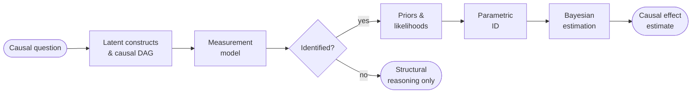

# causal-ssm-agent

> Ask a causal question in plain English. Get a statistically rigorous answer — or an honest "not identifiable" — from your own longitudinal data.

[](https://github.com/ma9o/causal-ssm-agent/actions/workflows/ci.yml)


**causal-ssm-agent** translates natural-language causal questions into formal causal inference. An LLM proposes latent constructs, a measurement model, a causal DAG with explicit confounders, and informative priors. Algebraic identifiability checks gate numeric estimation — unidentified effects stop at structural reasoning. Identified effects are estimated via continuous-time state-space models with variational inference on JAX.

Built for intensive longitudinal data (ILD) and N-of-1 settings: irregular timestamps, mixed indicator types, semantic heterogeneity.

*"Why do I feel tired on Mondays?"* · *"Does talking to my therapist actually help?"* · *"What's making my code reviews take so long?"*

<!-- TODO: Add screenshot of web UI showing a completed pipeline run -->

## Pipeline



Stages alternate between LLM proposals (constructs, measurement model, priors) and statistical verification (identifiability, parametric diagnostics, estimation). The identification gate is the central architectural decision: if a causal effect can't be nonparametrically identified from the proposed DAG, the system stops and explains why rather than producing an unwarranted estimate. See the [pipeline docs](docs/pipeline.md) for the full stage breakdown.

## Features

- **Natural language queries** — Users ask informal causal questions; the LLM translates into formal structure with latent constructs, indicators, and explicit confounders
- **Identification before estimation** — Structural identifiability checked via [y0](https://y0.readthedocs.io/) ([Shpitser & Pearl 2006](https://doi.org/10.1016/j.artint.2008.12.006)) before any numeric claim. No identification, no causal estimate.
- **Continuous-time state-space models** — Multivariate Ornstein-Uhlenbeck dynamics with exact matrix-exponential discretization for arbitrarily irregular observation intervals
- **Mixed likelihood families** — Gaussian, ordinal logistic, Poisson, Bernoulli, Beta, categorical — matched to indicator dtype automatically
- **LLM-elicited priors** — Prior distributions proposed by the LLM with optional literature grounding via [Exa](https://docs.exa.ai/) search, validated through prior predictive checks (stability, scale plausibility)
- **Explicit latent confounders** — Unobserved confounding modeled as explicit nodes in the DAG, never bidirected edges; ADMGs used only internally for the ID algorithm
- **Dual inference backends** — Kalman filter (exact, via [cuthbert](https://github.com/cuthbert-ai/cuthbert)) for linear-Gaussian models; Rao-Blackwellized particle filter for non-Gaussian observations
- **Full web interface** — Interactive DAG visualization, stage-by-stage pipeline progress, posterior diagnostics, intervention analysis

## Modeling

A causal question becomes a directed acyclic graph: latent constructs as nodes, directed edges as hypothesized effects, with unobserved confounders as explicit latent nodes. Each target effect is checked for nonparametric identifiability — the DAG is [temporally unrolled](https://arxiv.org/abs/2504.20172), projected to an ADMG, and passed through the [ID algorithm](https://doi.org/10.1016/j.artint.2008.12.006). Effects that aren't identified stop here — no estimate produced.

Identified effects are estimated as a continuous-time latent state-space model:

$$d\boldsymbol{\eta}(t) = \bigl(\mathbf{A}\,\boldsymbol{\eta}(t) + \mathbf{c}\bigr)\,dt + \mathbf{G}\,d\mathbf{W}(t)$$

Off-diagonal entries of the drift matrix $\mathbf{A}$ are the causal effects of interest. Observations link to latent states through indicator-specific likelihoods (Gaussian, ordinal, Poisson, Bernoulli, Beta, categorical) via a factor loading matrix, and exact matrix-exponential discretization handles irregular time intervals natively.

See [estimation](docs/reference/estimation.md) and [compilation](docs/reference/compilation.md) for the full formulation.

## Quick Start

```bash
bun install --frozen-lockfile
cd apps/data-pipeline && uv sync --frozen --group dev && cd ../..

# Environment — set OPENROUTER_API_KEY at minimum
cp .env.example.dev .env

# Start all dev servers - NextJS, Prefect and LLM tools server
bun run dev
```

See the [dev setup guide](docs/guides/dev_setup.md) for full details including environment variables and optional dependencies.

## Documentation

| Section | Description |
|---------|-------------|
| **[Index](docs/index.md)** | Full documentation entrypoint with route-by-question |
| **[Pipeline](docs/pipeline.md)** | Stage-by-stage walkthrough and artifact ownership |
| **[Reference](docs/reference/)** | Assumptions, compilation, estimation, inference routing |
| **[Guides](docs/guides/)** | Dev setup, codegen, integration testing, evals |

## Project Structure

```text
causal-ssm-agent/                    # Turborepo monorepo
├── apps/
│   ├── data-pipeline/               # Python — Prefect pipeline + NumPyro models
│   │   ├── src/causal_ssm_agent/
│   │   │   ├── orchestrator/        # LLM agents: construct, measurement, prior proposals
│   │   │   ├── workers/             # Parallel indicator extraction + prior research
│   │   │   ├── models/              # NumPyro SSM compilation + likelihoods
│   │   │   ├── flows/               # Prefect stages (0–6) + orchestration
│   │   │   └── utils/               # Identifiability, config, LLM runtime
│   │   ├── evals/                   # Inspect AI evaluation suites
│   │   └── tests/                   # pytest suite
│   └── web/                         # Next.js — interactive frontend
│       └── src/
│           ├── app/                  # App router + API routes
│           ├── components/           # DAG editor, charts, pipeline views
│           └── lib/                  # Clients, hooks, types
├── packages/
│   └── api-types/                   # Generated TypeScript types from Pydantic
├── data/                            # Workspace data (local inputs, runs, artifacts)
└── docs/                            # Documentation
```
