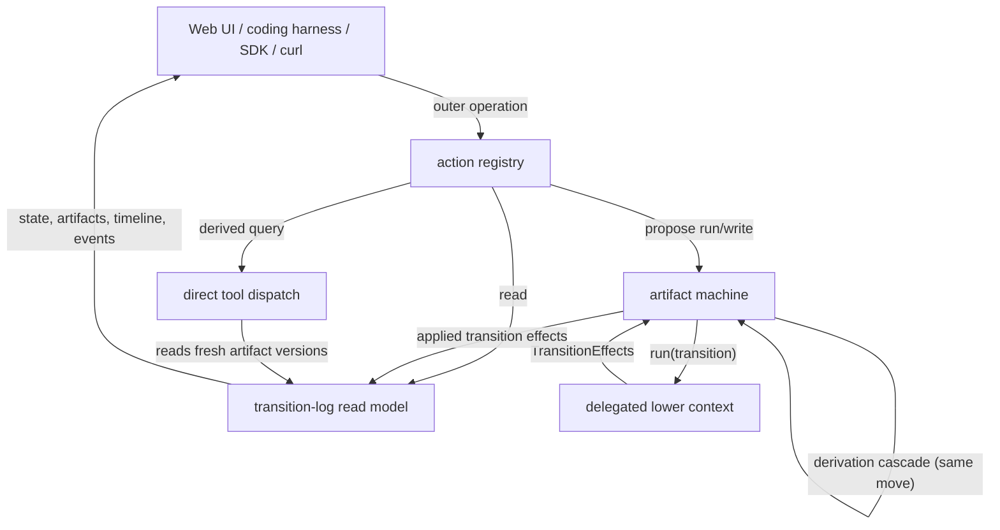
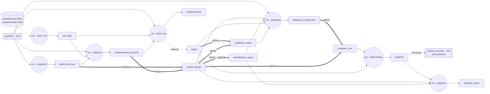
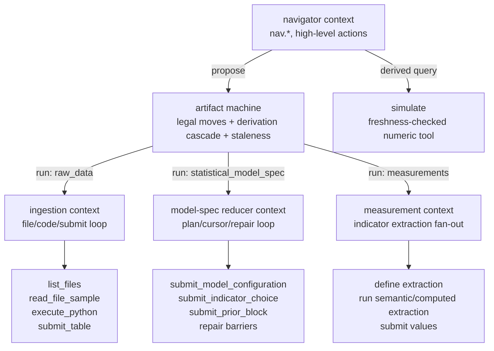

# Action Hierarchy and State-Machine Contexts

Status: **implemented**. This is the artifact-machine contract encoded by
[`machine/graph.py`](../../apps/data-pipeline/src/nof1_causal_lab/machine/graph.py),
[`machine/moves.py`](../../apps/data-pipeline/src/nof1_causal_lab/machine/moves.py),
[`machine/derivations.py`](../../apps/data-pipeline/src/nof1_causal_lab/machine/derivations.py),
[`machine/writes.py`](../../apps/data-pipeline/src/nof1_causal_lab/machine/writes.py), and
[`machine/runners.py`](../../apps/data-pipeline/src/nof1_causal_lab/machine/runners.py).

## Purpose

The engine's state is an **artifact machine**: the nodes are artifacts, and the only thing
that changes state is a rule that *creates an artifact*. This document specifies that ruleset —
which artifacts exist, how each one comes into being, when a creation is legal, and what becomes
stale — plus the control and context hierarchy that sits above it.

Read it as three nested layers:

1. **Outer operations**: what a human, LLM navigator, web UI, script, or notebook can ask the
   system to do.
2. **Lower contexts**: the scoped loops opened by heavy operations, such as the ingestion
   exploration loop or the statistical-model-spec reducer.
3. **Artifact machine**: the artifact-level ruleset that decides which creations are legal, what
   the machine itself must recompute, what became stale, and which numeric claims can still be
   served.

The machine core lives in those modules; this document describes the same model and the
naming/context layer above it.

The main usage pattern is a coding harness: a human and an LLM collaborate through a SKILL.md
contract, observe engine state, and issue actions the same way they drive a REPL or a CLI. The
web UI is the default visual navigator over the same actions, not a privileged orchestration
layer.

## Core Shape



The important separation is:

- An **outer operation** is what the navigator is trying to accomplish, for example "ingest
  uploaded data", "recompute stale outputs", "edit the measurement design", or "simulate an
  intervention".
- A **lower context** is the restricted tool loop opened to complete one heavy operation, for
  example the ingestion agent's file/code loop or the model-spec reducer's block/repair loop.
- A **machine move** is the only mutating transition the machine accepts: `write(artifact)` or
  `run(transition)`. Everything the machine recomputes for itself (derivations, retractions,
  staleness) happens inside the move, run-to-completion.

Outer operations compile to reads, derived queries, or machine moves. Lower-context tools never
become public machine moves; the [Temporal LLM orchestration](temporal-llm-orchestration.md)
doc describes which lower-context calls are still visible as Temporal child workflows and
activities.

## The Artifact Machine

The machine's state is a versioned artifact store. Every artifact version is immutable and records
provenance plus the exact input artifact versions it was derived from (`derived_from`). That stamp
is what makes staleness and freshness *derived* properties rather than stored flags.

An artifact enters the store exactly one of three ways — this is the whole ruleset:

| Creation kind | What it is | Examples |
|---|---|---|
| **Root** | A caller supplies the payload directly (`write(artifact)`), schema-validated and provenance-stamped `human`/`llm`. `write_pins` stamp input versions so a written root participates in staleness. | `question`, `saved_scenarios` |
| **Produced** | A `run(transition)` computes it from its inputs inside a delegated context. A transition is named by the primary artifact it produces. Judgment-class produced artifacts are also `writable`. | `raw_data`, `latent_structure`, `measurement_structure`, `measurements`, `statistical_model_spec`, `posterior`, `baseline_report` |
| **Derived** | A deterministic, machine-maintained node recomputed **atomically in the same move** when its parents are fresh and one of them changed. It has no producer of its own, is never written, is never scheduled, and is **never stale** on the public surface: if any parent is absent or stale during a cascade, the current derivation is retracted instead of recomputed from stale inputs. An `optional` derivation is present only when its finding is nonempty; retraction is a finding, not a failure. | `causal_design`, `identification_report`, `validation_report`, `compiled_ssm` |

Derivations are standalone nodes with **multiple parents**:

```text
Derivation(produces, from_=(parents…), optional=bool)
```

The payoff is that everything mechanical given the judgment artifacts — composition,
identification, validation checks, model compilation — becomes machine-maintained, and the
staleness surface shrinks to produced/written artifacts only.

Each produced artifact's transition declares:

- `consumes` — the inputs whose existence gates the run (the guard; see below).
- `produces_optional` — substantive co-outputs withheld on a negative finding (e.g. `panel`
  when extraction yields nothing usable). Withholding one on a re-run **retracts** the stale
  version.
- `creation_class` — `deterministic` | `batch_llm` | `judgment` (see [Creation classes](#creation-classes)).
- `writable` — whether a caller may also supply the primary artifact directly via `write`.

Roots declare `write_pins`: the inputs a direct write should stamp into `derived_from` so the
written artifact participates in staleness like any computed one. `saved_scenarios` pins the
`posterior` it was simulated against; `question` pins nothing.

Writes of judgment-class produced artifacts pin too: a `write` stamps the current versions of
the transition's `consumes` that exist at write time into `derived_from` (absent inputs are
omitted — write legality stays existence-free). A hand-written `baseline_report` therefore goes
stale when `posterior` moves, exactly like a run-produced one. There are no permanent fresh
roots except true roots.

### The artifact graph



As a node table:

| Node | Kind | consumes / from | class | writable | Notes |
|---|---|---|---|---|---|
| `question` | root | — | — | ✅ | pins nothing |
| `raw_data` | produced | ∅ | batch_llm | ❌ | ingestion context; deliberately consumes nothing, so question edits never stale it |
| `latent_structure` | produced | question | judgment | ✅ | theoretical constructs and causal edges |
| `measurement_structure` | produced | question, raw_data, latent_structure | judgment | ✅ | **promoted out of `causal_design`**; indicators, operationalization, model clock |
| `causal_design` | derived | latent_structure, measurement_structure | — | ❌ | composition + identification result + estimation projection; pure and total — the composing move is rejected if composition fails to validate |
| `identification_report` | derived · optional | causal_design | — | ❌ | present iff ≥ 1 treatment identifies — the epistemic gate |
| `measurements` | produced | question, raw_data, measurement_structure | batch_llm | ❌ | extraction report + per-indicator audit (**one domain object**) |
| `panel` | optional co-output of `measurements` | — | — | ❌ | the usable model-ready table; absence = negative finding, disables fit |
| `validation_report` | derived | panel, causal_design | — | ❌ | measured-data checks (coverage, degeneracy, construct observability); deterministic, so no transition |
| `statistical_model_spec` | produced | question, causal_design, identification_report, panel, validation_report | judgment | ✅ | likelihoods, parameters, priors — the declarative math model; the reducer is this run's lower context |
| `compiled_ssm` | derived | statistical_model_spec, causal_design | — | ❌ | deterministic compile; the composing move is rejected if compilation fails |
| `posterior` | produced | compiled_ssm, panel | deterministic | ❌ | exact nonlinear SSM engines; long-running job |
| `baseline_report` | produced | posterior, causal_design, identification_report | judgment | ✅ | ranked identified effects; shares the `Scenario` value type with `saved_scenarios` |
| `saved_scenarios` | root | pins posterior | — | ✅ | user/agent-saved simulation results |

`identification_report` has a single origin — it derives from `causal_design`, which itself
derives from the two structures — whether those structures arrived by `run` or by direct `write`.
There is no second producer and no directly-writable derivation; the epistemic gate ("numeric
claims only when identification supports them") is exactly the presence of this derived node, and
it tracks the structures automatically.

The four judgment/writable artifacts — `latent_structure`, `measurement_structure`,
`statistical_model_spec`, `baseline_report` — plus the two roots are **exactly the LLM's write
surface** in the SKILL.md harness. Everything else is machine-maintained (derivations) or
credentialed compute (batch_llm, deterministic runs). That is the contract a skill documents:
"you may write these six things; after each move the machine tells you what was produced,
derived, retracted, stale, and legal."

### How movement is restricted

Two questions the machine keeps strictly separate, following the build-systems literature that
splits a build into a *rebuilder* (what is out of date) and a *scheduler* (what to run next):

- **Legality (may I create this now?)** — for `run`, a pure existence check: every `consumes`
  artifact must exist. For `write`, the artifact must be writable, the payload must validate,
  provenance must be `human`/`llm`, and the derivation cascade must satisfy **derivation
  totality**: if a non-optional derivation on the move's fresh cascade path fails to validate
  (composition error, compile error), the whole move is rejected and the versions written during
  the failed move are removed.
- **Staleness (is an existing artifact still current?)** — derived from `derived_from`. A
  produced or written artifact is stale iff any pinned input is absent, has moved past the pinned
  version, or is itself transitively stale. Roots with empty `derived_from` are never stale; a
  pinned root like a saved scenario is stale when its pinned `posterior` moves. **Derived nodes
  are never reported stale** — the cascade recomputes them when parents are fresh and retracts
  them when any parent is absent or stale.

| Mechanism | Restriction |
|---|---|
| Guards on `run` | A transition runs only when every `consumes` artifact exists. `statistical_model_spec` is impossible until `question`, `causal_design`, `identification_report`, `panel`, and `validation_report` exist — so fitting is unreachable without an identification milestone and usable measured data. |
| `write` legality | A write must be schema-valid, provenance-stamped `human`/`llm`, and its derivation cascade must validate. It installs a new version and, for roots with `write_pins`, stamps the pinned inputs. |
| Optional co-outputs | `produces_optional` artifacts appear only when the finding is nonempty; absence disables downstream consumers. |
| Derivation cascade | On every install of a parent, the machine walks derivations in topological order inside the same move. It recomputes derivations whose parents exist and are fresh; it retracts a current derivation when any parent is absent or stale; and it retracts an `optional` derivation whose finding is empty. The parent and its derivations are never observable out of sync. |
| Retractions | Re-running a transition retracts an optional co-output the new run withholds; a derivation cascade retracts an optional derivation whose finding went empty — so downstream enabledness reflects the new finding. |
| Version pins + freshness gate | Every artifact pins the exact input versions it consumed. Numeric query surfaces must refuse or hard-flag results whose provenance chain is stale — a stale `posterior` is not a valid basis for reported causal numbers. |

The auto-run driver is only a **scheduler policy** over this machine: it walks artifacts in
dependency order and proposes the next legal `run` whose output is missing or stale. It adds no
second legality model. Derivations never appear in a schedule — they are not runnable.

### The run-to-completion move

A move's atomic step, journaled as one `TransitionEffects`:

1. Validate legality (existence guard for `run`; schema + provenance for `write`).
2. Execute the delegated context (for `run`) or accept the payload (for `write`).
3. Persist the new version(s) with `derived_from` pins.
4. **Cascade derivations** reachable from the installed artifacts, in topological order:
   recompute each when all parents are fresh, retract it when any parent is absent or stale, and
   pin parents on derived outputs. A failed (non-optional) derivation aborts the whole move and
   removes the versions written by that failed move.
5. Compute retractions of withheld optional co-outputs.
6. Recompute staleness over produced/written artifacts.
7. Journal effects; return the envelope (see [Return Contract](#return-contract)).

Derivations run inside the move's critical section, so they must be **pure and total** —
deterministic functions of their parents, with failure rejecting the whole move. Cost is *not*
part of the definition: derivation-hood is semantic, and a slow derivation (SSM compile may
grow to minutes) blocks the move rather than changing kind. One accepted consequence: totality
means `write(statistical_model_spec)` blocks until the compile derivation succeeds or the move
is rejected — a spec that does not compile is never installed. How to execute slow derivations
(blocking vs async completion) is an open execution decision, not a graph-shape decision.

### Creation classes

`creation_class` describes *how* a produced artifact is computed, and therefore whether an external
agent can shortcut the run by writing the artifact itself:

- `deterministic` — needs no credentials (`posterior`).
- `batch_llm` — bulk LLM compute on the service's ambient key (`raw_data`, `measurements`).
- `judgment` — proposal work an external agent can do itself, so these transitions are also
  `writable` (`latent_structure`, `measurement_structure`, `statistical_model_spec`,
  `baseline_report`).

The judgment ↔ writable correspondence is total in this graph: every judgment transition is
writable and every writable produced artifact is judgment-class. The declarations stay independent
in the schema anyway, since the correspondence is an outcome of this graph, not a law.

## Borrowed Concepts (prior art)

This design deliberately reuses four established lineages. Each owns a different half of the
problem; the mapping below is the rationale for the choices above.

| Lineage | What we take | Where it lands |
|---|---|---|
| **Artifact-centric BPM — Guard-Stage-Milestone (GSM) → OMG CMMN** (IBM Research; Hull et al.) | The artifact-first framing itself: model the business *artifact* and its lifecycle with declarative rules, not an imperative flow. **Sentries** → our `run` guards. **Milestones** (objectives that become true and can be invalidated) → our optional derivations / co-outputs and their retraction. GSM stages nest sub-stages → our lower contexts. | The whole [Artifact Machine](#the-artifact-machine) section; guard/milestone vocabulary. |
| **Dagster Software-Defined Assets** | The reframe from task-centric to asset-centric: an asset is `(key, op, upstream keys)` — the artifact is the identity, the transition an attribute. Their critique of task orchestration ("which process updated this asset? is it current?") is the critique of a stage-keyed surface. Observable-source-style pinning → `saved_scenarios` pinning `posterior`. Declarative Automation → the driver as per-artifact policy. | Transitions named by output; `write_pins`; the scheduler-as-policy stance. |
| **Build Systems à la Carte / Salsa** (Mokhov et al.; rust-analyzer) | The *scheduler × rebuilder* split (kept strictly separate above). Verifying traces (our version-pinned `derived_from`). Salsa's derived queries — memoized pure functions over inputs, never set directly — are our derivations. **Early cutoff** — stop the stale cascade when a recompute yields an unchanged value — is noted as a deferred extension (it requires content-hashed pins in the store). | [How movement is restricted](#how-movement-is-restricted); Open Decisions. |
| **Harel statecharts / UML HSM** | Hierarchically nested states and **run-to-completion**: a composite state runs to completion before the parent sees the next event. Our heavy transitions are composite states whose private FSM (cursor, block statuses, repair loop) is invisible to the parent, which sees only the final `TransitionEffects`. **Completion transitions** → the derivation cascade firing inside the same move. Orthogonal regions → the DAG's independent branches and the extraction worker fan-out. | [Context Hierarchy](#context-hierarchy); [the run-to-completion move](#the-run-to-completion-move). |

## Legality vs Affordance

Machine **legality** (above) is existence-plus-validation and lives in the core. The action layer
computes a strictly separate **affordance** set — which actions are worth *surfacing and ranking*
for the navigator. Affordance may be stricter than legality:

- `analyze.save` compiles to `write(saved_scenarios)`, which is always machine-legal, but is only
  worth offering once a `posterior` exists.
- `specify.measurement` compiles to `write(measurement_structure)` — machine-legal whenever the
  payload validates — but refining it against degenerate indicators is only a sensible affordance
  once `panel` and `validation_report` exist to refine against. That extra condition is an
  affordance guard, not a machine gate; the machine still accepts the write on its own terms.

Keeping these apart means there is exactly one legality engine (`moves.validate_move`), and the
richer per-action preconditions live where they belong — in the surfacing layer — instead of
silently becoming a shadow legality model.

## Context Hierarchy

Context means the local state, allowed tools, and authority visible to the active agent.

| Layer | Scope | Owns | May mutate artifacts? |
|---|---|---|---|
| Navigator context | Human+LLM harness (SKILL.md), web UI, SDK, curl | The current episode view, affordances, timeline, artifact diffs | Only by proposing machine moves |
| Action registry | Transport-independent action contracts | Mapping from intent names to reads, queries, or moves | No; it routes to the machine |
| Machine context | One serialized move at a time | Current artifact versions, legal moves, derivation cascade, staleness, journaled outcomes | Yes, by applying `write` or successful `run` effects — including all derivations, atomically |
| Delegated transition context | One heavy operation (a composite state) | Transition-local runtime state, restricted tool set, repair loop | No direct mutation; returns produced/retracted artifacts to the machine |
| Tool/sandbox context | One helper call inside a delegated context | File samples, sandbox execution, validation helpers, literature lookup | No |



A delegated context is a **composite state** with run-to-completion semantics: the navigator sees
it as one operation with progress and trace events, not as a bag of public tools, and the machine
sees only its final `TransitionEffects` — never its internal cursor or block states. Derived
numeric queries (`simulate`, `counterfactual`, `ppc`) are **read surfaces**, not contexts and not
machine moves: they read fresh artifact versions and are freshness-gated at serve time, returning
a hard flag when the provenance chain is stale.

## Lower Context Examples

| Outer operation | Machine move | Lower context state | Lower operations | Exit condition |
|---|---|---|---|---|
| `episode.ingest_data` | `run` → `raw_data` | Prepared input directory, sandbox, latest `result_df`, column descriptions | `list_files`, `read_file_sample`, `execute_python`, `submit_table` | `submit_table` validates a single timestamped Polars table, producing `raw_data` |
| `specify.latent_structure` | `run` → `latent_structure` or `write(latent_structure)` | Question-focused latent-structure proposal context | propose constructs, revise descriptions, submit construct set | `latent_structure` exists; `causal_design` re-derives in the same move |
| `specify.measurement` | `run` → `measurement_structure` or `write(measurement_structure)` | Indicator design against raw data columns and constructs | inspect columns, propose indicators, set aggregation and clock, submit | `measurement_structure` exists; `causal_design` + `identification_report` re-derive in the same move |
| `measure.extract` | `run` → `measurements` | Indicator extraction plan and worker fan-out | define extraction, run computed extraction, run semantic extraction, submit values | `measurements` exists; `panel` co-produced only if measurement yielded usable data; `validation_report` derives from the panel |
| `fit.specify` | `run` → `statistical_model_spec` or `write(statistical_model_spec)` | Reducer skeleton, immutable plan, runtime cursor, accepted state, repair campaign | block submissions, model lock, prior authoring, deterministic repair routing, barrier validation | `statistical_model_spec` exists; `compiled_ssm` derives in the same move (compile-must-succeed is the derivation's totality) |
| `fit.infer` | `run` → `posterior` | Long-running inference job | fit exact nonlinear SSM engines, emit progress | `posterior` exists |
| `analyze.rank` | `run` → `baseline_report` | Baseline causal-query context over a fresh posterior | rank identified effects | `baseline_report` exists |
| `analyze.simulate` | Derived query tool | Current fitted model and scenario input | `simulate` | Returns a `Scenario` result; saving it is a later `write(saved_scenarios)` |

The `statistical_model_spec` transition is the clearest nested state machine. The outer operation
is just `fit.specify`; inside that composite state, the reducer owns a cursor (`block`,
`statistical_model_spec_lock`, `repair_barrier`, `done`), block statuses (`pending`, `accepted`,
`reopened`, `inactive`), accepted state, and deterministic repair routing. The machine does not
know about those prompt blocks. It only knows whether the run eventually produced
`statistical_model_spec` (and hence a `compiled_ssm` derivation), raised an error, or left state
unchanged.

## Domain Objects

The machine nodes map onto the domain models in
[`artifacts/`](../../apps/data-pipeline/src/nof1_causal_lab/artifacts/):

- `LatentStructure`, `MeasurementStructure`, `StatisticalModelSpec` are already top-level pydantic
  models; this machine gives the latter two their own artifact lineages instead of nesting them inside
  composite payloads.
- `CausalDesign` remains the composite (latent + measurement + identifiability + estimation
  projection) and is machine-derived, never written. Its derivation composes latent and
  measurement structures, runs identifiability, and validates the estimation projection.
- **`Measurements`** is the one new composite: extraction report + per-indicator audit, with the
  usable panel as an optional co-output.
- **`Scenario`** is the one new value type: intervention spec + simulated trajectories + summary,
  shared by `baseline_report` (produced, recomputed, stale-able) and `saved_scenarios` (written
  root, pinned). They stay separate artifacts precisely because they differ in the dimension the
  machine cares about — creation kind and staleness behavior.

Internal plumbing (`EstimationSpec`, indicator audits, traces) stays inside payloads and never
becomes a machine node. Numeric query results (`simulate`, `ppc`) never enter the store except
via `write(saved_scenarios)`.

## Target Action Names

The public control surface is named by intent, not by stage number. Each action has one contract
with three transport faces: MCP for the harness, RPC/curl for scripts and CI, and SDK methods for
notebooks.

| Namespace | Concern | Typical action names | Machine mapping |
|---|---|---|---|
| `nav` | Observe state and history | `state`, `timeline`, `events`, `get`, `versions`, `diff` | Replay applied transition effects; read timeline/events from logs |
| `episode` | Lifecycle and roots | `create`, `attach_data`, `ingest_data`, `refresh` | `write(question)`, staged upload, `run` → `raw_data`, scheduler policy |
| `specify` | Design causal and measurement structure | `latent_structure`, `measurement`, `edit`, `identify` | `run`/`write` → `latent_structure`/`measurement_structure`; `causal_design` + `identification_report` derive automatically |
| `measure` | Execute measurement | `extract` | `run` → `measurements` (+ `panel`, `validation_report` derivation) |
| `fit` | Specify and estimate | `specify`, `infer`, `check` | `run`/`write` → `statistical_model_spec` (+ `compiled_ssm` derivation), `run` → `posterior`, derived diagnostics |
| `analyze` | Query and persist | `rank`, `simulate`, `counterfactual`, `ppc`, `save` | `run` → `baseline_report`, derived tools, `write(saved_scenarios)` |

The `specify` → `measure` loop is the iterative design loop; validation now rides along as a
derivation instead of needing its own `analyze.validate` action. `fit` and `analyze` are
downstream because they require an identified, measured, validated, and compiled model — enforced
structurally by `statistical_model_spec`'s guard.

## Return Contract

Every mutating action returns the same envelope, so the harness loop does not need to poll just to
understand what happened.

| Field | Meaning |
|---|---|
| `produced` | Artifact versions newly installed as current — including derivations recomputed by the cascade. |
| `retracted` | Optional co-outputs and derivations removed from current because a new creation withheld them or their finding went empty. Each entry carries a `reason_ref` pointing at the finding in the parent version that caused the retraction (e.g. the identifiability status inside the new `causal_design`) — a retraction records its cause, not just its effect. |
| `stale` | Existing produced/written artifacts whose provenance chain is no longer fresh after this move. |
| `legal` | The new legal move set at this state. |
| `next` | Suggested affordances, ranked for the current context. |

Reads return the same state vocabulary without mutation. Derived query tools return their result
plus freshness warnings when the input provenance chain is not fresh.

## Worked Example: Degenerate Indicator Revision

1. `nav.state` shows `validation_report` flagging five indicators with a single observed level,
   and `statistical_model_spec` present.
2. `nav.get(validation_report)` shows the details.
3. The navigator writes a revised `measurement_structure` (drop the degenerate indicators; one
   construct thereby becomes unmeasured and stays latent).
4. In the **same move**, the machine cascades: `causal_design` re-derives (recomposition +
   identification + estimation projection); `identification_report` re-derives or is retracted
   according to the new finding; nothing is ever observable half-updated.
5. Version pins make `measurements`, `panel`, and downstream produced artifacts such as
   `statistical_model_spec`, `posterior`, and `baseline_report` stale as applicable. Derived
   artifacts are recomputed or retracted, never reported stale.
6. `nav.diff(measurement_structure, v1, v2)` shows the exact structural change;
   `nav.diff(causal_design, v1, v2)` shows its derived consequence.
7. `measure.extract` is the next useful affordance; after it lands, `validation_report`
   re-derives from the new panel.
8. `fit.specify` becomes useful only if its required inputs exist, including an
   `identification_report`; `fit.infer` and `analyze.rank` follow.

The navigator only writes the measurement structure it wants, and the machine keeps everything
mechanical consistent. The revision is one `measurement_structure` lineage with multiple versions;
the timeline scrubber follows artifact versions and does not invent a separate workflow state.

## Why Not One Action Per Stage

One action per stage is the tempting skeleton, but it is wrong as the public surface:

- It leaks internal stage numbers into the API and couples callers to the graph's current shape.
- Some transitions contain a lower state machine, not one user-level action. The model-spec
  reducer is a composite state inside `fit.specify`.
- Some essential operations are not transitions at all: artifact edits, diffs, freshness checks,
  direct simulation queries — and entire former stages (identification, validation,
  compilation) are derivations with no action of their own.
- The most-used harness surface is read navigation, which has no transition at all.
- It hides the delegation boundary, which is exactly the boundary that keeps broad navigator
  context separate from restricted lower contexts.

The heavy produce actions still map to transitions internally. They are named by the modeling
intent and surrounded by read, edit, check, and delegation structure that stage numbers alone
cannot express.

## Implementation Notes

- `measurements` consumes `measurement_structure` directly. The extraction prompt was checked:
  extraction workers use the causal question, indicator `how_to_measure`, measurement dtype,
  support semantics, source columns, and support windows; they do not need latent edges or
  construct definitions.
- Transitions are keyed by produced artifact on the machine move surface. Progress events,
  provenance, tool contexts, and web views use artifact/context ids rather than a parallel
  stage-number namespace.
- Derivation bodies execute inside move activities. The workflow records the returned
  `TransitionEffects` only after the move succeeds; failed cascades remove versions written by
  that failed move, and current state is reconstructed by replaying applied effects.

## Open Decisions

- **Early cutoff.** Version-integer pins over-cascade: any re-run stales all descendants even on
  byte-identical output. Content-hashed pins (Bazel/Salsa style) would add early cutoff, but touch
  the store's write path — deferred to a follow-up rather than bundled into this reframe.
- **Slow-derivation execution strategy.** *(Re-scoped from the former "derivation cost budget".)*
  Derivation-hood is semantic and is **not** conditioned on cost — `compiled_ssm` stays a
  derivation even if compile grows to minutes. What remains open is purely executional: whether
  a long-running derivation blocks the move synchronously or completes asynchronously while the
  move holds a pending state. Deferred.
- **One registry, three transports.** Confirm that MCP tools, RPC endpoints, and SDK methods are
  generated from one action registry, aligned with the existing `packages/api-types` codegen.
- **Async model.** Confirm that long operations such as `fit.infer` and possibly `measure.extract`
  return job handles observed through `nav.state`, consistent with the polling-not-streaming
  stance.

## Resolved Decisions

Formerly open, now decided:

- **Write pins for judgment-class writable artifacts.** Judgment writes pin existing consumed
  inputs; see [The Artifact Machine](#the-artifact-machine).
- **`compiled_ssm` is a derivation regardless of compile cost.** Cost affects execution strategy,
  not graph kind.
- **`identification_report` carries the positive identification finding.** It is derived from
  `causal_design.identifiability`, exists only when at least one treatment is estimable, and gates
  downstream fitting.
- **`measurements` consumes true extraction dependencies.** The extraction prompt cites the question
  and measurement metadata, not latent edges or construct definitions, so it consumes
  `measurement_structure` directly.
- **Retractions carry causes.** Envelope `retracted` entries are `{artifact_id, reason_ref}`.
- **Transition naming lands with the core.** Artifact-named transitions are the machine move
  surface and runtime event identity.
- **Code-version staleness is out.** Editing a runner, prompt, or derivation body currently
  stales nothing downstream.
