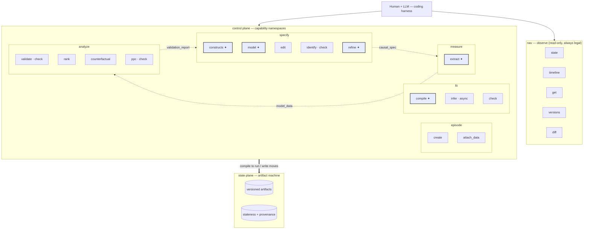

# Action Hierarchy (design)

Status: **proposal / RFC**. This is a forward-looking design, not the built system.

## Purpose

Define the **verbs** a human+LLM (working inside a coding harness) use to drive the
causal-modeling engine, exposed uniformly over MCP, curl/RPC, and an SDK. The engine's
*state* already exists as the episode artifact machine ([`machine/graph.py`](../../apps/data-pipeline/src/nof1_causal_lab/machine/graph.py),
[`machine/moves.py`](../../apps/data-pipeline/src/nof1_causal_lab/machine/moves.py)). This
document is only about the *control surface* that sits on top of it.

The main usage pattern is a coding harness: a human and an LLM collaborate, observe engine
state, and issue actions — the same way one drives a REPL or a CLI. The bespoke web UI is a
second consumer of the identical actions, not a privileged one.

## Principles

The whole design follows from one distinction and seven consequences.

- **Two planes.** The **state plane** is the artifact machine: versioned artifacts, `run`/`write`
  moves, staleness, provenance. The **control plane** is this action hierarchy. Actions *compile
  down to* moves; they never become a second state model.
- **Scoping, not sequencing.** Grouping actions under coarse verbs is a scoping of *concerns*,
  not an ordering of *steps*. An action is legal the instant its input artifacts exist — never
  "only after the previous verb." Sequence lives *only* in the state plane, implicitly, as
  staleness. This is what keeps the hierarchy from regressing into a Prefect pipeline.
- **Observe-first.** The read surface is first-class and drives the loop. Every mutating action
  returns a **state delta + affordances** (what changed, what is now stale, what to do next), so
  observe→act→observe folds into one round-trip.
- **Scoped delegation.** Heavy, self-contained actions spawn a sub-agent with a *restricted* MCP
  (least privilege — the direct lesson of the Stage-4 thrash). Light structural edits and cheap
  checks stay direct, close to the navigator, so the tight loops do not pay a handoff tax.
- **Derived checks, not stored steps.** Identifiability, validation, reachability, and fit
  diagnostics are *derived views* over the current artifacts. They can be recomputed at any
  timeline position and are never "a stage you ran once."
- **Incremental re-invocation.** Repeatable actions operate on the delta: re-extract only new
  indicators, re-identify only affected treatments. "Never repeats" is a cost artifact, not a
  principle — incremental re-invocation dissolves it.
- **Transport-agnostic.** Each action is one contract with three faces: an MCP tool for the
  LLM-in-harness, a curl/RPC endpoint for scripts and CI, and an SDK method for notebooks.
  Generated from a single action registry.
- **Versioned + scrubbable.** Every mutating action produces a new artifact *version* with
  provenance. The read surface exposes lineage and diff — the substrate for a per-artifact
  timeline scrubber.

## The two planes

```text
   human + LLM (coding harness)          <- drives
        │
        ▼
   CONTROL PLANE  — actions (this doc)    <- MCP / curl / RPC / SDK
        │  compile down to
        ▼
   STATE PLANE    — artifact machine      <- run/write moves, versions, staleness
        │
        ▼
   store (versioned artifact content on disk)
```

An action reads pinned input artifact versions, does its work (directly or via a delegated
sub-agent), and commits `run`/`write` moves that produce output versions. Humans and agents
travel the identical action→move path, distinguished only by provenance (`human | llm |
computed`).

## Hierarchy overview

Six namespaces. `nav` is cross-cutting (read-only). The other five are capability regions that
partition the artifact graph and each own a slice of the workflow. The
`specify` ↔ `measure` ↔ `analyze.validate` triangle is the iterative heart; `fit` and the rest
of `analyze` are downstream.

| Namespace | Concern | Owns artifacts | Execution character |
|---|---|---|---|
| `nav` | observe state + history | (none — reads all) | read |
| `episode` | lifecycle + roots | `question`, `raw_data` | setup |
| `specify` | design: structure + measurement + identifiability | `constructs`, `causal_spec`, `identification_report` | judgment + deterministic |
| `measure` | execute measurement | `model_data`, `extraction_report` | batch LLM |
| `fit` | estimate | `compiled_ssm`, `posterior` | judgment + deterministic + batch |
| `analyze` | validate + query | `validation_report`, `baseline_ranking`, scenarios | deterministic |



Legend: **✦** = delegated action (spawns a sub-agent with a restricted MCP — see
[Delegated sub-contexts](#delegated-sub-contexts)); **· check** = derived verdict, no mutation;
**· async** = returns a job handle. Dashed edges are the
`specify ↔ measure ↔ analyze.validate` iteration loop; the bold arrow is the control→state
compilation — every action ultimately becomes `run`/`write` moves on the artifact machine.

## Actions

Each action lists what it consumes and produces, its kind (`produce` mutates artifacts,
`check` derives a verdict without mutating domain artifacts, `read` observes), and whether it is
`direct` (executes in place) or `delegated` (spawns a scoped sub-agent — see
[Delegated sub-contexts](#delegated-sub-contexts)).

### `nav` — observe

| Action | Returns | Kind |
|---|---|---|
| `nav.state` | per-artifact `{exists, stale, version, provenance, produced_by}` + legal actions | read |
| `nav.timeline` | ordered move/version history (the provenance ribbon) | read |
| `nav.get(artifact, version?)` | artifact content, or a compact LLM-legible view | read |
| `nav.versions(artifact)` | the version lineage — the scrubber axis | read |
| `nav.diff(artifact, a, b)` | structural/semantic diff between two versions | read |

### `episode` — lifecycle + roots

| Action | Consumes → Produces | Kind | Mode |
|---|---|---|---|
| `episode.create(question)` | — → `question` | produce | direct |
| `episode.attach_data(source)` | source → `raw_data` | produce | direct |
| `episode.list` / `episode.select` | — | read | direct |

### `specify` — design plane

| Action | Consumes → Produces | Kind | Mode |
|---|---|---|---|
| `specify.constructs` | `question` → `constructs` | produce | delegated |
| `specify.model` | `question`, `raw_data`, `constructs` → `causal_spec` | produce | delegated |
| `specify.edit` | `causal_spec` → `causal_spec'` (add/remove node·edge, mark latent/observed, add/drop indicator) | produce | direct |
| `specify.identify` | `causal_spec` (+ observed-set) → identifiability verdict | check | direct |
| `specify.refine` | `causal_spec`, `model_data`, `validation_report` → `causal_spec'` | produce | delegated |

`specify.identify` is the marginalize-where-possible / drop-where-blocking computation, run as a
pure function of the DAG and an observed-set. `specify.refine` is the *same* computation driven
by the **measured** observed-set: recompute which constructs are actually observable from
`model_data`, drop degenerate indicators, cascade to constructs and incident edges, and
re-identify — producing a new `causal_spec` version, not a parallel artifact.

### `measure` — data plane

| Action | Consumes → Produces | Kind | Mode |
|---|---|---|---|
| `measure.extract` | `raw_data`, `causal_spec` → `model_data`, `extraction_report` | produce | delegated |

`measure.extract` is **incremental**: given a revised `causal_spec`, it extracts only the added
or changed indicators rather than re-measuring everything.

### `fit` — estimation plane

| Action | Consumes → Produces | Kind | Mode |
|---|---|---|---|
| `fit.compile` | `causal_spec`, `identification_report`, `model_data`, `validation_report` → `compiled_ssm` | produce | delegated |
| `fit.infer` | `compiled_ssm`, `model_data` → `posterior` | produce | direct (async) |
| `fit.check` | `compiled_ssm` / `posterior` → reachability + fit diagnostics | check | direct |

`fit.compile` is the current Stage-4 reducer (see the
[Stage 4 State Machine](../reference/model-spec/state-machine.md)) as one delegated sub-context.
`fit.infer` is long-running and returns a job handle; progress is observed through `nav.state`.

### `analyze` — query plane

| Action | Consumes → Produces | Kind | Mode |
|---|---|---|---|
| `analyze.validate` | `causal_spec`, `model_data` → `validation_report` | check | direct |
| `analyze.rank` | `posterior`, `causal_spec`, `identification_report` → `baseline_ranking` | produce | direct |
| `analyze.counterfactual` | `posterior`, `causal_spec` → scenario result | produce | direct |
| `analyze.ppc` | `posterior`, `model_data` → posterior-predictive report | check | direct |

`analyze.validate` is the bridge that feeds `specify.refine`: it flags the measured-data
problems (degeneracy, coverage) that refinement then acts on.

## Delegated sub-contexts

A delegated action opens a sub-agent whose MCP is exactly its job — no more. This is where the
"restricted MCP under the hood" lives, and where the finer, task-specific tools stay quarantined
from the navigator's context.

| Delegated action | Restricted sub-MCP (illustrative) |
|---|---|
| `specify.model` | `list_columns`, `preview_column`, `propose_indicator`, `set_node`, `set_edge`, `set_observed`, `submit_model` |
| `measure.extract` | `list_sources`, `preview_column`, `define_extraction`, `run_computed`, `run_semantic`, `submit_values` |
| `fit.compile` | `inspect_construct`, `set_family_link`, `author_prior`, `check_reachability`, `submit_construct`, `accept` |
| `specify.refine` | `list_degenerate`, `drop_indicator`, `mark_latent`, `submit_refinement` |

Direct actions (`nav.*`, `specify.edit`, `specify.identify`, `analyze.*`, `fit.infer`) do **not**
spawn a sub-agent — they execute against the state plane and return. The rule of thumb: delegate
when the work is heavy and self-contained; keep it direct when it is cheap or sits in a tight
edit→check loop (a DAG edit followed by re-identification must not cost a context handoff).

## Return contract

Every mutating action returns one envelope so the harness loop stays tight:

- `produced` / `retracted`: the artifact versions the move changed.
- `stale`: artifacts whose provenance chain was invalidated by this change (the cascade).
- `next`: suggested affordances — the legal actions most relevant to the new state.

This is why the human+LLM never has to poll separately after acting: the act *is* the next
observation.

## Worked example — the post-measurement revision loop

The degenerate-indicator failure, driven from the harness:

1. `nav.state` → sees `validation_report` present, `compiled_ssm` failed/stale.
2. `nav.get(validation_report)` → five indicators with a single observed level.
3. `specify.refine` → recomputes the observed-set from `model_data`, drops the five indicators,
   marks one now-unmeasured construct latent (marginalized) and drops another (blocking),
   re-identifies. Returns: `produced: causal_spec v2, identification_report v2`;
   `stale: compiled_ssm, posterior, baseline_ranking`; `next: fit.compile`.
4. `nav.diff(causal_spec, v1, v2)` → the human/LLM inspects exactly what the prune changed.
5. `measure.extract` (only if refinement *added* a proxy) — incremental, skipped here.
6. `fit.compile` → re-authors only the affected constructs → `compiled_ssm v2`.
7. `fit.infer` → `posterior v2`; `analyze.rank` → `baseline_ranking v2`.

The revision is one `causal_spec` lineage with two versions — the exact substrate a per-artifact
scrubber renders (`nav.versions(causal_spec)` → v1 pre-measurement, v2 post-measurement).

## Why not one action per stage

One action per stage is the tempting skeleton, but it is wrong as the public surface:

- It leaks internal stage numbers into the API and couples callers to the graph's shape.
- Some stages are a whole sub-hierarchy, not one action (`fit.compile` is the Stage-4 reducer).
- Some essential actions are not stages at all — the light `write`-move edits (`specify.edit`)
  and the derived checks (`specify.identify`).
- The most-used surface in a coding harness — `nav.*` — has no stage at all.
- It hides the delegation boundary, which is exactly the boundary that makes the surface safe.

The heavy `produce` actions do roughly align one-to-one with stages (`fit.compile` ≈ 4,
`fit.infer` ≈ 5b, `measure.extract` ≈ 2) — but named by intent, and surrounded by the read,
edit, check, and delegation structure that stages alone cannot express.

## Open decisions

- **`specify.refine`: deterministic gate vs LLM re-invocation.** The degeneracy is a mechanical
  fact (deterministic), but drop-vs-keep-latent is the judgment the `specify.model` sub-agent
  already makes. Choose one, or a deterministic core with optional LLM review.
- **Checks: stored artifacts or pure derived views?** `identification_report` and
  `validation_report` are stored today, but conceptually they are derived. Making them derived
  turns the fit-gate (which currently keys off `identification_report` *existence*) into a
  content predicate — a deliberate change to the graph's "pure existence, no content predicates"
  rule.
- **One registry, three transports.** Confirm we generate MCP tools, RPC endpoints, and the SDK
  from a single action registry (aligns with the existing `packages/api-types` codegen).
- **Async model.** `fit.infer` and `measure.extract` are long — confirm job handles observed via
  `nav.state`, consistent with the polling-not-streaming stance.
- **Namespace set.** Confirm the six namespaces, and whether `analyze.validate` should live under
  `specify` (it drives refinement) or stay a standalone check.
