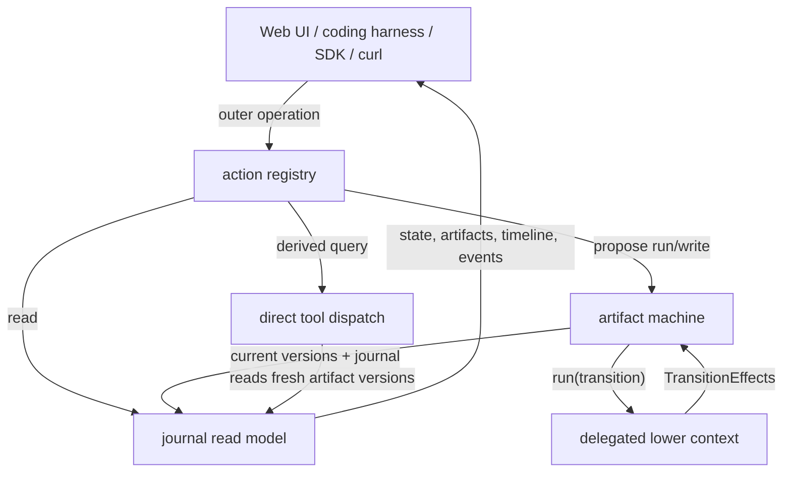
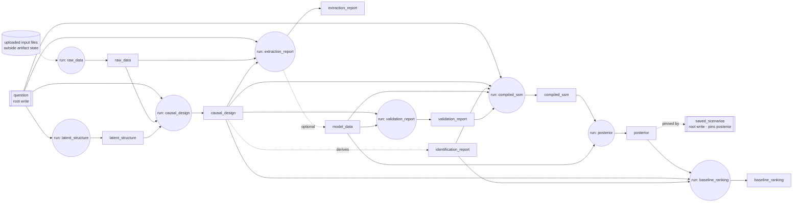
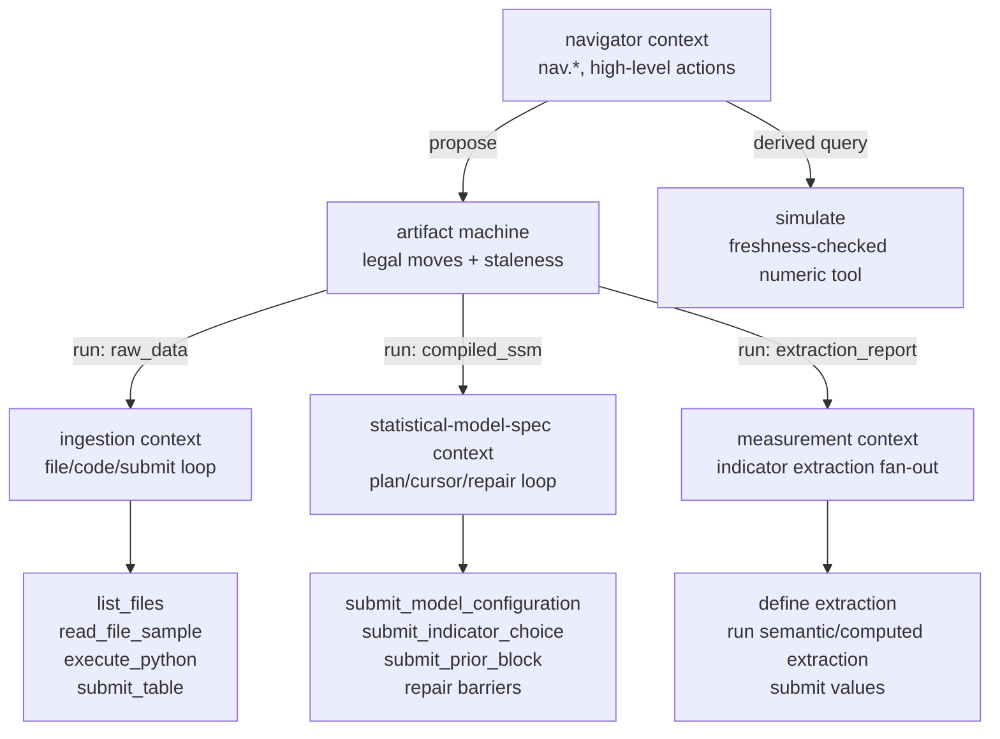

# Action Hierarchy and State-Machine Contexts (design)

Status: **proposal / RFC**. This is a forward-looking design, not the built system.

## Purpose

The engine's state is an **artifact machine**: the nodes are artifacts, and the only thing
that changes state is a rule that *creates an artifact*. This document specifies that ruleset —
which artifacts exist, how each one comes into being, when a creation is legal, and what becomes
stale — plus the control and context hierarchy that sits above it.

Read it as three nested layers:

1. **Outer operations**: what a human, LLM navigator, web UI, script, or notebook can ask the
   system to do.
2. **Lower contexts**: the scoped loops opened by heavy operations, such as Stage 0 ingestion
   exploration or the Stage 4 model/prior reducer.
3. **Artifact machine**: the artifact-level ruleset that decides which creations are legal, what
   changed, what became stale, and which numeric claims can still be served.

The machine core lives in
[`machine/graph.py`](../../apps/data-pipeline/src/nof1_causal_lab/machine/graph.py) (the artifact
ruleset), [`machine/moves.py`](../../apps/data-pipeline/src/nof1_causal_lab/machine/moves.py)
(legality, staleness, freshness), and
[`machine/writes.py`](../../apps/data-pipeline/src/nof1_causal_lab/machine/writes.py) /
[`machine/runners.py`](../../apps/data-pipeline/src/nof1_causal_lab/machine/runners.py) (the
executors that realize a creation). This document specifies the model those files encode and the
naming/context layer above them.

The main usage pattern is a coding harness: a human and an LLM collaborate, observe engine state,
and issue actions the same way they drive a REPL or a CLI. The web UI is the default visual
navigator over the same actions, not a privileged orchestration layer.

## Core Shape

The important separation is:

- An **outer operation** is what the navigator is trying to accomplish, for example "ingest
  uploaded data", "recompute stale outputs", "edit the causal model", or "simulate an
  intervention".
- A **lower context** is the restricted tool loop opened to complete one heavy operation, for
  example the ingestion agent's file/code loop or the Stage 4 reducer's block/repair loop.
- A **machine move** is the only mutating transition the machine accepts: `write(artifact)` or
  `run(transition)`.

Outer operations compile to reads, derived queries, or machine moves. Lower-context tools never
become public workflow steps; they are private to the scoped context that opened them.

## The Artifact Machine

The machine's state is a versioned artifact store. Every artifact version is immutable and records
provenance plus the exact input artifact versions it was derived from (`derived_from`). That stamp
is what makes staleness and freshness *derived* properties rather than stored flags.

An artifact enters the store exactly one of three ways — this is the whole ruleset:

| Creation kind | What it is | Examples |
|---|---|---|
| **Produced** | A `run(transition)` computes it from its inputs. A transition is named by the primary artifact it produces; `stage_id` is only its execution/runner label. | `raw_data`, `latent_structure`, `causal_design`, `posterior` |
| **Written** | A caller supplies the payload directly (`write(artifact)`), schema-validated and provenance-stamped `human`/`llm`. Includes roots (no producing transition) and writable produced artifacts. | roots: `question`, `saved_scenarios`; writable: `latent_structure`, `causal_design`, … |
| **Derived** | A deterministic milestone recomputed whenever its parent artifact is (re)created — by run *or* by write. It has no independent producer and is never written directly. | `identification_report` from `causal_design` |

Each produced artifact's transition declares:

- `consumes` — the inputs whose existence gates the run (the guard; see below).
- `produces_optional` — substantive co-outputs withheld on a negative finding (e.g. `model_data`
  when extraction yields nothing usable). Withholding one on a re-run **retracts** the stale
  version.
- `derives` — deterministic milestones (e.g. `identification_report`) recomputed on every
  creation of the primary and retracted when the finding goes empty.
- `creation_class` — `deterministic` | `batch_llm` | `judgment` (see [Creation classes](#creation-classes)).
- `writable` — whether a caller may also supply the primary artifact directly via `write`.

Roots declare `write_pins`: the inputs a direct write should stamp into `derived_from` so the
written artifact participates in staleness like any computed one. `saved_scenarios` pins the
`posterior` it was simulated against; `question` pins nothing.

`identification_report` has a single origin — it is *derived from* `causal_design` — whether that
`causal_design` arrived by a `run` (Stage 1b) or by a direct `write`/edit. There is no second
producer and no directly-writable `identification_report`; the epistemic gate ("numeric claims
only when identification supports them") is exactly the presence of this derived milestone, and it
tracks the spec automatically.

### How movement is restricted

Two questions the machine keeps strictly separate, following the build-systems literature that
splits a build into a *rebuilder* (what is out of date) and a *scheduler* (what to run next):

- **Legality (may I create this now?)** — a pure existence check, no content predicates. A
  `run` is legal iff every `consumes` artifact exists. A `write` is legal for any writable
  artifact/root, gated only by schema validation and a non-`computed` provenance. This is the
  entire machine legality surface (`moves.validate_move`).
- **Staleness (is an existing artifact still current?)** — derived from `derived_from`. An
  artifact is stale iff any pinned input is absent, has moved past the pinned version, or is
  itself transitively stale. Roots (empty `derived_from`) are never stale; a pinned root like a
  saved scenario is stale when its pinned `posterior` moves.

| Mechanism | Restriction |
|---|---|
| Guards on `run` | A transition runs only when every `consumes` artifact exists. `compiled_ssm` is impossible until `question`, `causal_design`, `identification_report`, `model_data`, and `validation_report` exist — so it is unreachable without an identification milestone. |
| `write` legality | A write must be schema-valid and provenance-stamped `human`/`llm`. It installs a new version and, for roots with `write_pins`, stamps the pinned inputs. |
| Optional milestones | `produces_optional` artifacts appear only when the finding is nonempty; absence disables downstream consumers. |
| Derived milestones | `derives` artifacts are recomputed on every creation of their parent and retracted when the finding goes empty — the parent and its derivation move together. |
| Retractions | Re-running a transition retracts an optional/derived artifact the new run withholds, so downstream enabledness reflects the new finding. |
| Version pins + freshness gate | Every artifact pins the exact input versions it consumed. Numeric query surfaces must refuse or hard-flag results whose provenance chain is stale — a stale `posterior` is not a valid basis for reported causal numbers. |

The auto-run driver is only a **scheduler policy** over this machine: it walks artifacts in
dependency order and proposes the next legal `run` whose output is missing or stale. It adds no
second legality model.

### Creation classes

`creation_class` describes *how* a produced artifact is computed, and therefore whether an external
agent can shortcut the run by writing the artifact itself:

- `deterministic` — needs no credentials (`validation_report`, `posterior`).
- `batch_llm` — bulk LLM compute on the service's ambient key (`raw_data`, `extraction_report`).
- `judgment` — proposal work an external agent can do itself, so these transitions are also
  `writable` (`latent_structure`, `causal_design`, `baseline_ranking`).

Creation class and writability are declared independently rather than inferred from one another,
because the correspondence is not total: `compiled_ssm` is `judgment`-shaped but not hand-writable
(its payload is a compiled artifact), and some report artifacts are writable for override without
being judgment work.

## Borrowed Concepts (prior art)

This design deliberately reuses four established lineages. Each owns a different half of the
problem; the mapping below is the rationale for the choices above.

| Lineage | What we take | Where it lands |
|---|---|---|
| **Artifact-centric BPM — Guard-Stage-Milestone (GSM) → OMG CMMN** (IBM Research; Hull et al.) | The artifact-first framing itself: model the business *artifact* and its lifecycle with declarative rules, not an imperative flow. **Sentries** → our `run` guards. **Milestones** (objectives that become true and can be invalidated) → our `produces_optional` / `derives` and their retraction. GSM stages nest sub-stages → our lower contexts. | The whole [Artifact Machine](#the-artifact-machine) section; guard/milestone vocabulary. |
| **Dagster Software-Defined Assets** | The reframe from task-centric to asset-centric: an asset is `(key, op, upstream keys)` — the artifact is the identity, the transition an attribute. Their critique of task orchestration ("which process updated this asset? is it current?") is the critique of a stage-keyed surface. Observable-source-style pinning → `saved_scenarios` pinning `posterior`. Declarative Automation → the driver as per-artifact policy. | Transitions named by output; `write_pins`; the scheduler-as-policy stance. |
| **Build Systems à la Carte / Salsa** (Mokhov et al.; rust-analyzer) | The *scheduler × rebuilder* split (kept strictly separate above). Verifying traces (our version-pinned `derived_from`). **Early cutoff** — stop the stale cascade when a recompute yields an unchanged value — is noted as a deferred extension (it requires content-hashed pins in the store). | [How movement is restricted](#how-movement-is-restricted); Open Decisions. |
| **Harel statecharts / UML HSM** | Hierarchically nested states and **run-to-completion**: a composite state runs to completion before the parent sees the next event. Our heavy transitions are composite states whose private FSM (cursor, block statuses, repair loop) is invisible to the parent, which sees only the final `TransitionEffects`. Orthogonal regions → the DAG's independent branches and the Stage 2 worker fan-out. | [Context Hierarchy](#context-hierarchy); the "one operation, not a bag of tools" rule. |

## Legality vs Affordance

Machine **legality** (above) is existence-only and lives in the core. The action layer computes a
strictly separate **affordance** set — which actions are worth *surfacing and ranking* for the
navigator. Affordance may be stricter than legality:

- `analyze.save` compiles to `write(saved_scenarios)`, which is always machine-legal, but is only
  worth offering once a `posterior` exists.
- `specify.refine` compiles to `write(causal_design)` — always machine-legal — but is only a
  sensible affordance once `model_data` and `validation_report` exist to refine against. That
  extra condition is an affordance guard, not a machine gate; the machine still accepts the write
  on its own terms.

Keeping these apart means there is exactly one legality engine (`moves.validate_move`), and the
richer per-action preconditions live where they belong — in the surfacing layer — instead of
silently becoming a shadow legality model.

## Current Web Operations as Outer Operations

The web app already demonstrates the outer operation layer, even though it currently names many
things by stage.

| Outer operation | Current web/facade behavior | Target action name | Machine effect |
|---|---|---|---|
| Start an analysis | `POST /api/episodes` optionally writes the question | `episode.create` | `write(question)` |
| Attach uploaded data | Files are placed under the workspace input directory | `episode.attach_data` | Staged upload, outside the artifact store until ingestion |
| Ingest data | Auto-run or manual run invokes Stage 0 | `episode.ingest_data` | `run` producing `raw_data` |
| Run / recompute | `POST /api/episodes/{workspace}/auto` starts the default driver | `episode.refresh` | Scheduler policy: proposes legal `run` moves for missing or stale outputs |
| Inspect state | Episode status, artifact payloads, timeline, and runtime events | `nav.state`, `nav.get`, `nav.timeline`, `nav.events` | Read-only |
| Edit a result artifact | Web edits or harness proposals write a replacement artifact version | `specify.edit`, `analyze.save` | `write(latent_structure)`, `write(causal_design)`, `write(saved_scenarios)`, etc. |
| Simulate from a fitted model | `POST /api/tools/dispatch` invokes the Stage 6 `simulate` tool | `analyze.simulate` | Derived query over fresh artifact versions; no artifact mutation unless saved later |

This table is the public surface we should preserve while renaming it by intent. The redesign
should not expose Stage 0's `list_files` or Stage 4's `submit_prior_block` as top-level actions.
Those are lower-context operations.

## Context Hierarchy

Context means the local state, allowed tools, and authority visible to the active agent.

| Layer | Scope | Owns | May mutate artifacts? |
|---|---|---|---|
| Navigator context | Human+LLM harness, web UI, SDK, curl | The current episode view, affordances, timeline, artifact diffs | Only by proposing machine moves |
| Action registry | Transport-independent action contracts | Mapping from intent names to reads, queries, or moves | No; it routes to the machine |
| Machine context | One serialized transition at a time | Current artifact versions, legal moves, staleness, journaled outcomes | Yes, by applying `write` or successful `run` effects |
| Delegated transition context | One heavy operation (a composite state) | Transition-local runtime state, restricted tool set, repair loop | No direct mutation; returns produced/retracted artifacts to the machine |
| Tool/sandbox context | One helper call inside a delegated context | File samples, sandbox execution, validation helpers, literature lookup | No |

A delegated context is a **composite state** with run-to-completion semantics: the navigator sees
it as one operation with progress and trace events, not as a bag of public tools, and the machine
sees only its final `TransitionEffects` — never its internal cursor or block states. Derived
numeric queries (`simulate`, `counterfactual`, `ppc`) are **read surfaces**, not contexts and not
machine moves: they read fresh artifact versions and are freshness-gated at serve time, returning
a hard flag when the provenance chain is stale.

## Lower Context Examples

| Outer operation | Machine move | Lower context state | Lower operations | Exit condition |
|---|---|---|---|---|
| `episode.ingest_data` | `run` → `raw_data` | Prepared input directory, sandbox, latest `result_df`, column descriptions | `list_files`, `read_file_sample`, `execute_python`, `submit_table` | `submit_table` validates a single timestamped Polars table, producing `raw_data` |
| `specify.latent_structure` | `run` → `latent_structure` or `write(latent_structure)` | Question-focused latent-structure proposal context | propose constructs, revise descriptions, submit construct set | `latent_structure` version exists |
| `specify.model` | `run` → `causal_design` or `write(causal_design)` | DAG, indicators, observed set, identification check | inspect columns, propose indicators, set nodes/edges, mark observed/latent, submit model | `causal_design` exists; `identification_report` derives only if at least one treatment is identified |
| `measure.extract` | `run` → `extraction_report` | Indicator extraction plan and worker fan-out | define extraction, run computed extraction, run semantic extraction, submit values | `extraction_report` exists; `model_data` co-produced only if measurement yielded usable data |
| `analyze.validate` | `run` → `validation_report` | Measured-data diagnostics over `causal_design` and `model_data` | coverage checks, degeneracy checks, construct observability checks | `validation_report` exists |
| `fit.compile` | `run` → `compiled_ssm` | Stage 4 skeleton, immutable plan, runtime cursor, accepted state, repair campaign | block submissions, model lock, prior authoring, deterministic repair routing, barrier validation | `compiled_ssm` exists |
| `fit.infer` | `run` → `posterior` | Long-running inference job | fit exact nonlinear SSM engines, emit progress | `posterior` exists |
| `analyze.rank` | `run` → `baseline_ranking` | Baseline causal-query context over a fresh posterior | rank identified effects | `baseline_ranking` exists |
| `analyze.simulate` | Derived query tool | Current fitted model and scenario input | Stage 6 `simulate` | Returns a scenario result; saving it is a later `write(saved_scenarios)` |

`compiled_ssm`'s transition is the clearest nested state machine. The outer operation is just
`fit.compile`; inside that composite state, the reducer owns a cursor (`block`, `statistical_model_spec_lock`,
`repair_barrier`, `done`), block statuses (`pending`, `accepted`, `reopened`, `inactive`), accepted
state, and deterministic repair routing. The machine does not know about those prompt blocks. It
only knows whether the run eventually produced `compiled_ssm`, raised an error, or left state
unchanged.

## Target Action Names

The public control surface is named by intent, not by stage number. Each action has one contract
with three transport faces: MCP for the harness, RPC/curl for scripts and CI, and SDK methods for
notebooks.

| Namespace | Concern | Typical action names | Machine mapping |
|---|---|---|---|
| `nav` | Observe state and history | `state`, `timeline`, `events`, `get`, `versions`, `diff` | Read journal/artifact store |
| `episode` | Lifecycle and roots | `create`, `attach_data`, `ingest_data`, `refresh` | `write(question)`, staged upload, `run` → `raw_data`, scheduler policy |
| `specify` | Design causal and measurement structure | `latent_structure`, `model`, `edit`, `identify`, `refine` | `run` → `latent_structure`/`causal_design`, `write(causal_design)`, derived checks |
| `measure` | Execute measurement | `extract` | `run` → `extraction_report` |
| `fit` | Compile and estimate | `compile`, `infer`, `check` | `run` → `compiled_ssm`/`posterior`, derived diagnostics |
| `analyze` | Validate and query | `validate`, `rank`, `simulate`, `counterfactual`, `ppc`, `save` | `run` → `validation_report`/`baseline_ranking`, derived tools, `write(saved_scenarios)` |

The `specify` → `measure` → `analyze.validate` loop is the iterative design loop. `fit` and the
rest of `analyze` are downstream because they require an identified, measured, validated, and
compiled model.

## Return Contract

Every mutating action returns the same envelope, so the harness loop does not need to poll just to
understand what happened.

| Field | Meaning |
|---|---|
| `produced` | Artifact versions newly installed as current. |
| `retracted` | Optional/derived artifacts removed from current because a new creation withheld them. |
| `stale` | Existing artifacts whose provenance chain is no longer fresh after this move. |
| `legal` | The new legal move set at this state. |
| `next` | Suggested affordances, ranked for the current context. |

Reads return the same state vocabulary without mutation. Derived query tools return their result
plus freshness warnings when the input provenance chain is not fresh.

## Worked Example: Degenerate Indicator Revision

1. `nav.state` shows `validation_report` present and `compiled_ssm` missing or stale.
2. `nav.get(validation_report)` shows five indicators with a single observed level.
3. `specify.refine` opens a scoped refinement context. It recomputes the measured observed set
   from `model_data`, drops the degenerate indicators, marks one now-unmeasured construct latent,
   drops another construct whose causal query is blocked, and re-runs identification.
4. The machine applies the resulting `write(causal_design)` as a new `causal_design` version;
   `identification_report` is re-derived or retracted according to the finding, in the same move.
5. Version pins make `compiled_ssm`, `posterior`, and `baseline_ranking` stale if they still exist.
6. `nav.diff(causal_design, v1, v2)` shows the exact structural change.
7. `fit.compile` becomes a useful affordance only if its required inputs exist, including an
   `identification_report`.
8. `fit.infer` and `analyze.rank` become useful only after `compiled_ssm` and then `posterior`
   are fresh.

The revision is one `causal_design` lineage with multiple versions. The timeline scrubber follows
artifact versions; it does not invent a separate workflow state.

## Why Not One Action Per Stage

One action per stage is the tempting skeleton, but it is wrong as the public surface:

- It leaks internal stage numbers into the API and couples callers to the graph's current shape.
- Some transitions contain a lower state machine, not one user-level action. The `compiled_ssm`
  reducer is a composite state inside `fit.compile`.
- Some essential operations are not transitions, including artifact edits, diffs, freshness
  checks, and direct simulation queries.
- The most-used harness surface is read navigation, which has no transition at all.
- It hides the delegation boundary, which is exactly the boundary that keeps broad navigator
  context separate from restricted lower contexts.

The heavy produce actions still map to transitions internally. They are named by the modeling
intent and surrounded by read, edit, check, and delegation structure that stage numbers alone
cannot express.

## Open Decisions

- **Early cutoff.** Version-integer pins over-cascade: any re-run stales all descendants even on
  byte-identical output. Content-hashed pins (Bazel/Salsa style) would add early cutoff, but touch
  the store's write path — deferred to a follow-up rather than bundled into this reframe.
- **Code-version staleness.** Editing a runner or prompt currently stales nothing downstream.
  Dagster's `code_version` mechanism would close this, but is explicitly out of scope for now.
- **`specify.refine`: deterministic gate vs LLM re-invocation.** The degeneracy is a mechanical
  fact, but drop-vs-keep-latent is a judgment the `specify.model` context already makes. Choose
  one, or use a deterministic core with optional LLM review.
- **Checks: stored artifacts or pure derived views?** `validation_report` is stored today, but
  conceptually it is a derived view. `identification_report` has already moved to a derived
  milestone of `causal_design`; whether `validation_report` should follow (turning fit enabledness
  from existence into a content predicate) is still open.
- **One registry, three transports.** Confirm that MCP tools, RPC endpoints, and SDK methods are
  generated from one action registry, aligned with the existing `packages/api-types` codegen.
- **Async model.** Confirm that long operations such as `fit.infer` and possibly `measure.extract`
  return job handles observed through `nav.state`, consistent with the polling-not-streaming
  stance.
