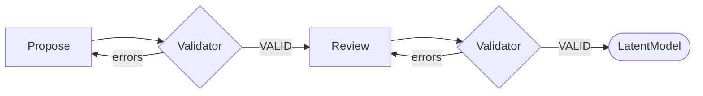

# Stage 1a: Latent Model Proposal

| Modality | Interactive | Produces |
|---|---|---|
| Semantic | Yes | [`LatentModel`](#latentmodel) |

Builds a causal DAG[^pearl2009] ([`LatentModel`](#latentmodel)) from the natural language research question.

## Inputs

| Input | Source | Description |
|---|---|---|
| `question` | User | User's research question in natural language |

Notably, there is no observed data input at this stage.

## Process

Stage 1a runs a single LLM conversation in which the LLM reasons purely from domain knowledge and the research question to specify a theoretical causal DAG.

The conversation has two phases: an initial proposal checked by a structural validation tool, followed by a self-review pass using the same validator.

**Propose:** The LLM works backward from the outcome implied by the question: what directly causes it, what causes those causes, and so on. The goal is completeness over parsimony: downstream pipeline stages will prune based on identifiability; this stage must not omit anything causally important.

Each proposed construct is classified by [role and temporal status](../reference/latent-model/constructs-and-edges.md#construct-dimensions), and each directed edge carries a [lag designation](../reference/latent-model/constructs-and-edges.md#edge-lag-rules)—lagged (cause at *t−1* → effect at *t*) or contemporaneous (within the same time index).

**Validator:** The LLM submits its proposal via a `validate_latent_model` tool call. The tool enforces the `LatentModel` contract:

- *Construct-role invariants and temporal rules* from [constructs-and-edges.md](../reference/latent-model/constructs-and-edges.md)
- *Assumption-derived restrictions* from [A4](../reference/latent-model/assumptions.md#a4-acyclicity-within-time-slice), [A4b](../reference/latent-model/assumptions.md#a4b-endogenous-time-varying-directed-effects-are-drift-mediated), and [A5](../reference/latent-model/assumptions.md#a5-time-invariant-latents-as-subject-level-static-states)
- *Outcome reachability:* the designated outcome must have at least one incoming edge

On failure the tool returns the specific errors; the LLM revises and resubmits within the same conversation until the tool returns VALID.

**Review:** A follow-up prompt then asks the LLM to review its validated model for theoretical coherence—outcome clarity, causal completeness, edge justification, temporal consistency, and whether exogenous designations are appropriate. If the review surfaces issues, the LLM revises and re-validates before the conversation ends.

### Example

For a question about whether tutoring intensity improves exam performance through study confidence, Stage 1a may posit constructs such as `Tutoring Intensity`, `Study Confidence`, `Prior Mastery`, and `Exam Performance`. Causal edges would connect `Tutoring Intensity` → `Study Confidence` → `Exam Performance`, with a lagged edge from `Prior Mastery` → `Exam Performance`.

## Outputs

| Output | Type | Description |
|---|---|---|
| `latent_model` | `LatentModel` | Theoretical causal topological structure over latent constructs |
| `llm_trace` | `LLMTrace` | Conversation trace for UI provenance and debugging |

### `LatentModel`

| Field | Type | Description |
|---|---|---|
| `constructs` | `list[Construct]` | Theoretical constructs in the model. Exactly one construct must have `is_outcome=true`. |
| `edges` | `list[CausalEdge]` | Directed causal edges between constructs. `lagged=true` means the effect at time `t` depends on the cause at `t-1`. |

Each `Construct` carries `name`, `description`, `role`, `is_outcome`, and `temporal_status`. Each `CausalEdge` carries `cause`, `effect`, `description`, and `lagged`. There is no notion of latent confounding yet.

[^pearl2009]: Pearl, J. (2009). *Causality: Models, Reasoning, and Inference* (2nd ed.). Cambridge University Press. [Bibliography entry](../reference/bibliography.md)
