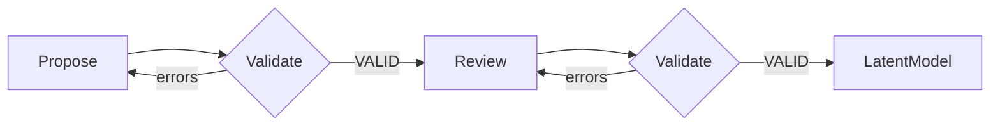

# Stage 1a: Latent Model Proposal

| Modality | Interactive | Gate | Produces |
|---|---|---|---|
| Semantic | Yes | No | [`LatentModel`](#latent-model) |

Builds a [`LatentModel`](#latent-model) from the natural language research question.

## Inputs

| Input | Source | Description |
|---|---|---|
| `question` | User | User's research question in natural language |

Notably, there is no observed data input at this stage.

## Process

Stage 1a runs a single LLM conversation in which the LLM reasons purely from domain knowledge and the research question to come up with a purely theoretical causal DAG.

The conversation has two phases: an initial proposal grounded by a structural validation tool, followed by a self-review pass.

**Backward reasoning from the outcome.** The LLM works backward from the outcome implied by the question: what directly causes it, what causes those causes, and so on. The goal is completeness over parsimony: downstream stages will prune based on identifiability; this stage must not omit anything causally important.

Each proposed construct is classified by [role and temporal status](../reference/latent-model/constructs-and-edges.md#construct-dimensions), and each directed edge carries a [lag designation](../reference/latent-model/constructs-and-edges.md#edge-lag-rules)—lagged (cause at *t−1* → effect at *t*) or contemporaneous (within the same time index).

**Validation loop.** The LLM submits its proposal via a `validate_latent_model` tool call. The tool enforces the `LatentModel` contract: construct-role invariants and temporal rules from [constructs-and-edges.md](../reference/latent-model/constructs-and-edges.md), plus assumption-derived restrictions from [A4](../reference/latent-model/assumptions.md#a4-acyclicity-within-time-slice), [A4b](../reference/latent-model/assumptions.md#a4b-endogenous-time-varying-directed-effects-are-drift-mediated), and [A5](../reference/latent-model/assumptions.md#a5-time-invariant-latents-as-subject-level-static-states). It also requires the designated outcome to have at least one incoming edge so the stage does not terminate on an effect-free target.

On failure the tool returns the specific errors; the LLM revises and resubmits within the same conversation until the tool returns VALID.

**Self-review.** A follow-up prompt then asks the LLM to review its validated model for theoretical coherence—outcome clarity, causal completeness, edge justification, temporal consistency, and whether exogenous designations are appropriate. If the review surfaces issues, the LLM revises and re-validates before the conversation ends.

## Outputs

| Output | Type | Description |
|---|---|---|
| `latent_model` | `LatentModel` | Theoretical causal topological structure over latent constructs |

The public stage payload exposes that artifact directly. It may also include `llm_trace` as runtime provenance for the UI.

## Definitions

### Latent Model

Stage 1a emits a `LatentModel` with two top-level fields:

| Field | Type | Description |
|---|---|---|
| `constructs` | `list[Construct]` | Theoretical constructs in the model. Exactly one construct must have `is_outcome=true`. |
| `edges` | `list[CausalEdge]` | Directed causal edges between constructs. `lagged=true` means the effect at time `t` depends on the cause at `t-1`. |

Each `Construct` carries `name`, `description`, `role`, `is_outcome`, and `temporal_status`. Each `CausalEdge` carries `cause`, `effect`, `description`, and `lagged`.

The designated outcome is encoded on the outcome construct via `is_outcome=true`. Candidate intervention variables are derived from the validated graph rather than stored as separate Stage 1a state.

For construct semantics, edge legality, lag rules, and user-facing DAG conventions, see [reference/latent-model/constructs-and-edges.md](../reference/latent-model/constructs-and-edges.md).

Example: for a question about whether tutoring intensity improves exam performance through study confidence, Stage 1a may posit constructs such as `Tutoring Intensity`, `Study Confidence`, `Prior Mastery`, and `Exam Performance`, plus directed edges between them and an explicit latent confounder node if an unobserved common cause is believed to exist.
