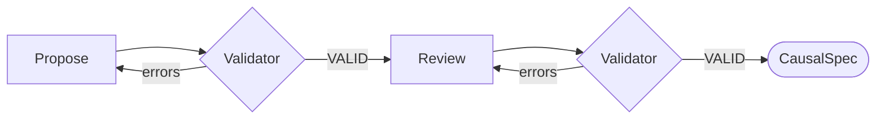

# Stage 1b: Measurement Model and Identifiability

| Modality | Interactive | Produces |
|---|---|---|
| Semantic | Yes | [`CausalSpec`](#causalspec) |

Operationalizes the [`LatentModel`](01a-latent-model.md#latent-model) against observed data by specifying indicators for each construct, then checks whether each treatment-to-outcome effect is causally identifiable.

## Inputs

| Input | Source | Description |
|---|---|---|
| `question` | User | Original research question, used to justify measurement choices |
| `latent_model` | [Stage 1a](01a-latent-model.md) | `LatentModel` with constructs and edges |
| `raw_dataframe` | [Stage 0](00-ingestion.md) | Raw dataframe with column descriptions |

Stage 1a provided theoretical structure without seeing any data. Stage 1b is the first point where the model meets the dataset.

## Process

Stage 1b runs one LLM conversation that bridges theory and data. The LLM sees the latent model, the research question, and a schema summary of the ingested dataset. The conversation has two phases: an initial measurement-model proposal checked by a validation tool that enforces both measurement and identifiability constraints, followed by a self-review pass using the same validator.

**Propose:** For each construct in the latent model, the LLM proposes one or more indicators: observed variables that operationalize the construct in this dataset. Each indicator names the source columns it uses, how extraction will work, what kind of value it produces, and over what support window that value is defined.

**Validator:** The LLM submits its proposal via a `validate_measurement_model` tool call. The tool checks schema and compiler constraints:

- *Outcome coverage:* every outcome construct has at least one indicator
- *No duplicate indicator definitions* across indicators
- *Valid construct references:* indicator references point to constructs in the latent model
- *Dtype–aggregation compatibility:* `measurement_dtype` and `aggregation` are compatible
- *Computed-rule well-formedness:* computed indicators have valid rule expressions

It then checks [causal identifiability](../reference/causal-spec/identifiability.md) for each treatment-to-outcome pair. If some effects are blocked by an unobserved confounder, the tool reports which confounder is the problem and suggests adding proxy indicators to restore identifiability.

**Review:** A follow-up prompt asks the LLM to review its validated measurement model for coverage, operationalization clarity in `how_to_measure`, observation-window semantics, the [reflective measurement assumption](../reference/measurement-model/assumptions.md#a1-reflective-measurement-model), and absence of cumulative or running metrics. If the review surfaces issues, the LLM revises and re-validates before the conversation ends.

### Example

For a study of developer workload and code quality where Stage 1a posited an unobserved confounder `Organizational Pressure`, Stage 1b might map `Developer Workload` to indicators like "number of open PRs assigned" (computed, count) and "sprint velocity" (computed, mean), map `Review Thoroughness` to "average review comment count per PR" (computed, mean), and add a proxy indicator "manager-reported deadline pressure" (semantic, ordinal) to restore identifiability of the `Organizational Pressure` confounder path.

## Outputs

| Output | Type | Description |
|---|---|---|
| `causal_spec` | [`CausalSpec`](#causalspec) | Combined latent model, measurement model, and identifiability status |
| `llm_trace` | `LLMTrace` | Conversation trace for UI provenance and debugging |

### `MeasurementModel`

| Field | Type | Description |
|---|---|---|
| `indicators` | `list[Indicator]` | Observed indicators attached to constructs |
| `model_clock` | `str` | Shared observation-window width used for extraction, discretization, and the default lag unit for construct-level temporal semantics |

Indicators are reflective: the construct causes the indicator value, not the reverse. The assumptions behind that commitment live in [measurement-model/assumptions.md](../reference/measurement-model/assumptions.md).

### `Indicator`

| Field | Type | Description |
|---|---|---|
| `name` | `str` | Indicator name used everywhere downstream |
| `construct_name` | `str` | Name of the parent construct in the latent model |
| `how_to_measure` | `str` | Human-readable measurement instructions grounded in the dataset |
| `measurement_dtype` | `str` | Semantic value type: `continuous`, `binary`, `count`, `ordinal`, or `categorical` |
| `aggregation` | `str` | Summary operator applied within each realized support window |
| `observation_window` | `str` | Window width such as `"1d"` or `"1w"` over which one indicator value is defined |
| `ordinal_levels` | `list[str]` \| `null` | Ordered labels when `measurement_dtype="ordinal"` |
| `source_columns` | `list[str]` | Raw columns needed to compute or interpret the indicator |
| `extraction_mode` | `str` | Whether extraction is deterministic (`computed`) or LLM-mediated (`semantic`) |

### `observation_window` and `model_clock`

Examples of indicator-level observation windows:

- "Average heart rate over the previous day"
- "Number of production incidents during the previous week"
- "Teacher feedback sentiment in the current grading period"

Different indicators may use different `observation_window` values as long as they are aligned back onto the shared `model_clock`.

### Indicator Level `aggregation`

| Operator | Support meaning | Typical anchor |
|---|---|---|
| `mean` | Average level over the window matters | `support_end` |
| `sum` | Cumulative amount over the window matters | `support_end` |
| `count` | Event frequency over the window matters | `support_end` |
| `last` | The most recent observed state in the window matters | `support_end` |
| `first` | The earliest observed state in the window matters | `support_start` |
| `std` | Within-window instability matters | `support_end` |

These are substantive commitments, not mere implementation details. A daily mean mood score and an end-of-day mood score encode different theories of what matters.

### Derived Observation Semantics

The `MeasurementModel` does not store row timestamps itself, but it fully determines the row-level support semantics that [Stage 2](02-indicator-extraction.md) materializes into [`ObservationRecord`](02-indicator-extraction.md#observationrecord) fields. The derivation is deterministic: the indicator's `aggregation` operator selects the `support_kind` (point vs. interval) and the `anchor_policy` per the "Typical anchor" column above.

### `CausalSpec`

`CausalSpec` is the combined input to downstream stages that includes the Stage 1a latent model, the Stage 1b measurement model, and the derived identifiability status:

| Field | Type | Description |
|---|---|---|
| `latent` | [`LatentModel`](01a-latent-model.md#latent-model) | The validated Stage 1a construct-level graph |
| `measurement` | [`MeasurementModel`](#measurementmodel) | The indicator mapping and model clock introduced here |
| `identifiability` | [`IdentifiabilityStatus`](#identifiabilitystatus) \| `null` | Treatment-level identifiability results from the Stage 1b checker |

### `IdentifiabilityStatus`

| Field | Type | Description |
|---|---|---|
| `identifiable_treatments` | `dict[str, IdentifiedTreatmentStatus]` | Treatment names mapped to the identification method, estimand, marginalized confounders, and any instruments used |
| `non_identifiable_treatments` | `dict[str, NonIdentifiableTreatmentStatus]` | Treatment names mapped to the blocking confounders and optional notes |

The identifiability assumptions, including temporal unrolling and the internal DAG-to-ADMG projection, live in [causal-spec/identifiability.md](../reference/causal-spec/identifiability.md).
