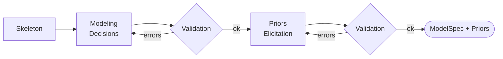

# Stage 4: Model Specification and Prior Elicitation

| Modality | Interactive | Produces |
|---|---|---|
| Semantic | Yes | `ModelSpec`, `PriorProposal` per parameter |

Translates the [Stage 1b `CausalSpec`](01b-measurement-identifiability.md#causalspec) into a fully specified statistical model by choosing observation-model distributions for ambiguous indicators and eliciting Bayesian priors for every parameter, validated against prior predictive checks.

## Inputs

| Input | Source | Description |
|---|---|---|
| `question` | User | Original research question, used to justify prior reasoning |
| `causal_spec` | [Stage 1b](01b-measurement-identifiability.md) | [`CausalSpec`](01b-measurement-identifiability.md#causalspec) with constructs, edges, indicators, and `model_clock` |
| `data_for_model` | [Stage 2](02-indicator-extraction.md) | Encoded long-format [`ObservationRecord`](02-indicator-extraction.md#observationrecord) table |
| `indicator_audits` | [Stage 3](03-extraction-validation.md) | Per-indicator [`EmpiricalProfile`](03-extraction-validation.md#empiricalprofile)s and validation summaries |
| `enable_literature` | Pipeline config | Whether the `search_literature` tool is offered to the LLM |

Stage 4 is the first point where the pipeline reasons about statistical model form. Earlier stages defined what to measure and how.

## Process

Stage 4 runs in two phases — model specification followed by prior elicitation — each gated by a validation loop.

**Skeleton:** Before any LLM judgment, a deterministic engine derives everything that follows mechanically from the `CausalSpec`:

- *Parameter enumeration*: one parameter per structural element in the `CausalSpec`; [roles, scoping rules, and constraints](../reference/model-spec/parameters.md) are defined in the reference
- *Deterministic likelihoods*: where an indicator's `measurement_dtype` maps to exactly one valid distribution and link per the [dtype-to-distribution mapping](../reference/model-spec/likelihoods.md#dtype-to-distribution-mapping), the likelihood is locked without LLM input
- *Ambiguous indicators*: where the dtype admits multiple valid distributions or links, the choice is deferred to the LLM

Temporal and measurement structure fixed by the skeleton:

- Endogenous time-varying constructs receive AR(1) dynamics under the [Stage 1a](01a-latent-model.md) Markov commitment
- Single-indicator constructs fix λ = 1; multi-indicator constructs use factor-analysis structure with the first or reference loading fixed for scale identification
- When cause and effect operate at different granularities, finer-to-coarser effects are aggregated with the indicator's declared operator; coarser-to-finer values are broadcast across governed finer timepoints

**Modeling Decisions:** The LLM resolves two sets of choices left open by the skeleton:

- *Distribution and link* for each ambiguous indicator, informed by its [Stage 3](03-extraction-validation.md) empirical profile and domain semantics
- *Loading constraint* for each loading parameter: `positive` for sign identification, or `none` if negative loadings are theoretically plausible

Validation happens with the same compilation validator below, using default priors and disabling PPCs.

These decisions are merged with the skeleton to produce a complete `ModelSpec`.

**Priors Elicitation:** With the model spec locked, the LLM proposes a prior for every parameter. Each prior specifies:

- A distribution family from the [supported prior families](../reference/model-spec/parameters.md#supported-prior-families)
- Distribution parameters
- Optionally, a `reference_interval_days` — the compiler rescales to the model clock accordingly

All priors are specified on the discrete-time scale at the model clock interval; [compilation](../reference/compilation.md) converts them to continuous-time rates where needed.

*Literature search:* When enabled, the LLM can query [Exa](https://exa.ai/) for empirical studies that inform prior calibration. Evidence synthesis such as meta-analyses or closely matched longitudinal studies can justify narrower priors only when the estimand, population, and timescale align; otherwise the safer default is a weaker prior checked by [prior predictive simulation](https://sites.stat.columbia.edu/gelman/research/unpublished/Bayesian_Workflow_article.pdf), following the standard Bayesian workflow of [Gelman et al. (2020)](https://sites.stat.columbia.edu/gelman/research/unpublished/Bayesian_Workflow_article.pdf).

*Paraphrased elicitation (optional):* To reduce overconfidence from any single prompt wording, the pipeline can run multiple paraphrased LLM calls for a parameter and aggregate via simple pooling or a [Gaussian mixture model](https://arxiv.org/abs/2508.03766) (Huang, 2025), following the [AutoElicit](https://arxiv.org/abs/2411.17284) strategy (Capstick et al., 2024). Disabled by default for cost reasons.

**Validation:** Both phases are gated by the validation loop shown in the diagram. Two tiers of checks run on each submission.

*Compilation.* The model is compiled by the [SSM compiler](../reference/compilation.md), which enforces:

- Distribution–link compatibility: the chosen link must be valid for the chosen distribution family
- Dtype–distribution compatibility: the chosen distribution must be valid for the indicator's [`measurement_dtype`](01b-measurement-identifiability.md)
- Loading-matrix rank: the number of observed indicators must be at least the number of latent constructs
- Full SSM construction: the complete state-space model must build without error

*Prior predictive simulation.* When priors are present, the validator samples from the proposed priors, simulates from the compiled generative model, and checks:

- *Numerical health*: no NaN/Inf values in simulated sites; no extreme values (|value| > 10⁶)
- *Constraint satisfaction*: positive-constrained parameters (diffusion, observation variance, initial-state variance) must not violate their support
- *Dynamics stability*: the drift matrix must have strictly negative real eigenvalues under a majority of prior draws, ensuring stationary dynamics
- *Scale plausibility*: the implied observation standard deviation — derived analytically from the stationary covariance via the Lyapunov equation — must be within a reasonable ratio of the empirical standard deviation from [Stage 3](03-extraction-validation.md) profiles. This is a prior-predictive scale-calibration check in the sense of [Gelman et al. (2020)](https://sites.stat.columbia.edu/gelman/research/unpublished/Bayesian_Workflow_article.pdf), aimed at catching prior-predictive over-dispersion or under-dispersion; LLM-elicited priors appear especially vulnerable to this kind of scale miscalibration in [Riegler et al. (2025)](https://www.nature.com/articles/s41598-025-18425-9).

### Example

For a study of classroom engagement and academic performance where Stage 1b posited constructs `Teacher Feedback Frequency`, `Student Engagement`, and `Test Scores` with model clock `1w`, Stage 4 might resolve `Test Scores` deterministically to `gaussian` with `identity`, choose `poisson` with `log` for `Teacher Feedback Frequency`, set `beta_teacher_feedback_engagement` prior to `Normal(0.2, 0.15)` based on an educational psychology meta-analysis, and set `rho_engagement` prior to `Beta(5, 2)` reflecting moderate weekly persistence of engagement.

## Outputs

| Output | Type | Description |
|---|---|---|
| `model_spec` | `ModelSpec` | Complete statistical model specification |
| `_compiled_ssm` | [`CompiledSSMArtifact`](../reference/compilation.md) | Serializable compiled model consumed by [Stage 5a](05a-svi-preflight.md); contains the `SSMSpec`, compiled prior semantics, and parameter bindings |

### ModelSpec.LikelihoodSpec

| Field | Type | Description |
|---|---|---|
| `variable` | `str` | Name of the observed indicator |
| `distribution` | [`DistributionFamily`](../reference/model-spec/likelihoods.md#distribution-families) | Observation-model distribution family |
| `link` | [`LinkFunction`](../reference/model-spec/likelihoods.md#link-functions) | Link function mapping latent state to distribution parameter |

### ModelSpec.ParameterSpec

| Field | Type | Description |
|---|---|---|
| `name` | `str` | Parameter name such as `beta_stress_anxiety`, `rho_mood`, or `sigma_sleep` |
| `role` | [`ParameterRole`](../reference/model-spec/parameters.md#parameter-roles) | Role in the model |
| `constraint` | [`ParameterConstraint`](../reference/model-spec/parameters.md#parameter-roles) | Domain constraint |
| `description` | `str` | Human-readable description |
