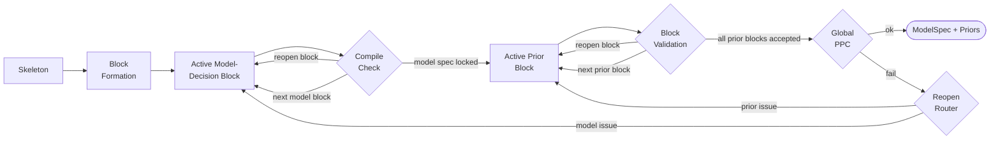

# Stage 4: Model Specification and Prior Elicitation

| Modality | Interactive | Produces |
|---|---|---|
| Semantic | Yes | `ModelSpec`, `PriorProposal` per parameter |

Translates the [Stage 1b `CausalSpec`](01b-measurement-identifiability.md#causalspec) into a fully specified statistical model by choosing observation-model distributions for ambiguous indicators and eliciting Bayesian priors for every parameter, validated against prior predictive checks.

## Inputs

| Input | Source | Description |
|---|---|---|
| `question` | User | Original research question, used to justify prior reasoning |
| `causal_spec` | [Stage 1b](01b-measurement-identifiability.md) | [`CausalSpec`](01b-measurement-identifiability.md#causalspec) with constructs, edges, indicators, and `model_clock` |
| `data_for_model` | [Stage 2](02-indicator-extraction.md) | Encoded long-format [`ObservationRecord`](02-indicator-extraction.md#observationrecord) table |
| `indicator_audits` | [Stage 3](03-extraction-validation.md) | Per-indicator [`EmpiricalProfile`](03-extraction-validation.md#empiricalprofile)s and validation summaries |
| `enable_literature` | Pipeline config | Whether the `search_literature` tool is offered to the LLM |

Stage 4 is the first point where the pipeline reasons about statistical model form. Earlier stages defined what to measure and how.

## Process

Stage 4 makes decisions incrementally: each block scopes the LLM to one choice, and accepted blocks stay frozen unless a validator reopens them.

**Skeleton:** Before any LLM judgment, a deterministic engine enumerates [parameters](../reference/model-spec/parameters.md), locks [likelihoods](../reference/model-spec/likelihoods.md#dtype-to-distribution-mapping) where the dtype maps to exactly one distribution, and fixes temporal structure (AR(1) dynamics, factor-analysis loadings with scale identification[^bollen1989], multi-resolution aggregation). Indicators where the dtype admits multiple distributions or links are deferred to the LLM.

**Block formation:** The skeleton produces *model-decision blocks* (one per ambiguous indicator or loading-constraint choice) and *prior blocks* in dependency order: measurement → dynamics → causal effects → confounding.

**Model-decision blocks:** Each block resolves either:

- *Distribution and link* for one ambiguous indicator, informed by its [Stage 3](03-extraction-validation.md) empirical profile and domain semantics; or
- *Loading constraint* for a construct's loading parameters: `positive` for sign identification, or `none` if negative loadings are theoretically plausible

The [compilation check](../reference/compilation.md) gates each block with PPCs disabled; errors reopen only the failing block.

**Prior blocks:** Once the `ModelSpec` is locked, the LLM proposes a full prior specification for each block in dependency order: distribution family, hyperparameters, and reasoning. All priors are specified on the discrete-time scale at the model clock interval; [compilation](../reference/compilation.md) converts them to continuous-time rates where needed.

When enabled, the LLM can query [Exa](https://exa.ai/) for empirical studies to inform prior calibration, justifying narrower priors only when the estimand, population, and timescale align[^gelman2020] [^gelman2013]. Optionally, multiple paraphrased calls per parameter can be aggregated via a Gaussian mixture model[^capstick2024] or logarithmic opinion pooling[^huang2025] to reduce prompt-wording bias.

**Validation:** The [SSM compiler](../reference/compilation.md) runs after each block, enforcing distribution–link and dtype compatibility, loading-matrix rank, and successful SSM construction. After all prior blocks are accepted, a global prior predictive simulation checks:

- *Numerical health*: no NaN/Inf or extreme values (|value| > 10⁶)
- *Constraint satisfaction*: positive-constrained parameters must not violate their support
- *Dynamics stability*: the drift matrix must have strictly negative real eigenvalues under a majority of prior draws[^sarkka2019]
- *Scale plausibility*: the implied observation SD from the stationary covariance[^sarkka2019] must be within a reasonable ratio of the [Stage 3](03-extraction-validation.md) empirical SD[^gelman2020] [^riegler2025]

If validation fails, a deterministic classifier reopens the smallest responsible block.

### Example

For a study of classroom engagement and academic performance where Stage 1b posited constructs `Teacher Feedback Frequency`, `Student Engagement`, and `Test Scores` with model clock `1w`, Stage 4 might: resolve `Test Scores` deterministically to `gaussian`/`identity` in the skeleton; present one model-decision block for `Teacher Feedback Frequency` where the LLM chooses `poisson`/`log`; then process prior blocks in order — the dynamics block for `Student Engagement` yields `rho_engagement ~ Beta(5, 2)` reflecting moderate weekly persistence, and the causal-effect block for the feedback→engagement edge yields `beta_teacher_feedback_engagement ~ Normal(0.2, 0.15)` anchored by an educational psychology meta-analysis.

## Outputs

| Output | Type | Description |
|---|---|---|
| `model_spec` | `ModelSpec` | Complete statistical model specification |
| `_compiled_ssm` | [`CompiledSSMArtifact`](../reference/compilation.md) | Serializable compiled model consumed by [Stage 5a](05a-svi-preflight.md); contains the `SSMSpec`, compiled prior semantics, and parameter bindings |

### ModelSpec.LikelihoodSpec

| Field | Type | Description |
|---|---|---|
| `variable` | `str` | Name of the observed indicator |
| `distribution` | [`DistributionFamily`](../reference/model-spec/likelihoods.md#distribution-families) | Observation-model distribution family |
| `link` | [`LinkFunction`](../reference/model-spec/likelihoods.md#link-functions) | Link function mapping latent state to distribution parameter |

### ModelSpec.ParameterSpec

| Field | Type | Description |
|---|---|---|
| `name` | `str` | Parameter name such as `beta_stress_anxiety`, `rho_mood`, or `sigma_sleep` |
| `role` | [`ParameterRole`](../reference/model-spec/parameters.md#parameter-roles) | Role in the model |
| `constraint` | [`ParameterConstraint`](../reference/model-spec/parameters.md#parameter-roles) | Domain constraint |
| `description` | `str` | Human-readable description |

[^gelman2020]: Gelman, A., Vehtari, A., Simpson, D., et al. (2020). Bayesian Workflow. arXiv:2011.01808. [Bibliography entry](../reference/bibliography.md)
[^gelman2013]: Gelman, A., Carlin, J. B., Stern, H. S., Dunson, D. B., Vehtari, A., & Rubin, D. B. (2013). *Bayesian Data Analysis* (3rd ed.). CRC Press. [Bibliography entry](../reference/bibliography.md)
[^bollen1989]: Bollen, K. A. (1989). *Structural Equations with Latent Variables*. Wiley. [Bibliography entry](../reference/bibliography.md)
[^sarkka2019]: Särkkä, S., & Solin, A. (2019). *Applied Stochastic Differential Equations*. Cambridge University Press. [Bibliography entry](../reference/bibliography.md)
[^huang2025]: Huang, Y. (2025). LLM-Prior: A Framework for Knowledge-Driven Prior Elicitation and Aggregation. arXiv:2508.03766. [Bibliography entry](../reference/bibliography.md)
[^capstick2024]: Capstick, A., Krishnan, R. G., & Barnaghi, P. (2024). AutoElicit: Using Large Language Models for Expert Prior Elicitation in Predictive Modelling. arXiv:2411.17284. [Bibliography entry](../reference/bibliography.md)
[^riegler2025]: Riegler, M. A., Hellton, K. H., Thambawita, V., & Hammer, H. L. (2025). Using Large Language Models to Suggest Informative Prior Distributions in Bayesian Regression Analysis. *Scientific Reports*, 15, 33386. [Bibliography entry](../reference/bibliography.md)
