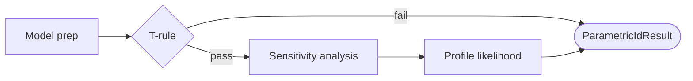

# Stage 4b: Parametric Identifiability Diagnostics

| Modality | Interactive | Produces |
|---|---|---|
| Computed | No | [`ParametricIdResult`](#parametricidresult), [`InferenceStructureResult`](#inferencestructureresult) |

Checks whether the [Stage 4 functional specification](04-model-specification-priors.md) is numerically recoverable from the observed data before committing to expensive inference, and plans the [inference routing](../reference/inference-routing.md) that downstream stages will use.

## Inputs

| Input | Source | Description |
|---|---|---|
| `stage4.result` | [Stage 4](04-model-specification-priors.md) | Model spec, authored priors, and the compiled SSM artifact |
| `stage2.result` | [Stage 2](02-indicator-extraction.md) | Model-ready observation data (long-format canonical rows) |

Stage 4 provided the parametric model and priors without seeing how tightly the data constrain them. Stage 4b is the first point where the model's parameter recoverability is tested against the actual dataset. This is distinct from [Stage 1b](01b-measurement-identifiability.md) causal identifiability: Stage 1b asks whether the treatment effect is identified from the causal graph; Stage 4b asks whether the chosen parameterization is numerically recoverable from the available data.

## Process

Stage 4b is a fully deterministic grounding stage (no LLM). It builds the SSM runtime from the compiled artifact, pivots the observation data to wide format, and runs three diagnostic phases in sequence. If a diagnostic fails or is uninformative, the stage degrades gracefully and continues to the next check.

**Model preparation:** The compiled SSM from Stage 4 is hydrated into an `SSMModel` via `prepare_model_runtime`. This step pivots the long-format canonical rows to a `(T, n_manifest)` wide matrix, compiles observation-support metadata (handling interval-summary columns and discrete-manifest families), and resolves the [inference structure](#inferencestructureresult)—the likelihood path, auto-selected inference method, and first-pass Rao-Blackwellization plan—which is emitted as a co-output alongside the diagnostics.

**T-rule counting screen:** A fast necessary-condition check that compares the number of free parameters against a conservative lower bound on the number of independent moment conditions available from the data. For a model with `p` manifest variables observed at `T` time points, the available moments are `p` means + `p(p+1)/2` contemporaneous covariance entries + `(T−1)·p` lagged autocovariance entries (a conservative count using `p` per lag rather than the full `p²` cross-autocovariance). If the free-parameter count exceeds this lower bound, the model is at high risk of non-identifiability. This screen is warning-only: passing does not guarantee identification, and failing does not halt inference. When the T-rule fails, the stage short-circuits and skips the more expensive sensitivity and profile-likelihood analyses.

**Output sensitivity analysis:** A structural identifiability check via the Jacobian of the forward model. For each of several prior draws (default 8), the stage computes the sensitivity matrix `S[i,j] = ∂yᵢ/∂θⱼ` where `y` is the vector of predicted observation means and variances from the Kalman prediction equations (no data update) and `θ` is the unconstrained parameter vector. SVD of `S` reveals structurally non-identifiable parameter directions as near-zero singular values. The analysis runs both raw and normalized variants—the normalized Jacobian scales columns by prior standard deviation and rows by observation-noise scale, giving thresholds in interpretable units. Per-parameter identifiability is classified via the effective singular value (the smallest singular value in which the parameter participates with weight > 0.1): `pass` if > 10⁻³ of the maximum, `warn` if > 10⁻⁶, `fail` otherwise. Results are aggregated across prior draws via the median for robustness.

**Profile likelihood analysis:** A per-parameter practical identifiability diagnostic. The stage first finds the MAP (maximum a posteriori) estimate by BFGS optimization of the log-posterior. For each scalar parameter element, it fixes the parameter at `n_grid` (default 20) evenly spaced points around the MAP, re-optimizes all other parameters at each grid point via BFGS, and records the resulting profile log-likelihood curve. Each parameter is then classified by comparing the profile shape against a χ²(1) threshold (default 95% confidence, threshold = 1.92):

- *identified*: profile drops below threshold on both sides of the peak
- *practically unidentifiable*: profile does not cross the threshold on one or both sides
- *structurally unidentifiable*: profile is flat (total range < 0.5 log-likelihood units)

When [first-pass Rao-Blackwellization](../reference/inference-routing.md) is active with a composed likelihood path, only Kalman-block parameters are profiled—particle-block parameters have stochastic likelihoods that make profile curves unreliable.

### Example

For a model with three latent constructs (Stress, Sleep Quality, Work Performance) and four indicators, where Stress has a Poisson-distributed indicator, the inference structure might route Sleep Quality and Work Performance through the Kalman filter and Stress through the particle filter (`likelihood_path: "composed"`, `auto_method: "laplace_em"`). The sensitivity analysis might flag the diffusion parameter for Stress as structurally unidentifiable (effective SV < 10⁻⁶ of max), while the profile likelihood confirms Sleep Quality's drift parameter as well-identified (profile crosses threshold on both sides) and Stress's diffusion as practically unidentifiable (profile flat on the right side).

## Outputs

| Output | Type | Description |
|---|---|---|
| `parametric_id` | [`ParametricIdResult`](#parametricidresult) | Combined T-rule, sensitivity, and profile-likelihood diagnostics |
| `inference_structure` | [`InferenceStructureResult`](#inferencestructureresult) | Resolved likelihood path and inference-routing plan |

The public stage payload exposes these two artifacts directly.

### ParametricIdResult

Combined pre-fit recoverability payload.

| Field | Type | Description |
|---|---|---|
| `checked` | `bool` | Whether the diagnostics ran successfully |
| `t_rule` | [`TRuleResult`](#truleresult) \| `null` | T-rule counting-condition result, or null if the check was skipped |
| `sensitivity_analysis` | [`SensitivityAnalysisResult`](#sensitivityanalysisresult) \| `null` | SVD spectrum and per-parameter flags, or null if skipped (e.g. because the T-rule short-circuited) |
| `summary` | [`ParametricIdSummary`](#parametricidsummary) | Aggregated structural issues, boundary issues, and weakly-identified parameters |
| `per_param_classification` | `list[ParameterIdentification]` | Per-parameter [profile-likelihood classifications](#parameteridentification) with profile curve data for visualization |
| `threshold` | `float` | χ²(1) threshold used for profile-likelihood classification |
| `error` | `str` \| `null` | Human-readable error string if the diagnostics failed entirely |

### InferenceStructureResult

Resolved inference-routing plan emitted alongside the diagnostics.

| Field | Type | Description |
|---|---|---|
| `likelihood_path` | `str` | Likelihood evaluation strategy: `"kalman"` (all-linear-Gaussian, exact), `"composed"` (Kalman sub-block + particle filter), or `"particle"` (full particle filter) |
| `auto_method` | `str` | Auto-selected inference method: `"nuts"` for fully Gaussian models, `"laplace_em"` when a particle block is present, or `"svi"` when interval-summary support requires it |
| `first_pass_rb` | [`FirstPassRBResult`](#firstpassrbresult) | First-pass Rao-Blackwellization plan with per-variable Kalman/particle assignments |

Downstream stages use `InferenceStructureResult` as the runtime-facing summary of how this model will be fitted.

### TRuleResult

Counting-condition check result.

| Field | Type | Description |
|---|---|---|
| `n_free_params` | `int` | Total count of free parameters in the model |
| `n_manifest` | `int` | Number of manifest (observed) variables |
| `n_timepoints` | `int` | Number of observed time points |
| `n_moments` | `int` | Conservative lower bound on independent moment conditions |
| `satisfies` | `bool` | Whether `n_free_params` ≤ `n_moments` |
| `param_counts` | `dict[str, int]` | Free-parameter count by site name (e.g. `drift: 4`, `diffusion: 3`, `lambda: 2`) |

### SensitivityAnalysisResult

Jacobian-based structural identifiability check result.

| Field | Type | Description |
|---|---|---|
| `singular_values` | `list[float]` | Median SVD spectrum across prior draws, descending |
| `condition_number` | `float` | Ratio of max to min singular value |
| `per_parameter` | `list[dict]` | Per-parameter entries with `sensitivity_norm`, `effective_sv`, `sv_status`, `normalized_effective_sv`, `normalized_sv_status`, and `identifiable` flag |
| `n_draws` | `int` | Number of prior draws used |
| `n_observations` | `int` | Number of observation elements in the sensitivity matrix |
| `n_parameters` | `int` | Number of parameters in the sensitivity matrix |

### ParametricIdSummary

Aggregated diagnostic findings.

| Field | Type | Description |
|---|---|---|
| `structural_issues` | `list[str]` | Parameters classified as structurally unidentifiable |
| `boundary_issues` | `list[str]` | Parameters with boundary identifiability problems at some prior draws |
| `weak_params` | `list[str]` | Parameters with low contraction—practically unidentifiable or poorly constrained |

### ParameterIdentification

Per-parameter profile-likelihood result.

| Field | Type | Description |
|---|---|---|
| `name` | `str` | Parameter name |
| `classification` | `str` | One of `"identified"`, `"practically_unidentifiable"`, `"structurally_unidentifiable"` |
| `contraction_ratio` | `float` \| `null` | Ratio measuring how much the data contract the prior |
| `profile_x` | `list[float]` | Grid points for the profile curve |
| `profile_ll` | `list[float]` | Profile log-likelihood values at each grid point |

### FirstPassRBResult

First-pass Rao-Blackwellization plan.

| Field | Type | Description |
|---|---|---|
| `status` | `str` | `"active"` or `"inactive"` |
| `inactive_reason` | `str` \| `null` | One of `"disabled_in_spec"`, `"interval_summary_support"`, `"no_executable_partition"`, `"likelihood_override"` |
| `latent_variables` | `list[dict]` | Per-variable entries with `name` and `method` assignment (`"kalman"` or `"particle"`) |
| `obs_variables` | `list[dict]` | Per-variable entries with `name` and `method` assignment (`"kalman"` or `"particle"`) |
