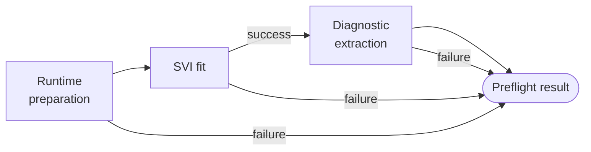

# Stage 5a: SVI Preflight

| Modality | Interactive | Produces |
|---|---|---|
| Computed | No | [`SVIDiagnostics`](#svidiagnostics), [`PosteriorMarginal`](#posteriormarginal)s, [`PosteriorPair`](#posteriorpair)s |

Runs a lightweight variational fit as a pre-fit diagnostic before [Stage 5b](05b-inference-diagnostics.md) commits to expensive inference, producing an ELBO convergence curve and approximate posterior summaries.

## Inputs

| Input | Source | Description |
|---|---|---|
| `compiled_ssm` | [Stage 4](04-model-specification-priors.md) | [`CompiledSSMArtifact`](../reference/compilation.md) with model spec, priors, and compiled SSM |
| `data_for_model` | [Stage 2](02-indicator-extraction.md) | Encoded long-format [`ObservationRecord`](02-indicator-extraction.md#observationrecord) table |

Stage 5a is the first stage that fits the compiled model to the observation data.

## Process

Stage 5a is a fully deterministic stage (no LLM). If any step fails, the stage returns all diagnostic fields as `null`; the pipeline continues to Stage 5b regardless.

**Runtime preparation:** Loads the observation data, pivots to wide format, builds an executable model from the [`CompiledSSMArtifact`](../reference/compilation.md), and resolves the [inference structure](../reference/inference-routing.md) (likelihood backend, Rao-Blackwellization split). The inference structure is re-derived at fit time rather than reused from [Stage 4b](04b-parametric-identifiability.md).

**SVI fit:** Fits a full-rank multivariate normal guide over all latent parameters using 5 000 gradient steps, then draws 500 posterior samples. The multivariate normal family captures posterior correlations but cannot represent multimodality or heavy tails — sufficient for detecting gross misspecification, not for characterizing the full posterior.

**Diagnostic extraction:** From the posterior draws the stage computes:

- *ELBO curve*: the full loss trace over the optimization steps
- *Posterior marginals*: per-parameter density curve with mean, standard deviation, and 94% highest density interval (HDI)
- *Posterior pairs*: pairwise scatter plots for up to 6 parameters, revealing posterior correlations

### Example

For a model with constructs `Symptom Burden`, `Medication Adherence`, and `Functional Capacity`, Stage 5a might produce: an ELBO curve that drops steeply over the first 1 000 steps then plateaus by step 3 000, indicating convergence; marginal densities showing `beta_symptom_adherence` centered at −0.18 (sd 0.09, 94% HDI [−0.35, −0.02]) and `rho_functional_capacity` at 0.81 (sd 0.04, HDI [0.73, 0.88]); and a pairwise scatter for (`rho_symptom_burden`, `sigma_symptom_burden`) revealing a strong negative posterior correlation (r ≈ −0.7), signaling that Stage 5b should watch for slow mixing between these two parameters.

## Outputs

| Output | Type | Description |
|---|---|---|
| `svi_diagnostics` | [`SVIDiagnostics`](#svidiagnostics) | ELBO loss curve |
| `posterior_marginals` | list\[[`PosteriorMarginal`](#posteriormarginal)\] | Per-parameter density summaries |
| `posterior_pairs` | list\[[`PosteriorPair`](#posteriorpair)\] | Pairwise scatter data |

### `SVIDiagnostics`

A monotonically decreasing ELBO curve indicates convergence; oscillations or a plateau suggest the guide cannot capture the posterior geometry.

| Field | Type | Description |
|---|---|---|
| `elbo_losses` | `list[float]` | ELBO loss at each optimization step, thinned to at most 500 points |

### `PosteriorMarginal`

Per-parameter marginal posterior density summary.

| Field | Type | Description |
|---|---|---|
| `parameter` | `str` | Parameter name (array elements indexed as `name[i]`) |
| `x_values` | `list[float]` | Bin centers for the density curve |
| `density` | `list[float]` | Normalized density at each bin center |
| `mean` | `float` | Posterior mean |
| `sd` | `float` | Posterior standard deviation |
| `hdi_3` | `float` | Lower bound of the 94% HDI |
| `hdi_97` | `float` | Upper bound of the 94% HDI |

### `PosteriorPair`

Pairwise posterior scatter data for joint visualization.

| Field | Type | Description |
|---|---|---|
| `param_x` | `str` | Name of the x-axis parameter |
| `param_y` | `str` | Name of the y-axis parameter |
| `x_values` | `list[float]` | Posterior draws for x |
| `y_values` | `list[float]` | Posterior draws for y |
