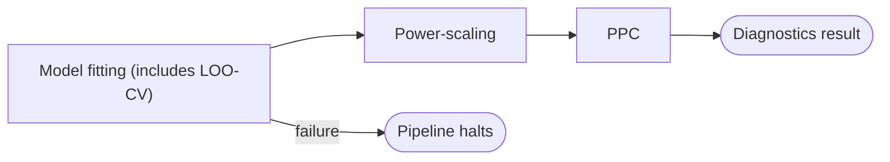

# Stage 5b: Inference and Diagnostics

| Modality | Interactive | Produces |
|---|---|---|
| Computed | No | [`PowerScalingResult`](#powerscalingresult), [`PPCResult`](#ppcresult), [`LOODiagnostics`](#loodiagnostics) |

Fits the compiled state-space model from [Stage 4](04-model-specification-priors.md) to the extracted observation data from [Stage 2](02-indicator-extraction.md), then runs post-fit diagnostics that assess prior–data agreement, posterior predictive fit, and leave-one-out cross-validation. Backend selection follows the [structural routing](../reference/inference-routing.md) decision tree; the user can override to any [available method](../reference/inference-routing.md#method-taxonomy).

## Inputs

| Input | Source | Description |
|---|---|---|
| `compiled_ssm` | [Stage 4](04-model-specification-priors.md) | [`CompiledSSMArtifact`](../reference/compilation.md) with model spec, priors, and compiled SSM |
| `data_for_model` | [Stage 2](02-indicator-extraction.md) | Encoded long-format [`ObservationRecord`](02-indicator-extraction.md#observationrecord) table |
| `inference_method` | Pipeline config | Optional sampler override (`"nuts"`, `"laplace_em"`, `"svi"`, etc.); `null` triggers [auto-routing](../reference/inference-routing.md#structural-routing) |

Stage 4 provided the compiled model and priors; Stage 5b is where that model is fitted to data and the posterior is characterized.

## Process

Stage 5b is a fully deterministic stage (no LLM). It runs three sequential tasks: model fitting, power-scaling sensitivity analysis, and posterior predictive checks. LOO cross-validation is computed inside the fitting task.

**Model fitting:** The stage resolves the inference method—either the user-supplied override or the [auto-routed default](../reference/inference-routing.md#structural-routing)—and delegates to the corresponding [backend](../reference/inference-routing.md#method-reference).

**LOO cross-validation:** For MCMC and SMC backends, the stage computes PSIS-LOO via ArviZ using the state-space innovation decomposition[^durbin2012]: each "observation" is one complete timestep (all manifest variables at time *t*), and the per-timestep log-likelihoods log p(y\_t | y\_{1:t−1}, θ) are conditionally independent given θ. Vehtari, Gelman, and Gabry (2017)[^vehtari2017] justify PSIS-LOO once those pointwise log-likelihood terms are available. For dependent time series, this should be read as a one-step-ahead predictive diagnostic rather than a substitute for leave-future-out validation[^burkner2020].

**Power-scaling:** Detects whether each parameter's posterior is dominated by the prior, well-identified by the data, or in prior–data conflict, following Kallioinen et al. (2024)[^kallioinen2024]. The method perturbs the prior and likelihood contributions by a small power-scaling factor (α ± 0.01), reweights the posterior draws via PSIS, and measures the resulting shift in posterior means. The PSIS k-hat diagnostic for each perturbation direction indicates whether the importance-weighted estimate is reliable (k < 0.7).

**Posterior predictive checks:** The stage forward-simulates observations from posterior parameter draws through the full generative model[^gabry2019] (latent dynamics → discretization → emission sampling) and compares the simulated data to the real observations, producing posterior predictive interval-coverage, autocorrelation, and variance diagnostics for each manifest variable.

### Example

For a longitudinal study of teacher workload and student outcomes with latent constructs `Teacher Burnout`, `Instructional Quality`, and `Student Achievement`, Stage 5b would auto-route to NUTS (all Gaussian emissions), run 4 chains of 2 500 draws each, then produce: MCMC diagnostics showing R-hat < 1.01 and ESS > 400 for all drift and loading parameters; power-scaling results classifying the cross-lag from `Teacher Burnout` to `Instructional Quality` as `well_identified` and a weakly informed diffusion parameter as `prior_dominated`; PPC overlays showing 93% posterior predictive interval coverage for each manifest indicator; and LOO diagnostics with no Pareto-k values exceeding 0.7—all before Stage 6 uses the fitted artifact to simulate interventions.

## Outputs

| Output | Type | Description |
|---|---|---|
| `power_scaling` | list\[[`PowerScalingResult`](#powerscalingresult)\] | Per-parameter sensitivity diagnosis with PSIS reliability |
| `ppc` | [`PPCResult`](#ppcresult) | Per-variable posterior predictive interval-coverage, autocorrelation, and variance checks |
| `posterior_marginals` | list\[[`PosteriorMarginal`](05a-svi-preflight.md#posteriormarginal)\] \| `null` | Per-parameter posterior mean, sd, and 94% HDI |
| `posterior_pairs` | list\[[`PosteriorPair`](05a-svi-preflight.md#posteriorpair)\] \| `null` | Pairwise posterior scatter data with divergence flags (MCMC only) |
| `_fitted_artifact` | [`FittedArtifact`](#fittedartifact) | Persisted runtime artifact consumed by [Stage 6](06-intervention-analysis.md); bundles posterior samples, runtime builder, and diagnostic results |

### `FittedArtifact`

Bundles posterior samples, runtime builder, and diagnostic results for [Stage 6](06-intervention-analysis.md) intervention simulations.

### `PowerScalingResult`

Per-parameter power-scaling sensitivity diagnosis as in Kallioinen et al. (2024)[^kallioinen2024].

| Field | Type | Description |
|---|---|---|
| `parameter` | `str` | Parameter name |
| `diagnosis` | `"prior_dominated"` \| `"well_identified"` \| `"prior_data_conflict"` | `well_identified`: both sensitivities low; `prior_dominated`: high prior, low likelihood sensitivity; `prior_data_conflict`: both high |
| `prior_sensitivity` | `float` | Posterior mean shift under prior power-scaling perturbation |
| `likelihood_sensitivity` | `float` | Posterior mean shift under likelihood power-scaling perturbation |
| `psis_k_hat` | `float` \| `null` | Pareto-k reliability diagnostic for the importance-weighted estimate |

### `PPCResult`

Per-variable posterior predictive diagnostics.

| Field | Type | Description |
|---|---|---|
| `per_variable_warnings` | `list[PPCWarning]` | Per-manifest-variable diagnostic warnings |

`PPCWarning` fields: `variable` (str), `check_type`, `message` (str), `value` (float), `passed` (bool). Check types:

- `"calibration"`: empirical 95% posterior predictive interval coverage; flags if coverage < 0.80 or > 0.99
- `"autocorrelation"`: lag-1 autocorrelation of observed series vs. distribution across replicated datasets
- `"variance"`: observed variance vs. distribution across replicated datasets

### `LOODiagnostics`

PSIS-LOO cross-validation as in Vehtari, Gelman, and Gabry (2017)[^vehtari2017].

| Field | Type | Description |
|---|---|---|
| `elpd_loo` | `float` | Expected log pointwise predictive density |
| `p_loo` | `float` | Effective number of parameters |
| `se` | `float` | Standard error of the ELPD estimate |
| `n_data_points` | `int` | Number of timesteps used |
| `pareto_k` | `list[float]` \| `null` | Per-timestep Pareto-k shape parameters |
| `n_bad_k` | `int` \| `null` | Count of timesteps with k > 0.7 |
| `loo_pit` | `list[float]` \| `null` | LOO-PIT values for calibration assessment |

[^kallioinen2024]: Kallioinen, N., Paananen, T., Bürkner, P.-C., & Vehtari, A. (2024). Detecting and Diagnosing Prior and Likelihood Sensitivity with Power-Scaling. *Statistics and Computing*, 34, 57. [Bibliography entry](../reference/bibliography.md)
[^durbin2012]: Durbin, J., & Koopman, S. J. (2012). *Time Series Analysis by State Space Methods* (2nd ed.). Oxford University Press. [Bibliography entry](../reference/bibliography.md)
[^vehtari2017]: Vehtari, A., Gelman, A., & Gabry, J. (2017). Practical Bayesian Model Evaluation Using Leave-One-Out Cross-Validation and WAIC. *Statistics and Computing*, 27(5), 1413–1432. [Bibliography entry](../reference/bibliography.md)
[^burkner2020]: Bürkner, P.-C., Gabry, J., & Vehtari, A. (2020). Approximate Leave-Future-Out Cross-Validation for Bayesian Time Series Models. *Journal of Statistical Computation and Simulation*, 90(14), 2499–2523. [Bibliography entry](../reference/bibliography.md)
[^gabry2019]: Gabry, J., Simpson, D., Vehtari, A., Betancourt, M., & Gelman, A. (2019). Visualization in Bayesian Workflow. *JRSS-A*, 182(2), 389–402. [Bibliography entry](../reference/bibliography.md)
