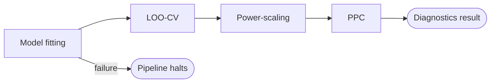

# Stage 5b: Inference and Diagnostics

| Modality | Interactive | Produces |
|---|---|---|
| Computed | No | [`PowerScalingResult`](#powerscalingresult), [`PPCResult`](#ppcresult), [`LOODiagnostics`](#loodiagnostics), [`MCMCDiagnostics`](#mcmcdiagnostics) / [`SMCDiagnostics`](#smcdiagnostics) |

Fits the compiled state-space model from [Stage 4](04-model-specification-priors.md) to the extracted observation data from [Stage 2](02-indicator-extraction.md), then runs post-fit diagnostics that assess prior–data agreement, posterior predictive calibration, and leave-one-out cross-validation. Backend selection follows the [structural routing](../reference/inference-routing.md) decision tree; the user can override to any [available method](../reference/inference-routing.md#method-taxonomy).

## Inputs

| Input | Source | Description |
|---|---|---|
| `compiled_ssm` | [Stage 4](04-model-specification-priors.md) | [`CompiledSSMArtifact`](../reference/compilation.md) with model spec, priors, and compiled SSM |
| `data_for_model` | [Stage 2](02-indicator-extraction.md) | Encoded long-format [`ObservationRecord`](02-indicator-extraction.md#observationrecord) table |
| `inference_method` | Pipeline config | Optional sampler override (`"nuts"`, `"laplace_em"`, `"svi"`, etc.); `null` triggers [auto-routing](../reference/inference-routing.md#structural-routing) |

Stage 4 provided the compiled model and priors; Stage 5b is where that model is fitted to data and the posterior is characterized. Inference routing is re-derived at fit time from the compiled SSM (independently of the [Stage 4b snapshot](04b-parametric-identifiability.md#inferencestructureresult) used for the web frontend).

## Process

Stage 5b is a fully deterministic stage (no LLM). It runs four sequential tasks: model fitting, LOO cross-validation, power-scaling sensitivity analysis, and posterior predictive checks. If model fitting fails, the pipeline halts before Stage 6; conditional on a successful fit, the remaining diagnostics are advisory and do not block downstream stages.

**Model fitting:** The stage resolves the inference method—either the user-supplied override or the [auto-routed default](../reference/inference-routing.md#structural-routing)—and delegates to the corresponding [backend](../reference/inference-routing.md#method-reference).

**LOO cross-validation:** For MCMC and SMC backends, the stage computes PSIS-LOO via ArviZ using the innovation decomposition: each "observation" is one complete timestep (all manifest variables at time *t*), and the per-timestep log-likelihoods log p(y\_t | y\_{1:t−1}, θ) are conditionally independent given θ.

**Power-scaling sensitivity analysis:** Detects whether each parameter's posterior is dominated by the prior, well-identified by the data, or in prior–data conflict ([Kallioinen et al. 2023](#references)). The method perturbs the prior and likelihood contributions by a small power-scaling factor (α ± 0.01), reweights the posterior draws via PSIS, and measures the resulting shift in posterior means. The PSIS k-hat diagnostic for each perturbation direction indicates whether the importance-weighted estimate is reliable (k < 0.7).

**Posterior predictive checks:** The stage forward-simulates observations from posterior parameter draws through the full generative model (latent dynamics → discretization → emission sampling) and compares the simulated data to the real observations, producing calibration, autocorrelation, and variance diagnostics for each manifest variable.

### Example

For a longitudinal study of teacher workload and student outcomes with latent constructs `Teacher Burnout`, `Instructional Quality`, and `Student Achievement`, Stage 5b would auto-route to NUTS (all Gaussian emissions), run 4 chains of 2 500 draws each, then produce: MCMC diagnostics showing R-hat < 1.01 and ESS > 400 for all drift and loading parameters; power-scaling results classifying the cross-lag from `Teacher Burnout` to `Instructional Quality` as `well_identified` and a weakly informed diffusion parameter as `prior_dominated`; PPC overlays showing 93% calibration coverage for each manifest indicator; and LOO diagnostics with no Pareto-k values exceeding 0.7—all before Stage 6 uses the fitted artifact to simulate interventions.

## Outputs

| Output | Type | Description |
|---|---|---|
| `power_scaling` | list\[[`PowerScalingResult`](#powerscalingresult)\] | Per-parameter sensitivity diagnosis with PSIS reliability |
| `ppc` | [`PPCResult`](#ppcresult) | Per-variable calibration, autocorrelation, and variance checks |
| `inference_metadata` | [`InferenceMetadata`](#inferencemetadata) | Method, sample count, and timing |
| `mcmc_diagnostics` | [`MCMCDiagnostics`](#mcmcdiagnostics) \| `null` | MCMC convergence diagnostics (null for non-MCMC backends) |
| `svi_diagnostics` | [`SVIDiagnostics`](05a-svi-preflight.md#svidiagnostics) \| `null` | ELBO loss curve (null for non-SVI backends) |
| `smc_diagnostics` | [`SMCDiagnostics`](#smcdiagnostics) \| `null` | ESS history across tempering levels (null for non-SMC backends) |
| `loo_diagnostics` | [`LOODiagnostics`](#loodiagnostics) \| `null` | PSIS-LOO cross-validation with per-timestep Pareto-k values |
| `posterior_marginals` | list\[[`PosteriorMarginal`](05a-svi-preflight.md#posteriormarginal)\] \| `null` | Per-parameter posterior mean, sd, and 94% HDI |
| `posterior_pairs` | list\[[`PosteriorPair`](05a-svi-preflight.md#posteriorpair)\] \| `null` | Pairwise posterior scatter data with divergence flags (MCMC only) |
| `_fitted_artifact` | [`FittedArtifact`](#fittedartifact) | Persisted runtime artifact consumed by [Stage 6](06-intervention-analysis.md); bundles posterior samples, runtime builder, and diagnostic results |

### `FittedArtifact`

Bundles posterior samples, runtime builder, and diagnostic results for [Stage 6](06-intervention-analysis.md) intervention simulations.

### `PowerScalingResult`

Per-parameter power-scaling sensitivity diagnosis ([Kallioinen et al. 2023](#references)).

| Field | Type | Description |
|---|---|---|
| `parameter` | `str` | Parameter name |
| `diagnosis` | `"prior_dominated"` \| `"well_identified"` \| `"prior_data_conflict"` | `well_identified`: both sensitivities low; `prior_dominated`: high prior, low likelihood sensitivity; `prior_data_conflict`: both high |
| `prior_sensitivity` | `float` | Posterior mean shift under prior power-scaling perturbation |
| `likelihood_sensitivity` | `float` | Posterior mean shift under likelihood power-scaling perturbation |
| `psis_k_hat` | `float` \| `null` | Pareto-k reliability diagnostic for the importance-weighted estimate |

### `PPCResult`

Per-variable posterior predictive diagnostics.

| Field | Type | Description |
|---|---|---|
| `per_variable_warnings` | `list[PPCWarning]` | Per-manifest-variable diagnostic warnings |

`PPCWarning` fields: `variable` (str), `check_type`, `message` (str), `value` (float), `passed` (bool). Check types:

- `"calibration"`: fraction of observed values within the 95% posterior predictive interval; flags if coverage < 0.80 or > 0.99
- `"autocorrelation"`: lag-1 autocorrelation of observed series vs. distribution across replicated datasets
- `"variance"`: observed variance vs. distribution across replicated datasets

### `InferenceMetadata`

Summary of the inference run configuration and timing.

| Field | Type | Description |
|---|---|---|
| `method` | `str` | Inference method used (e.g. `"nuts"`, `"svi"`, `"laplace_em"`) |
| `n_samples` | `int` | Number of posterior samples drawn |
| `duration_seconds` | `float` | Wall-clock time for the fitting step |

### `MCMCDiagnostics`

Produced by NUTS, NUTS-DA, and PGAS backends; exactly one of `mcmc_diagnostics`, `svi_diagnostics`, or `smc_diagnostics` is non-null per stage run.

| Field | Type | Description |
|---|---|---|
| `per_parameter` | `list[MCMCParamDiagnostic]` | Per-parameter R-hat, ESS (bulk + tail), and MCSE |
| `num_divergences` | `int` | Total divergent transitions |
| `divergence_rate` | `float` | Fraction of transitions that diverged |

### `SMCDiagnostics`

Produced by Laplace-EM, tempered SMC, Hess-MC², structured VI, and DPF backends.

| Field | Type | Description |
|---|---|---|
| `ess_history` | `list[float]` | Effective sample size at each tempering level |
| `n_levels` | `int` | Number of tempering levels |

### `LOODiagnostics`

PSIS-LOO cross-validation ([Vehtari, Gelman & Gabry 2017](#references)).

| Field | Type | Description |
|---|---|---|
| `elpd_loo` | `float` | Expected log pointwise predictive density |
| `p_loo` | `float` | Effective number of parameters |
| `se` | `float` | Standard error of the ELPD estimate |
| `n_data_points` | `int` | Number of timesteps used |
| `pareto_k` | `list[float]` \| `null` | Per-timestep Pareto-k shape parameters |
| `n_bad_k` | `int` \| `null` | Count of timesteps with k > 0.7 |
| `loo_pit` | `list[float]` \| `null` | LOO-PIT values for calibration assessment |

## References

- Kallioinen, N., Paananen, T., Bürkner, P.-C., & Vehtari, A. (2023). Detecting and Diagnosing Prior and Likelihood Sensitivity With Power-Scaling. *Statistics and Computing*.
- Vehtari, A., Gelman, A., & Gabry, J. (2017). Practical Bayesian Model Evaluation Using Leave-One-Out Cross-Validation and WAIC. *Statistics and Computing*.
