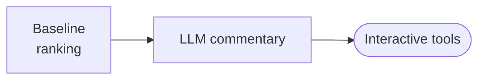

# Stage 6: Intervention Analysis

| Modality | Interactive | Produces |
|---|---|---|
| Hybrid | Yes | [`TreatmentEffect`](#treatmenteffect) list, interactive simulation tools |

Applies steady-state interventional-effect and trajectory-simulation semantics to the [Stage 5b fitted model](05b-inference-diagnostics.md#fittedartifact), ranks treatments by causal effect size, generates LLM commentary, and exposes three interactive tools for follow-up interventional (rung 2) and counterfactual (rung 3) queries in Pearl's ladder of causation [Pearl (2019)](https://ucla.in/2HI2yyx). This is the terminal stage—interactive edits persist in place with no downstream replay.

## Inputs

| Input | Source | Description |
|---|---|---|
| `fitted_artifact` | [Stage 5b](05b-inference-diagnostics.md) | [`FittedArtifact`](05b-inference-diagnostics.md#fittedartifact) with posterior samples, runtime builder, observation times, PPC result, and power-scaling result |
| `causal_spec` | [Stage 1b](01b-measurement-identifiability.md) | [`CausalSpec`](01b-measurement-identifiability.md#causalspec) with identifiability status, measurement model, and outcome construct designation |
| `question` | User | Original research question for grounding the opening commentary |

Stage 5b provided the posterior and diagnostics; Stage 1b provided the identifiability verdicts. Stage 6 is the first point where posterior samples are translated into causal decision quantities.

## Process

Stage 6 runs in two phases: a deterministic intervention computation that produces the baseline ranking, followed by a single LLM generation that produces opening commentary. After completion the stage exposes three interactive tools for follow-up exploration.

**Baseline ranking:** For each treatment that remains after the [Stage 1b identifiability screen](01b-measurement-identifiability.md), the stage computes a steady-state interventional effect under `do(treatment = baseline + 1)`. For a draw with [drift matrix **A** and continuous intercept **c**](../reference/estimation.md#1-ct-sde-formulation), the baseline steady state is η\* = −**A**⁻¹**c**; an intervention clamps the treatment equation, solves the modified linear system, and compares the intervened and baseline outcome values. The default `do(treatment = baseline + 1)` is vmapped over all posterior draws to produce the full posterior treatment-effect distribution.

- *Temporal forward simulation:* When temporal information is available (either from the [`model_clock`](01b-measurement-identifiability.md#observation_window-and-model_clock) or the median observed timestep), the stage also runs a 30-day forward simulation for each treatment, discretizing the continuous-time system from the baseline steady state with the treatment clamped at each step. The mean trajectory across posterior draws is summarized into a [`TemporalEffect`](#temporaleffect) with 1-day, 7-day, and 30-day snapshots plus peak effect and time-to-peak.
- *Manifest-level decomposition:* When posterior draws of the [loading matrix](../reference/estimation.md#1-ct-sde-formulation) λ are available, the stage projects each treatment's outcome-level effect through the loadings to produce per-manifest effects: `manifest_effect[i] = λ[i, outcome_idx] × effect_mean`.
- *Ranking:* Treatments are sorted by |mean(`posterior_draws`)| descending.

**LLM commentary:** A single LLM generation receives the top-5 ranked effects, any diagnostic warnings, excluded non-identifiable treatments, and a summary of the follow-up capabilities. The LLM produces plain Markdown commentary for the user, persisted as `final_summary`.

**Interactive tools:** After the baseline ranking completes, Stage 6 exposes three read-only tools for follow-up exploration within the same conversation.

- *`get_model_info`:* Returns a structured read-only summary of the fitted model and its diagnostics. An optional `names` filter restricts the response to specific constructs or indicators.
- *`simulate_intervention`:* Runs an interventional query on rung 2 of Pearl's ladder [Pearl (2019)](https://ucla.in/2HI2yyx), generalizing the baseline ranking to arbitrary intervention values, trajectory horizons, and manifest projections. Returns a posterior summary (mean, median, 95% CI, `prob_positive`) with any relevant [PPC](05b-inference-diagnostics.md#ppcresult) or [power-scaling](05b-inference-diagnostics.md#powerscalingresult) warnings.
- *`simulate_counterfactual`:* Runs a counterfactual query on rung 3 of Pearl's ladder [Pearl (2019)](https://ucla.in/2HI2yyx), conditioning on observed data before asking "what would have happened if we had intervened?" The caller specifies an evidence window (optional ISO-8601 `start_time`/`end_time` bounds, defaulting to the full observed range), the treatment and intervention mode, and the estimand (`"end_state"` or `"trajectory"` with `horizon_days` and projection level). Computation follows the standard abduction-action-prediction procedure in [Pearl, Glymour, and Jewell (2016)](https://web.cs.ucla.edu/~kaoru/BIB5/pearl-etal-2016-primer-text.pdf).
  - *Abduction:* recovers the latent state at the evidence boundary
  - *Forward simulation:* from the abducted state, simulates both a baseline path and a counterfactual path (treatment clamped)
  - *Output:* reports the difference as the causal effect with posterior summary, effect trajectory, and abduction warnings

### Example

For a study of agricultural practices and crop yield where Stage 1a posited constructs `Irrigation Frequency`, `Soil Nitrogen`, `Pest Pressure`, and `Crop Yield`, Stage 6 might rank `Soil Nitrogen` first with mean(posterior_draws)=+0.38 and a temporal peak at 12 days (`peak_effect=+0.41`), while `Pest Pressure` ranks second with mean(posterior_draws)=−0.22. Any [power-scaling](05b-inference-diagnostics.md#powerscalingresult) or [PPC](05b-inference-diagnostics.md#ppcresult) warnings from Stage 5b are referenced in the LLM commentary.

## Outputs

| Output | Type | Description |
|---|---|---|
| `intervention_results` | list\[[`TreatmentEffect`](#treatmenteffect)\] | Treatments ranked by \|mean(`posterior_draws`)\| descending |
| `final_summary` | `str` \| null | LLM-generated opening commentary |

### `TreatmentEffect`

| Field | Type | Description |
|---|---|---|
| `treatment` | `str` | Construct name of the treatment |
| `posterior_draws` | `list[float]` \| null | Full posterior distribution of the treatment effect (one draw per posterior sample); consumers derive effect_size=mean(draws) and P(>0)=mean(draws>0) |
| `temporal` | [`TemporalEffect`](#temporaleffect) \| null | Forward-simulation summary at 1-day, 7-day, and 30-day horizons |
| `manifest_effects` | `dict[str, float]` \| null | Per-manifest outcome decomposition via [loading-matrix](../reference/estimation.md#1-ct-sde-formulation) projection; keys are manifest names, values are `λ[manifest, outcome] × effect_mean` |

Identifiability status, [PPC warnings](05b-inference-diagnostics.md#ppcresult), and [power-scaling diagnostics](05b-inference-diagnostics.md#powerscalingresult) are not duplicated here — consumers derive them from [Stage 1b](01b-measurement-identifiability.md#identifiabilitystatus) and [Stage 5b](05b-inference-diagnostics.md) outputs respectively.

### `TemporalEffect`

| Field | Type | Description |
|---|---|---|
| `effect_1d` | `float` | Effect magnitude at 1 day post-intervention |
| `effect_7d` | `float` | Effect magnitude at 7 days |
| `effect_30d` | `float` | Effect magnitude at 30 days (or at the horizon boundary if shorter) |
| `peak_effect` | `float` | Maximum absolute effect reached during the trajectory |
| `time_to_peak_days` | `float` | Days from intervention onset to peak effect |
