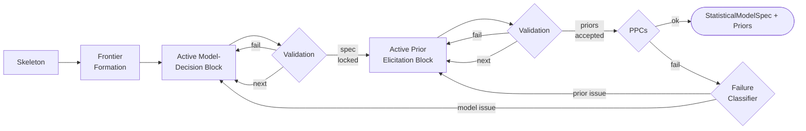

# Statistical Model Specification and Prior Elicitation

| Modality | Interactive | Produces |
|---|---|---|
| Semantic | Yes | `StatisticalModelSpec`, `PriorProposal` per parameter |

Translates the [`measurement_structure` transition `CausalDesign`](measurement-structure.md#causaldesign) into a fully specified statistical model by choosing observation-model distributions for ambiguous indicators and eliciting Bayesian priors for every parameter, validated against prior predictive checks.

For the high-level reducer flow, see [`statistical_model_spec` transition State Machine](../reference/statistical-model-spec/state-machine.md). For the exact control semantics of the LLM-driven loop, see [LLM-Driven `statistical_model_spec` transition Specification](../reference/statistical-model-spec/llm-driven-specification.md).

## Inputs

| Input | Source | Description |
|---|---|---|
| `question` | User | Original research question, used to justify prior reasoning |
| `causal_design` | [`measurement_structure` transition](measurement-structure.md) | [`CausalDesign`](measurement-structure.md#causaldesign) with constructs, edges, indicators, and `model_clock` |
| `data_for_model` | [`measurements` transition](extraction.md) | Encoded long-format [`ObservationRecord`](extraction.md#observationrecord) table |
| `indicator_audits` | [`validation_report` derivation](extraction-validation.md) | Per-indicator [`EmpiricalProfile`](extraction-validation.md#empiricalprofile)s and validation summaries |
| `enable_literature` | Pipeline config | Whether the `search_literature` tool is offered to the LLM |

`statistical_model_spec` transition is the first point where the pipeline reasons about statistical model form. Earlier transitions defined what to measure and how.

## Process

`statistical_model_spec` transition makes decisions incrementally: each block scopes the LLM to one choice, and accepted blocks stay frozen unless a validator reopens them.

**Skeleton:** Before any LLM judgment, a deterministic engine enumerates [parameters](../reference/statistical-model-spec/parameters.md), locks [likelihoods](../reference/statistical-model-spec/likelihoods.md#dtype-to-distribution-mapping) where the dtype maps to exactly one distribution, fixes loading orientations from `measurement_structure` transition indicator polarity, and fixes temporal structure (AR(1) dynamics, factor-analysis loadings with scale identification[^bollen1989], multi-resolution aggregation). Indicators where the dtype admits multiple distributions or links are deferred to the LLM.

**Frontier Formation:** The skeleton produces *model-decision blocks* (one per ambiguous indicator) and *prior blocks* in dependency order: measurement → dynamics → grouped causal-effect families (incoming effects per target construct) → confounding.

**Model-Decision Block:** Each block resolves:

- *Distribution and link* for one ambiguous indicator, informed by its [`validation_report` derivation](extraction-validation.md) empirical profile and domain semantics

Model-decision blocks are validated locally against the active frontier and accepted into reducer state one block at a time. Once all model-decision blocks are accepted, the transition materializes the full `StatisticalModelSpec` and runs a [compilation check](../reference/compilation.md) with PPCs disabled; compile failures reopen the smallest responsible model-decision block. Before prior elicitation, a compact global-review checkpoint can reopen the relevant model-decision blocks when those choices need to move together. Loading orientations remain visible at that checkpoint but are already fixed from `measurement_structure` transition indicator polarity rather than authored blockwise in `statistical_model_spec` transition.

**Prior Elicitation Block:** Once the `StatisticalModelSpec` is locked, the LLM proposes a full prior specification for each block in dependency order: distribution family, hyperparameters, and reasoning. Dynamic priors are specified on the discrete-time scale at the model clock interval; `rho_*` means baseline persistence absent incoming feedback, while [compilation](../reference/compilation.md) converts `rho_*` and `beta_*` to continuous-time rates where needed.

When enabled, the LLM can query [Exa](https://exa.ai/) for empirical studies to inform prior calibration, justifying narrower priors only when the estimand, population, and timescale align[^gelman2020] [^gelman2013]. Optionally, multiple paraphrased calls for one parameter can be aggregated via a Gaussian mixture model[^capstick2024] to reduce prompt-wording bias.

**Validation:** The transition validates in two layers. After the model-decision phase closes, the full locked `StatisticalModelSpec` is compiled once, enforcing distribution-link and dtype compatibility, loading-matrix rank, and successful SSM construction. During prior elicitation, each accepted prior block is merged into the accumulated authored priors, but real prior compilation and prior predictive checks only run once the full required prior set is present. At that point, a global prior predictive simulation checks:

- *Numerical health*: no NaN/Inf or extreme values (|value| > 10⁶)
- *Constraint satisfaction*: positive-constrained parameters must not violate their support
- *Dynamics stability*: the compiled hard-sparsity drift construction enforces strictly negative real eigenvalues by row diagonal dominance; prior predictive checks still surface the realised damping and any structural inconsistencies[^sarkka2019]
- *Scale plausibility*: the implied observation SD from the stationary covariance[^sarkka2019] must be within a reasonable ratio of the [`validation_report` derivation](extraction-validation.md) empirical SD[^gelman2020] [^riegler2025]

If validation fails, a deterministic classifier reopens the smallest responsible block.

### Example

For a study of classroom engagement and academic performance where `measurement_structure` transition posited constructs `Teacher Feedback Frequency`, `Student Engagement`, and `Test Scores` with model clock `1w`, `statistical_model_spec` transition might: resolve `Test Scores` deterministically to `gaussian`/`identity` in the skeleton; present one model-decision block for `Teacher Feedback Frequency` where the LLM chooses `poisson`/`log`; then process prior blocks in order — the dynamics block for `Student Engagement` yields `rho_engagement ~ Beta(5, 2)` reflecting moderate weekly baseline persistence absent feedback, and the causal-effect block for the feedback→engagement edge yields `beta_teacher_feedback_engagement ~ Normal(0.2, 0.15)` anchored by an educational psychology meta-analysis.

## Outputs

| Output | Type | Description |
|---|---|---|
| `statistical_model_spec` | `StatisticalModelSpec` | Complete statistical model specification |
| `_compiled_ssm` | [`CompiledSSMArtifact`](../reference/compilation.md) | Serializable compiled model consumed by [`posterior` transition](inference.md); contains the flat `SSMSpec`, `edge_lag_days`, compiled prior semantics, parameter bindings, and compile diagnostics |

### StatisticalModelSpec.LikelihoodSpec

| Field | Type | Description |
|---|---|---|
| `variable` | `str` | Name of the observed indicator |
| `distribution` | [`DistributionFamily`](../reference/statistical-model-spec/likelihoods.md#distribution-families) | Observation-model distribution family |
| `link` | [`LinkFunction`](../reference/statistical-model-spec/likelihoods.md#link-functions) | Link function mapping latent state to distribution parameter |
| `centered` | `bool` | Deterministic auto-centering flag for additive-location indicators that are centered before fitting |

### StatisticalModelSpec.ParameterSpec

| Field | Type | Description |
|---|---|---|
| `name` | `str` | Parameter name such as `beta_stress_anxiety`, `rho_mood`, or `sigma_sleep` |
| `role` | [`ParameterRole`](../reference/statistical-model-spec/parameters.md#parameter-roles) | Role in the model |
| `constraint` | [`ParameterConstraint`](../reference/statistical-model-spec/parameters.md#parameter-roles) | Domain constraint |
| `description` | `str` | Human-readable description |

### StatisticalModelSpec

| Field | Type | Description |
|---|---|---|
| `likelihoods` | `list[LikelihoodSpec]` | One likelihood row per retained manifest indicator |
| `parameters` | `list[ParameterSpec]` | Compiler-authoritative semantic prior surfaces that remain active after model decisions are locked |
| `initialization_policy` | `\"stationary\" \| \"free\"` | Whether dynamic-state initial conditions are stationary-derived or exposed as free `t0_*` surfaces |
| `observation_intercept_policy` | `\"free\" \| \"fixed\"` | Whether eligible manifest intercepts `manifest_mean_*` remain free or are fixed |
| `equilibrium_forcing` | `bool` | Whether eligible centered dynamic constructs may expose a continuous-time intercept `cint_*` |

[^gelman2020]: Gelman, A., Vehtari, A., Simpson, D., et al. (2020). Bayesian Workflow. arXiv:2011.01808. [Bibliography entry](../reference/bibliography.md)
[^gelman2013]: Gelman, A., Carlin, J. B., Stern, H. S., Dunson, D. B., Vehtari, A., & Rubin, D. B. (2013). *Bayesian Data Analysis* (3rd ed.). CRC Press. [Bibliography entry](../reference/bibliography.md)
[^bollen1989]: Bollen, K. A. (1989). *Structural Equations with Latent Variables*. Wiley. [Bibliography entry](../reference/bibliography.md)
[^sarkka2019]: Särkkä, S., & Solin, A. (2019). *Applied Stochastic Differential Equations*. Cambridge University Press. [Bibliography entry](../reference/bibliography.md)
[^capstick2024]: Capstick, A., Krishnan, R. G., & Barnaghi, P. (2024). AutoElicit: Using Large Language Models for Expert Prior Elicitation in Predictive Modelling. arXiv:2411.17284. [Bibliography entry](../reference/bibliography.md)
[^riegler2025]: Riegler, M. A., Hellton, K. H., Thambawita, V., & Hammer, H. L. (2025). Using Large Language Models to Suggest Informative Prior Distributions in Bayesian Regression Analysis. *Scientific Reports*, 15, 33386. [Bibliography entry](../reference/bibliography.md)
