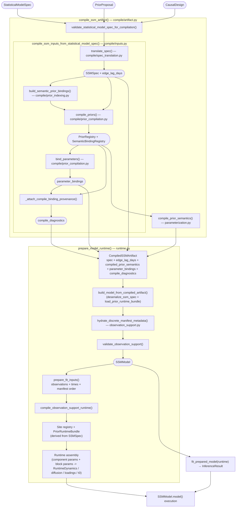
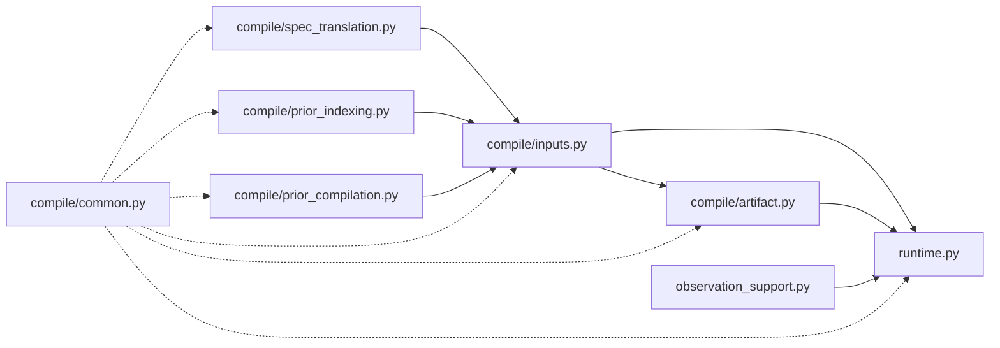

# SSM Compilation Pipeline

The compilation pipeline translates a [`StatisticalModelSpec`](../pipeline/statistical-model-spec.md#statisticalmodelspec) (the `statistical_model_spec` transition output) into a NumPyro-ready `SSMModel`. The resulting `CompiledSSMArtifact` is consumed by [`posterior` transition](../pipeline/inference.md) for fitting.



## Key Data Types

| Type | Defined in | Purpose |
|------|-----------|---------|
| [`StatisticalModelSpec`](../pipeline/statistical-model-spec.md#statisticalmodelspec) | `artifacts/statistical_model_spec.py` | User-facing statistical model spec: parameters, likelihoods, roles |
| [`CausalDesign`](../pipeline/measurement-structure.md#causaldesign) | `artifacts/causal_design.py` | DAG edges, construct metadata, temporal granularity |
| `SSMSpec` | `models/ssm/model.py` | SSM artifact: dimensions, names, distributions, structure blocks, and composite drift spec |
| `SiteDescriptor` | `models/ssm/structure/sites.py` | Canonical sample-site identity: name, shape, support, semantic kind, assembly group, and prior binding field |
| `PriorRegistry` | `models/ssm/priors.py` | Site-keyed canonical priors for both structure blocks and dynamics components |
| `PriorRuntimeBundle` | `models/ssm/parameterization.py` | Runtime site registry, transforms, and prior-state arrays reconstructed without model tracing |
| `SemanticBindingRegistry` | `models/ssm/compile/prior_indexing.py` | Named registry of parameter-name → compiled sample-site bindings; replaces the old positional prior-index tuple |
| `CompiledSSMArtifact` | `models/ssm/compile/artifact.py` | Serializable bundle: spec + edge lags + compiled prior semantics + bindings + diagnostics |
| `SSMModel` | `models/ssm/model.py` | Executable NumPyro generative model |
| `InferenceResult` | `models/ssm/inference/types.py` | Posterior samples + diagnostics |

## Stage 1: Spec Translation (`compile/spec_translation.py`)

Converts a `StatisticalModelSpec` + `CausalDesign` into an `SSMSpec` — the artifact that persists concrete numeric templates, structure blocks, and the composite drift spec.

**What it does:**

- Extracts latent construct layout from the DAG (names, order, time-invariant mask)
- Builds the **dynamics spec** as a composite vector field. The standard affine artifact uses `DiagonalDecaySpec` for per-latent decay, `LinearEdgeSpec` for cross-lag dynamics, and `StateInterceptSpec` for any free continuous-time state intercepts.
- Builds the **loading template** (`lambda_mat`) plus `lambda_mask`: fixed indicator-to-construct loadings and free non-reference loadings
- Compiles concrete templates plus masks for `cint`, `static_state_sds`, `diffusion_chol`, `manifest_means`, `manifest_chol`, `t0_means`, and `t0_chol`.
- Converts marginalized time-invariant confounders into compiled low-rank baseline factors of the form `B diag(tau^2) B^T` rather than free pairwise `cor0_*` surfaces on the causal-design path
- Derives deterministic `manifest_standardized` flags from the locked likelihood family, link, and observation support semantics
- Applies `initialization_policy` and `equilibrium_forcing` to determine which `t0_*`, `cint_*`, and `manifest_mean_*` surfaces remain free
- Computes **edge_lag_days**: for each cross-lag edge, the lag in days (used by prior compilation to scale DT→CT)
- Selects observation distribution families from `measurement_dtype`
- Eliminates legacy string matrix modes: translation always emits concrete templates and explicit masks

**Key function:** `translate_spec(statistical_model_spec, causal_design) -> (SSMSpec, edge_lag_days)`

## `measurements` transition: Semantic Prior Bindings (`compile/prior_indexing.py`)

Builds the mapping from semantic parameter names (e.g., `"rho_mood"`, `"beta_mood_stress"`) to canonical sample-site indices in the SSM structure and dynamics components.

**What it does:**

- For each parameter in `StatisticalModelSpec`, determines its role (AR coefficient, fixed effect, loading, residual SD, state intercept, observation intercept, static baseline-factor SD, correlation, and observation-family auxiliary site)
- Maps it to the correct SSM site (`vf_0_decay`, `vf_2_weight`, `lambda_free`, `manifest_means_free`, `static_state_sd_free`, etc.) and flat index
- Derives the canonical free-entry order from block and dynamics `SiteDescriptor`s so the compiler, runtime assembly, and posterior name resolution all share one site registry.
- Uses `split_compound_name()` to parse compound names like `"beta_mood_stress"` into (cause, effect)

**Key function:** `build_semantic_prior_bindings(ssm_spec, statistical_model_spec, *, causal_design=None) -> SemanticBindingRegistry`

This is now a strict internal helper: it requires both a translated `SSMSpec` and a semantic `StatisticalModelSpec`. Spec-only entrypoints decide explicitly when no semantic bindings should be produced; the indexer no longer falls back to all-empty maps.

**Returns:** a `SemanticBindingRegistry` — an immutable, parameter-name-keyed collection of `SemanticBinding`s (queryable via `by_parameter` and `by_site_kind`) that replaces the old positional 14-tuple. Each binding records the parameter's site kind, canonical site name, and flat index. Bindings span the full set of site categories:

- cross-lag effects (drift off-diagonal) and factor loadings
- AR coefficients (baseline decay for the derived drift diagonal)
- residual SDs and residual correlations
- transition input-effect entries
- initial-state means, standard deviations, and correlations
- manifest intercepts and manifest noise terms
- continuous-time state intercepts
- compiled baseline-factor scales (static state SDs)
- observation-family hyperparameter sites

## `validation_report` derivation: Prior Compilation (`compile/prior_compilation.py`)

Translates user-facing prior specifications into a site-keyed `PriorRegistry` with the correct parameterization.

**Critical transformations:**

- **AR coefficients (DT→CT):** User specifies `rho_*` as baseline persistence in `(0, 1)` over the authored interval, absent incoming feedback. The compiler transforms it to positive continuous-time base decay with `base_decay = −log(rho) / dt`; nondegenerate priors are moment-matched to `Gamma(concentration, rate)`, and fixed-width `rho_*` priors compile to positive `Delta(value)`.
- **Hard-sparsity drift assembly:** Off-diagonal entries are compiled as `A_ij = beta_ij / dt` on allowed edges only. For each dynamic row, the realised diagonal is derived as `A_ii = -(base_decay_i + sum_j |A_ij| + stability_margin)`, preserving structural zeros while guaranteeing strict row diagonal dominance.
- **Cross-lag effects:** Scaled by an explicitly resolved positive interval in this order: `reference_interval_days`, then compiled `edge_lag_days`, then the causal-design model clock. If none exists, compilation now raises instead of silently assuming `1.0d`.
- **Site binding:** compiled priors attach to canonical `SiteDescriptor`s. Structure blocks and dynamics components use the same prior materialization path.

**Key function:** `compile_priors(raw_priors, statistical_model_spec, ssm_spec, edge_lag_days, causal_design) -> (PriorRegistry, SemanticBindingRegistry, list[CompileDiagnostic])`

**Post-compilation diagnostics:**

- `collect_interval_provenance_warnings()` — warns when cited source intervals and authored/model intervals materially disagree
- `collect_first_order_approximation_warnings()` — uses the full matrix logarithm `logm(A_dt) / dt` to flag cross-lag priors whose elementwise `beta_dt / dt` CT coupling materially differs from the full-system CT scale
- `collect_compile_diagnostics()` — combines these warnings into the structured diagnostics payload persisted on the artifact

## `statistical_model_spec` transition: Parameter Bindings (`compile/prior_compilation.py`)

Creates the mapping from semantic parameter names to NumPyro sample sites — the bridge between the statistical model specification and posterior extraction.

**Key function:** `bind_parameters(index_maps) -> list[dict]`

Each binding is: `{parameter: "rho_mood", site_name: "vf_0_decay", flat_index: 0}`

This allows `InferenceResult` to map posterior samples back to user-facing parameter names. `bind_parameters()` consumes the already-compiled `SemanticBindingRegistry` from `validation_report` derivation rather than rebuilding it, and only the compile entrypoints decide whether semantic bindings should exist at all.

## Stage 5: Artifact Serialization (`compile/artifact.py`)

Bundles everything into a `CompiledSSMArtifact` — a JSON-serializable dict that can be persisted to disk and reconstructed later without re-running compilation.

```python
CompiledSSMArtifact = {
    "schema_version": 1,
    "spec": {...},                      # SSMSpec as dict
    "edge_lag_days": [...],             # serialized lag metadata per retained edge
    "compiled_prior_semantics": {...},  # serialized PriorRuntimeBundle payload
    "parameter_bindings": [...],        # semantic name → NumPyro site mappings
    "compile_diagnostics": [...],       # compile-time warnings / notes
}
```

The artifact stores `compiled_prior_semantics`, the canonical runtime prior block used to reconstruct `PriorRuntimeBundle` without retracing the model.

Also provides validation entry points used by earlier pipeline transitions:

- `validate_statistical_model_spec_for_compilation()` — catches structural errors before committing to compilation
- `trial_compile_statistical_model_spec()` / `trial_compile_measurement_structure()` — dry-run compilation that returns an error string or None

## Stage 5: Runtime Preparation (`compile/artifact.py`, `runtime.py`, `observation_support.py`)

`build_model_from_compiled_artifact()` in `compile/artifact.py` reconstructs the compiled artifact into a live `SSMModel`.

**`observation_support.py`** handles data-dependent hydration:

- `hydrate_discrete_manifest_metadata()` — infers level counts for categorical/ordinal emissions from observed data
- `validate_observation_support()` — checks no values fall outside the observation family's support (e.g., negative values for Poisson)

**`runtime.py`** provides the runtime API:

- `build_ssm_model(wide_data, ...)` → `SSMModel` — materializes the NumPyro model from direct specs or compiled inputs
- `prepare_model_runtime(data_for_model, ...)` → `PreparedModelRuntime` — prepares observations, times, observation support, transition inputs, and sampler config
- `fit_prepared_model(runtime)` → `InferenceResult` — routes prepared arrays into `inference.fit()`
- `sample_prior_predictive(model, ...)` — generates prior predictive samples for validation

Runtime reconstruction now has three layers:

- **`SSMSpec`** remains the serialization and validation boundary. It owns persisted templates, masks, distributions, names, and the composite drift spec.
- **`PriorRuntimeBundle`** is rebuilt from `compiled_prior_semantics` and owns sample-site registry, transforms, and prior-state semantics.
- **`RuntimeDynamics`** is sampled through the compiled composite drift spec. Inference backends then derive affine or local-linear views from the vector field instead of splitting linear vs nonlinear at the spec level.

**Why `fit()` stays outside `SSMModel`:** the runtime separates three concerns:

- **`SSMModel`** is a pure NumPyro model function. Its [`model(observations, times)`](estimation.md#data-flow) method takes JAX arrays, samples from the runtime prior bundle, assembles block deterministic values plus `RuntimeDynamics`, and injects the log-likelihood via `numpyro.factor()`. It has no knowledge of DataFrames, inference algorithms, or sampler configuration.
- **`inference.fit()`** handles [algorithm selection](inference-routing.md) and execution. It takes an `SSMModel` and prepared arrays.
- **`PreparedModelRuntime`** bridges the gap: it carries the `SSMModel`, prepared JAX arrays, observation-support runtime, transition inputs, manifest order, sampler config, and inference-structure plan for Stage 5 diagnostics.
- Before array conversion, `prepare_fit_inputs()` applies deterministic standardization to manifest columns whose compiled `manifest_standardized` flag is `True`, so standardized additive-location indicators arrive with mean 0 and sd 1 consistently in both fitting and prior-predictive scale checks.

Moving `fit()` onto `SSMModel` would couple it to DataFrame handling and sampler config routing — concerns that belong to the orchestrator layer, not the probabilistic model.

**Two model-construction entry points:**

- `build_model_from_compiled_artifact(compiled_ssm, wide_data)` in `compile/artifact.py` — deserializes a persisted `CompiledSSMArtifact`, rebuilds the prior runtime bundle from `compiled_prior_semantics`, hydrates observation metadata from wide data, and returns an `SSMModel`. This is the pipeline path because Stage 5 consumes the artifact that `statistical_model_spec` transition persisted.
- `build_ssm_model(wide_data, statistical_model_spec=..., priors=..., causal_design=...)` in `runtime.py` — compiles on the fly from raw specs and returns an `SSMModel`. This is the direct path for tests and notebooks.

Both return a live `SSMModel`. Callers that need fit-ready arrays use `prepare_model_runtime()` or `prepare_wide_model_runtime()` to construct a `PreparedModelRuntime`.

## File Dependency Graph



Leaf modules (`compile/spec_translation.py`, `compile/prior_indexing.py`, `observation_support.py`, `compile/common.py`) have no intra-pipeline dependencies and can be understood in isolation. The compilation orchestrator (`compile/inputs.py`) exposes two explicit entry points:

- `compile_ssm_inputs_from_statistical_model_spec()` for the semantic `statistical_model_spec` transition path
- `compile_ssm_inputs_from_spec()` for already-translated `SSMSpec` callers
