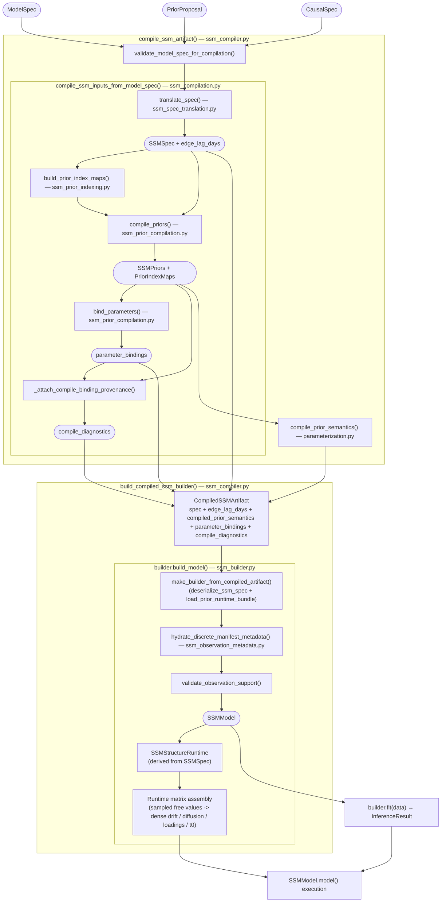
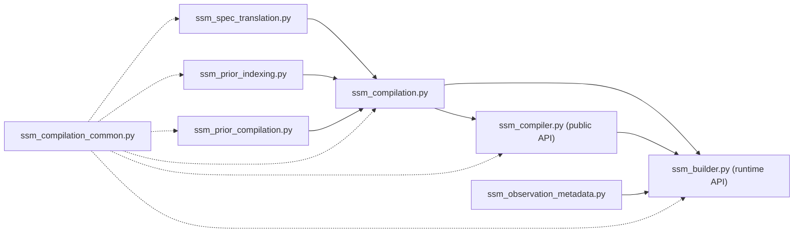

# SSM Compilation Pipeline

The compilation pipeline translates a [`ModelSpec`](../pipeline/04-model-specification-priors.md#modelspec) (the Stage 4 output) into a NumPyro-ready `SSMModel`. The resulting `CompiledSSMArtifact` is consumed by [Stage 4b](../pipeline/04b-parametric-identifiability.md) for parametric identifiability diagnostics and by [Stage 5](../pipeline/05a-svi-preflight.md) for fitting.



## Key Data Types

| Type | Defined in | Purpose |
|------|-----------|---------|
| [`ModelSpec`](../pipeline/04-model-specification-priors.md#modelspec) | `artifacts/model_spec.py` | User-facing model spec: parameters, likelihoods, roles |
| [`CausalSpec`](../pipeline/01b-measurement-identifiability.md#causalspec) | `artifacts/causal_spec.py` | DAG edges, construct metadata, temporal granularity |
| `SSMSpec` | `models/ssm/model.py` | Flat structural SSM artifact: dimensions, numeric templates, boolean masks, distributions |
| `SSMPriors` | `models/ssm/model.py` | Prior distributions for all SSM parameters |
| `SSMStructureRuntime` | `models/ssm/structure_runtime.py` | Derived runtime structure view: canonical free-entry order, index maps, assembly helpers, cached covariance templates |
| `PriorIndexMaps` | `ssm_compilation_common.py` | 13-tuple mapping param names → (prior field, flat index) |
| `CompiledSSMArtifact` | `ssm_compiler.py` | Serializable bundle: spec + edge lags + compiled prior semantics + bindings + diagnostics |
| `SSMModel` | `models/ssm/model.py` | Executable NumPyro generative model |
| `InferenceResult` | `models/ssm/inference.py` | Posterior samples + diagnostics |

## Stage 1: Spec Translation (`ssm_spec_translation.py`)

Converts a `ModelSpec` + `CausalSpec` into an `SSMSpec` — the flat structural artifact that persists concrete numeric templates plus boolean free-entry masks.

**What it does:**

- Extracts latent construct layout from the DAG (names, order, time-invariant mask)
- Builds the **drift template** plus split masks: `drift_diag_mask` for autoregressive diagonals and `drift_offdiag_mask` for cross-lag entries (maps to the [CT-SDE drift matrix](estimation.md#1-ct-sde-formulation))
- Builds the **loading template** (`lambda_mat`) plus `lambda_mask`: fixed indicator-to-construct loadings and free non-reference loadings
- Compiles concrete templates plus masks for `cint`, `static_state_sds`, `diffusion_chol`, `manifest_means`, `manifest_chol`, `t0_means`, and `t0_chol`
- Converts marginalized time-invariant confounders into compiled low-rank baseline factors of the form `B diag(tau^2) B^T` rather than free pairwise `cor0_*` surfaces on the causal-spec path
- Derives deterministic `manifest_centered` flags from the locked likelihood family, link, and observation support semantics
- Applies `initialization_policy` and `equilibrium_forcing` to determine which `t0_*`, `cint_*`, and `manifest_mean_*` surfaces remain free
- Computes **edge_lag_days**: for each cross-lag edge, the lag in days (used by prior compilation to scale DT→CT)
- Selects observation distribution families from `measurement_dtype`
- Eliminates legacy string matrix modes: translation always emits concrete templates and explicit masks

**Key function:** `translate_spec(model_spec, causal_spec) -> (SSMSpec, edge_lag_days)`

## Stage 2: Prior Index Mapping (`ssm_prior_indexing.py`)

Builds the mapping from semantic parameter names (e.g., `"rho_mood"`, `"beta_mood_stress"`) to flat array indices in the SSM matrices.

**What it does:**

- For each parameter in `ModelSpec`, determines its role (AR coefficient, fixed effect, loading, residual SD, state intercept, observation intercept, static baseline-factor SD, correlation, and observation-family auxiliary site)
- Maps it to the correct SSM field (`drift_diag`, `drift_offdiag`, `lambda_free`, `manifest_means`, `cint`, `static_state_sd`, etc.) and flat index
- Derives the canonical free-entry order from `SSMStructureRuntime(ssm_spec)` so the compiler, runtime assembly, and posterior name resolution all share one structural indexing authority
- Uses `split_compound_name()` to parse compound names like `"beta_mood_stress"` into (cause, effect)

**Key function:** `build_prior_index_maps(ssm_spec, model_spec, causal_spec) -> PriorIndexMaps`

This is now a strict internal helper: it requires both a translated `SSMSpec` and a semantic `ModelSpec`. Spec-only entrypoints decide explicitly when no semantic bindings should be produced; the indexer no longer falls back to all-empty maps.

**Returns:** 13-tuple of `dict[param_name -> (prior_field, flat_index)]`:

1. `offdiag_index` — cross-lag effects (drift off-diagonal)
2. `lambda_index` — factor loadings
3. `diag_index` — AR coefficients (drift diagonal)
4. `diffusion_diag_index` — residual SDs
5. `diffusion_offdiag_index` — residual correlations
6. `t0_offdiag_index` — initial-state correlations
7. `t0_mean_index` — initial-state means
8. `t0_sd_index` — initial-state standard deviations
9. `manifest_mean_index` — manifest intercepts
10. `manifest_var_index` — manifest noise terms
11. `cint_index` — continuous-time state intercepts
12. `static_state_sd_index` — compiled baseline-factor scales
13. `observation_site_index` — observation-family hyperparameter sites

## Stage 3: Prior Compilation (`ssm_prior_compilation.py`)

Translates user-facing prior specifications into `SSMPriors` arrays with the correct parameterization.

**Critical transformations:**

- **AR coefficients (DT→CT):** User specifies ρ ∈ (−1, 1) in discrete time. The compiler transforms to continuous-time drift diagonal[^sarkka2019] via `μ_ct = −log(|ρ|)/dt`, `σ_ct = σ_ar / (μ_ar · dt)`.
- **Cross-lag effects:** Scaled by an explicitly resolved positive interval in this order: `reference_interval_days`, then compiled `edge_lag_days`, then the causal-spec model clock. If none exists, compilation now raises instead of silently assuming `1.0d`.
- **Array assembly:** `build_array_prior_payload()` fills SSM-sized arrays from the sparse index maps, using defaults for unmapped slots.

**Key function:** `compile_priors(raw_priors, model_spec, ssm_spec, edge_lag_days, causal_spec) -> (SSMPriors, PriorIndexMaps)`

**Post-compilation diagnostics:**

- `collect_interval_provenance_warnings()` — warns when cited source intervals and authored/model intervals materially disagree
- `collect_first_order_approximation_warnings()` — flags when the first-order DT→CT approximation looks weak
- `collect_compile_diagnostics()` — combines these warnings into the structured diagnostics payload persisted on the artifact

## Stage 4: Parameter Bindings (`ssm_prior_compilation.py`)

Creates the mapping from semantic parameter names to NumPyro sample sites — the bridge between the model specification and posterior extraction.

**Key function:** `bind_parameters(index_maps) -> list[dict]`

Each binding is: `{parameter: "rho_mood", site_name: "drift_diag_free", flat_index: 0}`

This allows `InferenceResult` to map posterior samples back to user-facing parameter names. `bind_parameters()` consumes the already-compiled `PriorIndexMaps` from Stage 3 rather than rebuilding them, and only the compile entrypoints decide whether semantic bindings should exist at all.

## Stage 5: Artifact Serialization (`ssm_compiler.py`)

Bundles everything into a `CompiledSSMArtifact` — a JSON-serializable dict that can be persisted to disk and reconstructed later without re-running compilation.

```python
CompiledSSMArtifact = {
    "schema_version": 1,
    "spec": {...},                      # SSMSpec as dict
    "edge_lag_days": [...],             # serialized lag metadata per retained edge
    "compiled_prior_semantics": {...},  # serialized PriorRuntimeBundle payload
    "parameter_bindings": [...],        # semantic name → NumPyro site mappings
    "compile_diagnostics": [...],       # compile-time warnings / notes
}
```

The artifact does not serialize raw `SSMPriors`. Instead it stores `compiled_prior_semantics`, the canonical runtime prior block used to reconstruct `PriorRuntimeBundle` without retracing the model.

Also provides validation entry points used by earlier pipeline stages:

- `validate_model_spec_for_compilation()` — catches structural errors before committing to compilation
- `trial_compile_model_spec()` / `trial_compile_measurement_model()` — dry-run compilation that returns an error string or None

## Stage 6: Builder & Runtime (`ssm_compiler.py`, `ssm_builder.py`, `ssm_observation_metadata.py`)

`build_compiled_ssm_builder()` in `ssm_compiler.py` reconstructs the compiled artifact into a live `SSMModelBuilder` that can build and fit models.

**`ssm_observation_metadata.py`** handles data-dependent hydration:

- `hydrate_discrete_manifest_metadata()` — infers level counts for categorical/ordinal emissions from observed data
- `validate_observation_support()` — checks no values fall outside the observation family's support (e.g., negative values for Poisson)

**`ssm_builder.py`** provides the runtime API:

- `build_model(data)` → `SSMModel` — materializes the NumPyro model with data
- `fit(data)` → `InferenceResult` — runs inference end-to-end
- `sample_prior_predictive()` — generates prior predictive samples for validation

Runtime reconstruction now has three layers:

- **`SSMSpec`** remains the flat serialization and validation boundary. It owns the persisted templates, masks, distributions, and names.
- **`PriorRuntimeBundle`** is rebuilt from `compiled_prior_semantics` and owns sample-site registry, transforms, and prior-state semantics.
- **`SSMStructureRuntime`** is derived once inside `SSMModel` from `SSMSpec` and owns structural indexing plus dense matrix assembly from sampled free values during `SSMModel.model()` execution, including the additive low-rank baseline-factor covariance term in `t0_cov`.

**Why `fit()` lives on the builder, not on `SSMModel`:** the runtime separates three concerns:

- **`SSMModel`** is a pure NumPyro model function. Its [`model(observations, times)`](estimation.md#data-flow) method takes JAX arrays, samples from the runtime prior bundle, assembles matrices through `SSMStructureRuntime`, and injects the log-likelihood via `numpyro.factor()`. It has no knowledge of DataFrames, inference algorithms, or sampler configuration.
- **`inference.fit()`** handles [algorithm selection](inference-routing.md) (NUTS, SVI, SMC) and execution. It takes an `SSMModel` and raw arrays.
- **`SSMModelBuilder`** bridges the gap: it converts Polars DataFrames to JAX arrays (`prepare_fit_inputs`), loads the prior runtime bundle from `compiled_prior_semantics`, routes sampler configuration from `config.yaml` to `inference.fit()`, and caches the `SSMModel` and `InferenceResult` for downstream access (diagnostics, summaries, prior predictive checks).
- Before array conversion, the builder also applies deterministic centering to manifest columns whose compiled `manifest_centered` flag is `True`, so centered additive-location indicators are zero-centered consistently in both fitting and prior-predictive scale checks.

Moving `fit()` onto `SSMModel` would couple it to DataFrame handling and sampler config routing — concerns that belong to the orchestrator layer, not the probabilistic model.

**Two entry points to the builder:**

- `build_compiled_ssm_builder(compiled_ssm, wide_data)` in `ssm_compiler.py` — deserializes a persisted `CompiledSSMArtifact`, rebuilds the prior runtime bundle from `compiled_prior_semantics`, and eagerly calls `build_model()`, returning a ready-to-fit builder. This is the pipeline path (Stage 5 consumes the artifact that Stage 4 persisted).
- `build_ssm_builder(model_spec, priors, wide_data)` in `ssm_builder.py` — compiles on-the-fly from raw specs, also returning a ready-to-fit builder. This is the direct path for tests and notebooks.

Both return an `SSMModelBuilder` with the `SSMModel` already constructed. Callers that instantiate `SSMModelBuilder()` directly get a deferred builder — `build_model()` runs lazily on the first `fit()` call.

## File Dependency Graph



Leaf modules (`ssm_spec_translation`, `ssm_prior_indexing`, `ssm_observation_metadata`, `ssm_compilation_common`) have no intra-pipeline dependencies and can be understood in isolation. The compilation orchestrator (`ssm_compilation.py`) now exposes two explicit entry points:

- `compile_ssm_inputs_from_model_spec()` for the semantic Stage 4 path
- `compile_ssm_inputs_from_spec()` for already-translated `SSMSpec` callers

[^sarkka2019]: Särkkä, S., & Solin, A. (2019). *Applied Stochastic Differential Equations*. Cambridge University Press. [Bibliography entry](bibliography.md)
