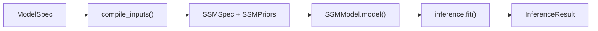

# Estimation Pipeline

The end-to-end estimation pipeline: from continuous-time SDE specification through discretization, likelihood computation, and Bayesian inference. For inference strategy selection rationale, see [inference-routing.md](inference-routing.md).

Within the pipeline artifact lineage, this document starts after Stage 4 has produced a [`ModelSpec`](../pipeline/04-model-specification-priors.md#modelspec) and the compilation path has produced an executable SSM runtime. For the cross-cutting pipeline map, see [pipeline-dimensions.md](pipeline-dimensions.md).

## 1. CT-SDE Formulation

The latent process is a multivariate Ornstein-Uhlenbeck SDE, the standard continuous-time linear-Gaussian state evolution used throughout continuous-discrete filtering and smoothing in [Särkkä (2013)](https://www.cambridge.org/core/books/bayesian-filtering-and-smoothing/C372FB31C5D9A100F8476C1B23721A67):

```text
d eta(t) = (A * eta(t) + c) dt + G dW(t)
```

where:

- `A` is the `n_latent x n_latent` **drift matrix** controlling auto- and cross-regressive dynamics. Diagonal entries (auto-effects) are constrained negative for stability; off-diagonal entries (cross-effects) are unconstrained.
- `c` is the `n_latent x 1` **continuous intercept** (CINT), shifting the asymptotic mean away from zero.
- `G` is the `n_latent x n_latent` **diffusion Cholesky factor**, so `G G'` is the process noise covariance.
- `W(t)` is a standard Wiener process.

The observation (measurement) model is:

```text
y(t) = Lambda * eta(t) + mu + epsilon,    epsilon ~ F(0, R)
```

where:

- `Lambda` is the `n_manifest x n_latent` **factor loading matrix** mapping latent states to observed indicators.
- `mu` is the `n_manifest x 1` **manifest intercept**.
- `R` is the `n_manifest x n_manifest` **measurement error covariance** (Cholesky-parameterized internally).
- `F` is the observation noise family -- Gaussian by default, but also Poisson (log-link), Student-t, Gamma (log-link), Bernoulli (logit-link), Negative Binomial (log-link), or Beta (logit-link).

## 2. Discretization (CT to DT)

Observations arrive at discrete (possibly irregular) times. Before filtering, the continuous-time system must be discretized for each inter-observation interval `dt`.

### Core equations

Given drift `A`, diffusion covariance `Q_c = G G'`, and continuous intercept `c`:

| Discrete quantity | Formula |
|---|---|
| Discrete drift | `A_d = exp(A * dt)` |
| Asymptotic covariance | `A * Q_inf + Q_inf * A' = -Q_c` (Lyapunov equation) |
| Discrete process noise | `Q_d = Q_inf - A_d * Q_inf * A_d'` |
| Discrete intercept | `c_d = A^{-1} * (A_d - I) * c` |

The Lyapunov equation is solved via Bartels-Stewart (Sylvester solver), which is O(n^3) vs O(n^6) for the Kronecker vectorization approach.

**Note on backward pass:** The forward pass uses Bartels-Stewart (Sylvester solver) at O(n^3). A custom VJP (`@jax.custom_vjp` on `solve_lyapunov`) uses implicit differentiation to compute gradients, but the adjoint Lyapunov equation is solved via Kronecker vectorization at O(n^6) because JAX lacks differentiation rules for Schur decomposition. For models with large latent dimension this backward pass can dominate gradient computation cost.

### Batched discretization

For a time series with T observations and potentially irregular intervals, the discretization is vmapped over the `dt` dimension to produce batched `(T, n, n)` discrete drift and noise matrices. The O(n^3) matrix exponential and Lyapunov solve are identical across particles and only need to be computed once per timestep, not once per particle.

**Note on `edge_lag_days`:** The per-edge lag in days, computed during [spec translation in the compilation pipeline](compilation.md#stage-1-spec-translation-ssmspectranslationpy), is used by prior compilation to scale DT-to-CT effects consistently with the discretization interval.

## 3. Likelihood Computation

Both likelihood backends compute log p(y | theta) and inject it into the NumPyro model via `numpyro.factor()`, which adds the log-likelihood scalar directly to the model's log-joint density.

### Kalman backend

For linear-Gaussian models. Computes the exact marginal likelihood via the prediction error decomposition, following the standard Kalman-filter treatment in [Särkkä (2013)](https://www.cambridge.org/core/books/bayesian-filtering-and-smoothing/C372FB31C5D9A100F8476C1B23721A67). Uses cuthbert's non-associative moments filter for numerically stable gradients.

**Applicable when:** Linear dynamics, Gaussian process noise, Gaussian observation noise.

**Complexity:** O(T n^3) -- one Cholesky per timestep, no sampling variance.

### Particle filter backend

Universal sequential Monte Carlo backend for arbitrary noise families and nonlinear dynamics. With a fixed RNG key the PF likelihood is a deterministic function of theta, making it compatible with gradient-based inference.

**Applicable when:** Any model. Fallback when Kalman assumptions fail.

**Complexity:** O(T n P) where P is the particle count.

**Automatic RBPF upgrade:** When dynamics are Gaussian but observations are non-Gaussian, the particle filter automatically delegates to Rao-Blackwell callbacks. Particles carry Kalman sufficient statistics instead of point samples, giving the usual Rao-Blackwellized variance reduction described in [Doucet et al. (2000)](https://research.google/pubs/rao-blackwellised-particle-filtering-for-dynamic-bayesian-networks/).

### Missing data handling

Missing observations are handled by inflating the measurement variance for unobserved channels, so the filter effectively ignores them.

## 4. Library Stack

The estimation pipeline composes three main libraries:

- **JAX**: Foundation layer. Array operations, matrix exponentials for discretization, vmap for batching, automatic differentiation for gradient-based inference, `lax.scan` for sequential filtering, `checkpoint` for memory-efficient backpropagation through long time series.

- **NumPyro**: Probabilistic programming layer. `sample()` for priors, `factor()` for custom log-likelihoods, `deterministic()` for derived quantities, NUTS for HMC, SVI with auto-guides for variational inference.

- **cuthbert**: Differentiable filtering library. Non-associative Kalman filter (`gaussian.moments`) and bootstrap/Rao-Blackwell particle filter (`smc.particle_filter`), both invoked through `cuthbert.filtering.filter()`.

### Data flow



[`ModelSpec`](../pipeline/04-model-specification-priors.md#modelspec) enters from the orchestrator. `SSMModelBuilder.compile_inputs()` produces the spec and priors. Inside the NumPyro model function, `SSMModel.model()` samples from priors, discretizes CT → DT, runs the Kalman or particle likelihood, and injects it via `numpyro.factor("log_likelihood", ll)`. `inference.fit()` returns an `InferenceResult` with posterior samples and diagnostics.

Post-estimation causal effect computation, intervention semantics, and interpretation guidance live in [Stage 6](../pipeline/06-intervention-analysis.md).
