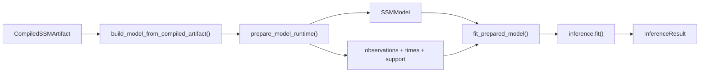

# Estimation Pipeline

This document describes what `SSMModel.model()` computes when the [compilation pipeline](compilation.md) hands off a ready-to-fit [`SSMModel`](compilation.md#stage-5-runtime-preparation-compileartifactpy-runtimepy-observation_supportpy). The entry point is a compiled artifact containing `SSMSpec`, `compiled_prior_semantics`, `edge_lag_days`, and parameter bindings — everything before this point is covered in [compilation.md](compilation.md). For inference strategy selection rationale, see [inference-routing.md](inference-routing.md).

**Reader guide:**

- **Sections 1–3** are math: the continuous-time SDE that the model encodes, how it gets discretized per observation interval, and how the runtime builds state-side objectives using IEKS/Laplace likelihoods.
- **Section 4** is runtime: the library stack (JAX / NumPyro / cuthbert) and the data flow from compiled artifact through fitting to `InferenceResult`.

## 1. CT-SDE Formulation

The latent process is a continuous-time stochastic differential equation with a composite **vector-field** drift and additive Gaussian diffusion:

```text
d eta(t) = f(eta(t), t; theta) dt + G dW(t)
```

where:

- `f` is the **drift vector field**, assembled as a sum of components: per-construct baseline decay and intercepts plus per-edge effects. Edges are drawn from a small vocabulary — **linear** (baseline coupling), **Hill** (saturating dose-response), and **multiplicative** (bilinear interaction) — so the dynamics are non-linear in general. The classic multivariate Ornstein-Uhlenbeck / CT-SEM form `f(eta) = A * eta + c`[^sarkka2019] is the constant-Jacobian special case (a single dense-linear component), recovered exactly when every edge is linear. The continuous-discrete filtering and smoothing machinery[^sarkka2013] (§2–§3) then operates on the locally-linearized system.
- In the affine case `A` is the `n_latent x n_latent` **drift matrix** controlling auto- and cross-regressive dynamics: off-diagonal entries (cross-effects) are sampled on allowed edges, and diagonal entries are derived from baseline decay plus incoming row mass so each dynamic row is strictly damped. For non-linear edges the relevant first-order object is the **Jacobian** `∂f/∂eta`, which drives discretization (§2) and the local stability check.
- `c` is the `n_latent x 1` **continuous intercept** (CINT), shifting the asymptotic mean away from zero (the affine intercept; the local intercept `f(x_lin) - (∂f/∂eta) x_lin` in general).
- `G` is the `n_latent x n_latent` **diffusion Cholesky factor**, so `G G'` is the process noise covariance; diffusion is additive Gaussian regardless of the drift.
- `W(t)` is a standard Wiener process.

The observation (measurement) model is:

```text
y(t) = Lambda * eta(t) + mu + epsilon,    epsilon ~ F(0, R)
```

where:

- `Lambda` is the `n_manifest x n_latent` **factor loading matrix** mapping latent states to observed indicators.
- `mu` is the `n_manifest x 1` **manifest intercept**.
- `R` is the `n_manifest x n_manifest` **measurement error covariance** (Cholesky-parameterized internally).
- `F` is the [observation noise family](model-spec/likelihoods.md#distribution-families) with its associated [link function](model-spec/likelihoods.md#link-functions). Gaussian (identity link) by default; see the [dtype-to-distribution mapping](model-spec/likelihoods.md#dtype-to-distribution-mapping) for all supported families.

## 2. Discretization (CT to DT)

Observations arrive at discrete (possibly irregular) times. Before filtering, the continuous-time system is discretized for each inter-observation interval `dt`. Because the drift `f` is non-linear in general, discretization operates on the **local linearization**: at a reference state `x_lin` (the filter mean, or the current trajectory sample at the start of the interval) the field is approximated as `f(eta) ≈ F * eta + b` with Jacobian `F = ∂f/∂eta` (via `jax.jacfwd`) and intercept `b = f(x_lin) - F * x_lin`, and that affine system is discretized exactly. Constant-Jacobian (dense-linear) fields skip the per-interval linearization and take the exact affine fast path; trajectory-dependent fields (Hill / multiplicative edges) linearize once per interval.

### Core equations

Given the local Jacobian `F`, diffusion covariance `Q_c = G G'`, and local intercept `b`:

| Discrete quantity | Method |
|---|---|
| Discrete drift | `A_d = exp(F * dt)` (matrix exponential) |
| Discrete process noise | `Q_d` from the **Van Loan block exponential** of `[[F, Q_c], [0, -F']] * dt` |
| Discrete intercept | `c_d` from the **augmented matrix exponential** of `[[F, b], [0, 0]] * dt` |

The Van Loan and augmented-exponential forms are used rather than the textbook closed forms (`Q_d = Q_inf - A_d Q_inf A_d'` and `c_d = F^{-1} (A_d - I) b`), because a local linearization far from equilibrium can be unstable (Jacobian eigenvalues with positive real part) or singular, which breaks both closed forms. Van Loan stays exact for any `F`, including singular or defective drift matrices.

### Stationary initial covariance

The Lyapunov equation `A Q_inf + Q_inf A' = -Q_c` supplies the **stationary initial-state covariance** under `initialization_policy="stationary"` (used by prior-predictive sampling) — not the per-interval process noise above. It is solved via Kronecker vectorization, `(I ⊗ A + A ⊗ I) vec(X) = vec(-Q_c)`: O(n^6) but fully differentiable and GPU-compatible, with the Bartels-Stewart / Sylvester route (O(n^3)) avoided because its Schur decomposition has no CUDA XLA implementation. `solve_lyapunov` carries a custom JVP (`@jax.custom_jvp`) that differentiates implicitly through the equation and solves the tangent system with the same Kronecker solver.

### Batched discretization

For a time series with T observations and potentially irregular intervals, the discretization is vmapped over the `dt` dimension to produce batched `(T, n, n)` discrete drift and noise matrices. For a constant-Jacobian (affine) field the matrix exponentials are identical across particles and are computed once per timestep rather than once per particle; a trajectory-dependent field discretizes at each particle's own per-interval linearization state.

**Note on `edge_lag_days`:** The per-edge lag in days, computed during [spec translation in the compilation pipeline](compilation.md#stage-1-spec-translation-compilespec_translationpy), is used by prior compilation to scale DT-to-CT effects consistently with the discretization interval.

## 3. State-Side Objectives

The IEKS/Laplace machinery implements a shared `compute_log_likelihood()` protocol and can inject log p(y | theta) into the NumPyro model via `numpyro.factor()`, which adds the log-likelihood scalar directly to the model's log-joint density. The `marginal_particle_gibbs` method updates latent trajectories directly through conditional-SMC smoothers, while `particle_marginal_mh` integrates them out with a bootstrap particle filter. The routing details live in [inference-routing.md](inference-routing.md).

### IEKS/Laplace backend

Approximate marginal likelihood for non-Gaussian observation models and support-aware interval summaries. It finds a latent trajectory mode with an Iterated Extended Kalman Smoother, then applies a Laplace correction around that mode.

**Applicable when:** The compiled model uses the CT-SDE latent dynamics.

**Complexity:** O(T n^3) for point observations, with profile-banded solvers for interval-summary support.

### Method-specific inner objectives

Some method internals do not use only the generic `models/likelihoods` package as their inner objective:

- The **`marginal_particle_gibbs`** latent smoothers (conditional SMC: `plain`, `amala`, `amala_plus`, `mgrad`, `dsmc`) update latent trajectories as part of the collapsed Particle Gibbs sweep rather than sampling only from a marginalized parameter target.

### Missing data handling

Missing observations are handled by masking: an observation mask (`~isnan`) drops the per-channel likelihood contribution of unobserved entries, so the smoother conditions only on the observed channels.

## 4. Library Stack

The estimation pipeline composes three main libraries:

- **JAX**: Foundation layer. Array operations, matrix exponentials for discretization, vmap for batching, automatic differentiation for gradient-based inference, `lax.scan` for sequential filtering, `checkpoint` for memory-efficient backpropagation through long time series.

- **NumPyro**: Probabilistic programming layer. `sample()` for priors, `factor()` for custom log-likelihoods, and `deterministic()` for derived quantities.

- **cuthbert**: Differentiable filtering library used by the auxiliary Kalman trajectory machinery.

### Data flow



A [`CompiledSSMArtifact`](compilation.md#stage-5-artifact-serialization-compileartifactpy) arrives from the compilation pipeline. `build_model_from_compiled_artifact()` deserializes `SSMSpec`, reloads the prior runtime bundle from `compiled_prior_semantics`, and constructs a live `SSMModel`. `prepare_model_runtime()` then hydrates data-dependent observation metadata, prepares JAX observations/times/support arrays, and attaches support and transition inputs to the model. Inside the NumPyro model function, `SSMModel.model()` samples from the runtime prior bundle, discretizes CT → DT (§2), delegates the state-side objective (§3), and injects it via `numpyro.factor("log_likelihood", ll)` when the active method uses a marginal-likelihood target. `fit_prepared_model()` passes the prepared model and arrays to `inference.fit()`, which returns an `InferenceResult` with posterior samples and diagnostics.

Post-estimation causal effect computation, intervention semantics, and interpretation guidance live in [Stage 6](../pipeline/06-intervention-analysis.md).

[^sarkka2019]: Särkkä, S., & Solin, A. (2019). *Applied Stochastic Differential Equations*. Cambridge University Press. [Bibliography entry](bibliography.md)
[^sarkka2013]: Särkkä, S. (2013). *Bayesian Filtering and Smoothing*. Cambridge University Press. [Bibliography entry](bibliography.md)
