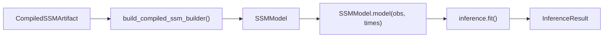

# Estimation Pipeline

This document describes what `SSMModel.model()` computes when the [compilation pipeline](compilation.md) hands off a ready-to-fit [`SSMModel`](compilation.md#stage-6-builder--runtime-ssm_compilerpy-ssm_builderpy-ssm_observation_metadatapy). The entry point is a compiled artifact containing `SSMSpec`, `compiled_prior_semantics`, `edge_lag_days`, and parameter bindings — everything before this point is covered in [compilation.md](compilation.md). For inference strategy selection rationale, see [inference-routing.md](inference-routing.md).

**Reader map:**

- **Sections 1–3** are math: the continuous-time SDE that the model encodes, how it gets discretized per observation interval, and how the runtime builds state-side objectives using IEKS/Laplace likelihoods.
- **Section 4** is runtime: the library stack (JAX / NumPyro / cuthbert) and the data flow from compiled artifact through fitting to `InferenceResult`.

## 1. CT-SDE Formulation

The latent process is a multivariate Ornstein-Uhlenbeck SDE[^sarkka2019], the standard continuous-time linear-Gaussian state evolution used throughout continuous-discrete filtering and smoothing[^sarkka2013]:

```text
d eta(t) = (A * eta(t) + c) dt + G dW(t)
```

where:

- `A` is the `n_latent x n_latent` **drift matrix** controlling auto- and cross-regressive dynamics. Off-diagonal entries (cross-effects) are sampled on allowed edges, and diagonal entries are derived from baseline decay plus incoming row mass so each dynamic row is strictly damped.
- `c` is the `n_latent x 1` **continuous intercept** (CINT), shifting the asymptotic mean away from zero.
- `G` is the `n_latent x n_latent` **diffusion Cholesky factor**, so `G G'` is the process noise covariance.
- `W(t)` is a standard Wiener process.

The observation (measurement) model is:

```text
y(t) = Lambda * eta(t) + mu + epsilon,    epsilon ~ F(0, R)
```

where:

- `Lambda` is the `n_manifest x n_latent` **factor loading matrix** mapping latent states to observed indicators.
- `mu` is the `n_manifest x 1` **manifest intercept**.
- `R` is the `n_manifest x n_manifest` **measurement error covariance** (Cholesky-parameterized internally).
- `F` is the [observation noise family](model-spec/likelihoods.md#distribution-families) with its associated [link function](model-spec/likelihoods.md#link-functions). Gaussian (identity link) by default; see the [dtype-to-distribution mapping](model-spec/likelihoods.md#dtype-to-distribution-mapping) for all supported families.

## 2. Discretization (CT to DT)

Observations arrive at discrete (possibly irregular) times. Before filtering, the continuous-time system must be discretized for each inter-observation interval `dt`.

### Core equations

Given drift `A`, diffusion covariance `Q_c = G G'`, and continuous intercept `c`:

| Discrete quantity | Formula |
|---|---|
| Discrete drift | `A_d = exp(A * dt)` |
| Asymptotic covariance | `A * Q_inf + Q_inf * A' = -Q_c` (Lyapunov equation) |
| Discrete process noise | `Q_d = Q_inf - A_d * Q_inf * A_d'` |
| Discrete intercept | `c_d = A^{-1} * (A_d - I) * c` |

The Lyapunov equation is solved via Bartels-Stewart (Sylvester solver), which is O(n^3) vs O(n^6) for the Kronecker vectorization approach.

**Note on backward pass:** The forward pass uses Bartels-Stewart (Sylvester solver) at O(n^3). A custom VJP (`@jax.custom_vjp` on `solve_lyapunov`) uses implicit differentiation to compute gradients, but the adjoint Lyapunov equation is solved via Kronecker vectorization at O(n^6) because JAX lacks differentiation rules for Schur decomposition. For models with large latent dimension this backward pass can dominate gradient computation cost.

### Batched discretization

For a time series with T observations and potentially irregular intervals, the discretization is vmapped over the `dt` dimension to produce batched `(T, n, n)` discrete drift and noise matrices. The O(n^3) matrix exponential and Lyapunov solve are identical across particles and only need to be computed once per timestep, not once per particle.

**Note on `edge_lag_days`:** The per-edge lag in days, computed during [spec translation in the compilation pipeline](compilation.md#stage-1-spec-translation-ssmspectranslationpy), is used by prior compilation to scale DT-to-CT effects consistently with the discretization interval.

## 3. State-Side Objectives

The marginalization backend implements a shared `compute_log_likelihood()` protocol and injects log p(y | theta) into the NumPyro model via `numpyro.factor()`, which adds the log-likelihood scalar directly to the model's log-joint density. The `map` backend uses an IEKS/Laplace approximate marginal likelihood, and the blocked MCMC methods update latent trajectories directly. The routing details live in [inference-routing.md](inference-routing.md).

### IEKS/Laplace backend

Approximate marginal likelihood for non-Gaussian observation models and support-aware interval summaries. It finds a latent trajectory mode with an Iterated Extended Kalman Smoother, then applies a Laplace correction around that mode.

**Applicable when:** The compiled model uses the CT-SDE latent dynamics.

**Complexity:** O(T n^3) for point observations, with profile-banded solvers for interval-summary support.

### Method-specific inner objectives

Some methods do not use only the generic `models/likelihoods` package as their inner objective:

- **`map`** uses the IEKS/Laplace approximate marginal likelihood before local Gaussian parameter sampling.
- **`aux_kalman_mcmc`** and **`pit_particle_mgrad`** update latent trajectories as part of blocked complete-data MCMC rather than sampling only from a marginalized parameter target.

### Missing data handling

Missing observations are handled by inflating the measurement variance for unobserved channels, so the filter effectively ignores them.

## 4. Library Stack

The estimation pipeline composes three main libraries:

- **JAX**: Foundation layer. Array operations, matrix exponentials for discretization, vmap for batching, automatic differentiation for gradient-based inference, `lax.scan` for sequential filtering, `checkpoint` for memory-efficient backpropagation through long time series.

- **NumPyro**: Probabilistic programming layer. `sample()` for priors, `factor()` for custom log-likelihoods, and `deterministic()` for derived quantities.

- **cuthbert**: Differentiable filtering library used by the auxiliary Kalman trajectory machinery.

### Data flow



A [`CompiledSSMArtifact`](compilation.md#stage-5-artifact-serialization-ssm_compilerpy) arrives from the compilation pipeline. `build_compiled_ssm_builder()` deserializes `SSMSpec`, reloads the prior runtime bundle from `compiled_prior_semantics`, and constructs a live `SSMModel`, which derives `SSMStructureRuntime` once for structural assembly. Inside the NumPyro model function, `SSMModel.model()` samples from the runtime prior bundle, discretizes CT → DT (§2), delegates the state-side objective (§3), and injects it via `numpyro.factor("log_likelihood", ll)` when the active method uses a marginal-likelihood target. `inference.fit()` returns an `InferenceResult` with posterior samples and diagnostics.

Post-estimation causal effect computation, intervention semantics, and interpretation guidance live in [Stage 6](../pipeline/06-intervention-analysis.md).

[^sarkka2019]: Särkkä, S., & Solin, A. (2019). *Applied Stochastic Differential Equations*. Cambridge University Press. [Bibliography entry](bibliography.md)
[^sarkka2013]: Särkkä, S. (2013). *Bayesian Filtering and Smoothing*. Cambridge University Press. [Bibliography entry](bibliography.md)
