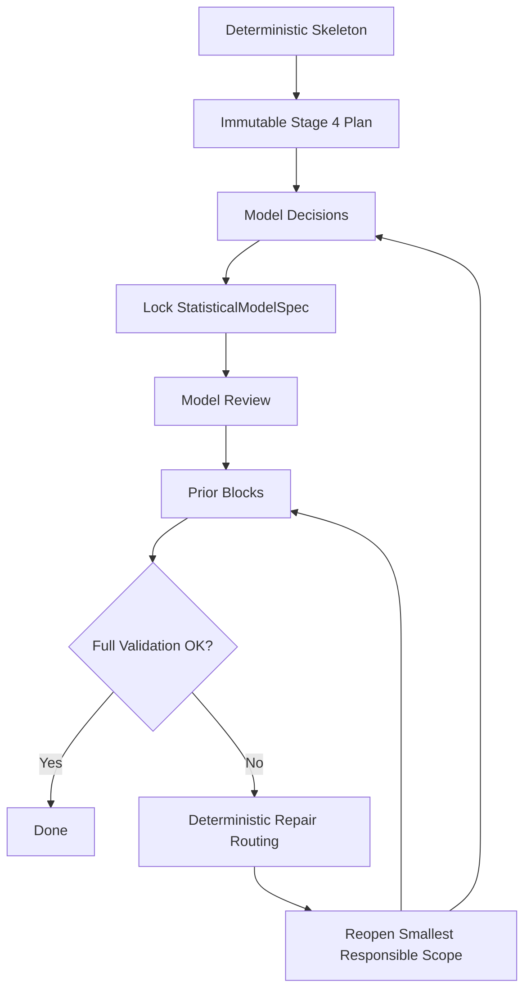

# Stage 4 State Machine

This page explains the [Stage 4](../../pipeline/04-statistical-model-specification-priors.md) control loop at a high level. It is meant to answer questions like "what is the reducer trying to do?", "what can reopen?", and "why does the stage sometimes pause for validation before asking the LLM another question?"

For the exact block-by-block contract, see [LLM-Driven Stage 4 Specification](llm-driven-specification.md). For the artifact contract that downstream stages consume, see [Stage 4](../../pipeline/04-statistical-model-specification-priors.md).

## 1. What the State Machine Owns

Stage 4 does not decide the causal graph, the retained indicators, or whether a causal estimand is graph-identified. Those decisions were already made upstream. Its job is narrower:

1. turn the fixed upstream structure into a prompt plan,
2. collect a bounded set of model-form decisions,
3. lock those decisions into one executable `StatisticalModelSpec`,
4. collect priors over the active parameter surface,
5. validate the assembled result,
6. reopen only the smallest scope that needs repair.

The important design choice is that Stage 4 is not a free-form conversation. It is a controlled state machine with deterministic ordering and deterministic repair routing.

## 2. The Four Moving Pieces

| Moving piece | Role in the state machine |
|---|---|
| Deterministic skeleton | Computes what is already fixed before any LLM turn: uniquely determined likelihoods, loading orientation, and the compiler-backed parameter inventory. |
| Immutable plan | Converts the skeleton into a fixed list of promptable blocks and review checkpoints in deterministic order. |
| Mutable runtime | Tracks where execution currently is, what has already been accepted, what is still pending, and whether a repair campaign is active. |
| Validators and repair routing | Decide whether a submission is acceptable and, when it is not, which scope must reopen. |

Everything else in the implementation hangs off those four pieces.

## 3. Plan First, Runtime Second

The state machine starts by building a plan from the deterministic skeleton. That plan is stable for the session.

At a high level, the plan contains these block families.

| Block family | High-level purpose |
|---|---|
| `model:configuration` | Choose the model-level switches that affect which parameter surfaces stay active. |
| `indicator:{variable}` | Choose a likelihood family and link for one ambiguous indicator. |
| `review:statistical_model_spec` | Check the locked model form as a whole before prior authoring starts. |
| `measurement:{construct}` | Author priors for one construct's loading parameters. |
| `observation:{parameter}` | Author priors for one observation intercept or observation-family auxiliary parameter. |
| `dynamics:{subsystem}` | Author priors for one dynamic subsystem's persistence, noise, and any active intercept or initial-state surfaces. |
| `effects:{target}` | Author priors for the incoming causal effects into one target construct. |
| `correlation:{parameter}` | Author priors for one correlation or baseline-factor scale surface. |
| `review:prior_system` | Whole-system prior review used only when repair routing escalates that far. |

The runtime is different from the plan. The runtime is the mutable session state:

| Runtime concern | Why it matters |
|---|---|
| Active cursor | Tells the stage which block is currently waiting on an LLM submission, or whether the stage is doing deterministic settling work between prompts. |
| Block status | Tracks whether each planned block is `pending`, `accepted`, `reopened`, or `inactive`. |
| Draft model decisions | Holds accepted model-form choices before the full `StatisticalModelSpec` is locked. |
| Accepted artifacts | Holds the locked `StatisticalModelSpec`, accepted priors, and latest accepted validation result. |
| Repair campaign | Tracks a bounded multi-block repair scope when one validation failure requires coordinated edits. |

That split is the core mental model: the plan says what can happen, and the runtime says where the current run stands inside that plan.

## 4. High-Level Flow

That picture hides one important detail: the stage alternates between two modes.

| Mode | What happens there |
|---|---|
| Prompt mode | The reducer is waiting for one block-local LLM submission. |
| Settling mode | The reducer runs deterministic follow-on work such as locking the `StatisticalModelSpec`, selecting the next block, or validating a finished repair scope. |

The LLM only acts in prompt mode. All routing decisions happen in settling mode.

## 5. The Nominal Path

On the happy path, execution is simple.

1. The stage asks for `model:configuration`.
2. It asks for each ambiguous indicator decision in deterministic order.
3. It pauses and tries to lock the full `StatisticalModelSpec`.
4. It runs `review:statistical_model_spec`.
5. It asks for prior blocks in deterministic order.
6. Once the required active priors exist, it runs full assembly validation.
7. If validation succeeds, the stage finishes.

Two points matter here.

First, `review:statistical_model_spec` is part of the nominal path. It is a checkpoint, not an error state.

Second, `review:prior_system` is not part of the nominal path. It exists as an escalation endpoint when local prior repairs are no longer enough.

## 6. Why the Lock Step Is a Separate State

The transition from model decisions to prior authoring is not direct. Stage 4 first pauses to lock the `StatisticalModelSpec`.

That lock step has one purpose: convert accepted draft decisions into one executable model form and verify that the assembled model is coherent before priors enter the picture.

At this point the state machine is asking a narrow question:

"Given the accepted indicator choices and model-level switches, is there a valid `StatisticalModelSpec` to build on?"

If the answer is no, the stage does not guess how to recover. It deterministically reopens the smallest model-form block that owns the problem.

## 7. Draft State Versus Accepted State

One of the most important moving pieces is the distinction between draft state and accepted state.

| State layer | What it stores |
|---|---|
| Draft model state | Accepted model-form choices that are still pre-lock, such as indicator likelihood choices and model-level switches. |
| Accepted locked state | The accepted `StatisticalModelSpec`, the accumulated accepted priors, and the latest accepted validation result. |

This separation gives the reducer two useful properties.

1. A local failure does not force the stage to rebuild everything from scratch.
2. Rejected compile attempts or prior-predictive failures do not overwrite the last accepted state.

That is why the stage can reopen one scope while keeping the rest of the run stable.

## 8. Block Statuses Are the Control Surface

Each planned block carries a status.

| Status | High-level meaning |
|---|---|
| `pending` | The block is part of the plan and has not yet been accepted. |
| `accepted` | The block's current content is accepted and frozen unless a validator reopens it. |
| `reopened` | The block had been accepted or was otherwise passed over, but repair routing brought it back into play. |
| `inactive` | The block exists in the plan but is not currently reachable. This is how the dormant whole-system prior review is represented, and it is also how prior blocks disappear when a relocked model no longer activates their parameters. |

The reducer largely advances by changing these statuses and then asking, "what is the next reachable non-accepted block in plan order?"

## 9. Prior Authoring Is Still Blocked and Incremental

After the model form is locked, Stage 4 still does not open the full prior surface all at once. It walks the prior blocks one scope at a time.

That matters for two reasons.

| Reason | Consequence |
|---|---|
| Priors are authored incrementally | The stage can reject a narrow prior bundle without discarding unrelated accepted priors. |
| The active parameter surface depends on the locked model form | Re-locking the model can deactivate some prior blocks or reactivate others, and the runtime resynchronizes block activity to match. |

The stage is allowed to finish once the required active priors are present. Some parameter roles can remain optional for closure, so the state machine distinguishes "active prior surface" from "required to complete."

## 10. Review Checkpoints Have Different Jobs

Stage 4 has two conceptually different review checkpoints.

| Checkpoint | Job |
|---|---|
| `review:statistical_model_spec` | Ask whether the locked model-form decisions still make sense when viewed together. It can reopen model-decision blocks, but it does not author priors. |
| `review:prior_system` | Revisit the prior system at the widest scope after repeated or global prior failures. It does not reopen the model-form surface on its own. |

That separation is deliberate. Model-form repair and prior-system repair are different classes of work.

## 11. Repair Routing Is Deterministic

When validation fails, the reducer does not ask the LLM which part to revisit. It computes a repair scope.

At a high level, the routing policy is:

| Failure type | Typical reopening behavior |
|---|---|
| Model-form compile issue | Reopen the responsible model block or review checkpoint. |
| Likelihood support issue | Route back to the responsible indicator decision. |
| Local prior issue with known owning parameters | Reopen the direct writer blocks for those parameters. |
| Drift or stability issue that spans a motif or subsystem | Escalate through increasingly wider structural scopes. |
| Global prior-system issue | Activate the whole-system prior review block. |

The important property is monotonicity: repair scopes widen when narrower repairs fail to resolve the same pathology.

## 12. Some Repairs Become Campaigns

Not every reopened scope is a single block. Some failures implicate several coordinated blocks.

When that happens, the runtime opens a repair campaign.

| Campaign property | Why it exists |
|---|---|
| Fixed scope | The campaign names the exact blocks that belong to the repair. |
| Deterministic order | Those reopened blocks are revisited in plan order. |
| Progress tracking | The runtime records which campaign blocks are already repaired and which are still pending. |
| Optional barrier validation | Multi-block campaigns can require one joint validation pass after every reopened block has been edited. |

This is the mechanism that keeps Stage 4 from accepting several locally plausible edits that only fail when assembled together.

## 13. Barrier Validation Is the Joint-Coherence Check

For a multi-block repair, the state machine does not immediately continue once the last reopened block is accepted. It pauses for one more deterministic step: barrier validation.

Barrier validation asks:

"Do these repaired blocks work together when reassembled into the current locked model and prior system?"

If yes, the campaign clears and the stage returns to the ordinary flow.

If no, the failure is classified again and the repair scope can widen.

This is the main high-level reason the reducer sometimes feels stricter than a simple sequential wizard: it is checking joint coherence, not just per-block plausibility.

## 14. What Can Reopen

At a high level, these are the reopenable surfaces.

| Surface | Can reopen because of |
|---|---|
| `model:configuration` | Lock-time compile failure or model-level review feedback. |
| `indicator:{variable}` | Indicator-local validation, support mismatch, compile failure, or model-level review feedback. |
| Prior blocks | Prior schema failure, partial drift failure, full validation failure, or repair escalation. |
| `review:statistical_model_spec` | Reopened implicitly when model-form repair makes the joint checkpoint relevant again. |
| `review:prior_system` | Activated only by global prior repair escalation. |

What does not reopen automatically is just as important: accepted state outside the chosen repair scope stays in place unless the deterministic router explicitly widens the scope.

## 15. Completion Means More Than "No More Questions"

The state machine is done only when all of these conditions hold at once.

| Condition | Meaning |
|---|---|
| Locked model form exists | The reducer has an accepted `StatisticalModelSpec`. |
| Required priors are covered | The active non-optional prior surface has accepted prior proposals. |
| No active repair campaign remains | The run is no longer inside a coordinated repair scope. |
| Latest accepted validation is clean enough to proceed | The stage is not ending on a compile failure or unresolved prior-predictive failure. |

Operationally, that means Stage 4 finishes with one accepted model form and one accepted prior system that passed assembled prior validation, not just with a sequence of accepted local edits.

## 16. What This Page Intentionally Leaves Out

This page omits the plumbing details on purpose:

- tool-level submission contracts,
- prompt section composition,
- exact payload schemas,
- validator packet structure,
- and the line-by-line repair-ladder implementation.

Those details live in [LLM-Driven Stage 4 Specification](llm-driven-specification.md). This page is the shorter mental model for understanding why the Stage 4 reducer behaves the way it does.
